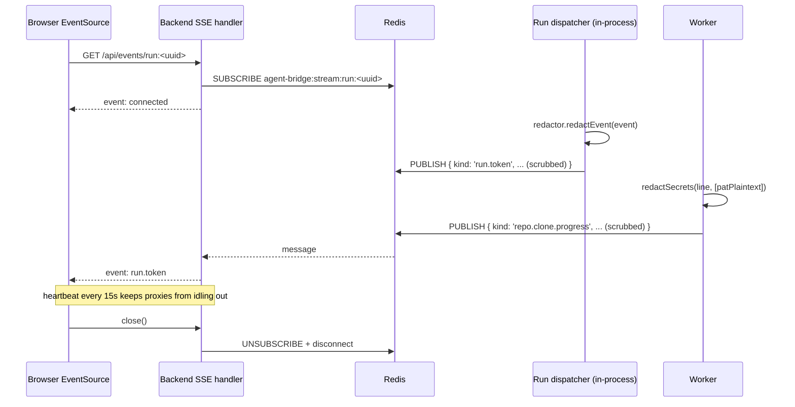

# Agent Bridge — Architecture

## 1. High-level map

```mermaid
flowchart LR
  subgraph Browser["Browser (Vite + React 19 + React Flow)"]
    UI[Agent canvas, chat, logs]
  end

  subgraph Backend["apps/backend (Hono)"]
    API[[REST API]]
    SSE[[SSE /api/events/:streamId]]
  end

  subgraph Worker["apps/worker (BullMQ)"]
    PING[ping job]
    CLONE[clone-repo job]
    IDX[index-repo job]
    WIKI[generate-wiki job]
  end

  subgraph Dispatcher["apps/backend/lib/run-dispatcher (in-process)"]
    RUN[agent.stream&nbsp;➜&nbsp;SSE + run_events]
  end

  subgraph Shared["packages/shared (subpath exports)"]
    Paths[./paths]
    Crypto[./crypto]
    Spawn[./spawn]
    GitN[./gitnexus]
    Bus[./event-bus]
    Events[./events, ./redact, ./secrets-dto]
  end

  subgraph DB["packages/db (Drizzle + Postgres)"]
    Schema[(pgvector)]
  end

  subgraph Infra["docker-compose.yml"]
    Redis[(Redis 8)]
    PG[(Postgres 17 + pgvector)]
  end

  subgraph DataRoot[".agent-bridge-data/ (isolation boundary)"]
    WS[workspace/&lt;agent&gt;/&lt;repo&gt;]
    GNH[gitnexus-home/ — fake HOME]
    Blobs[blobs/]
    Key[secret.key (0600)]
  end

  subgraph External["External MCPs (sandboxed)"]
    Notion[Notion MCP]
    DD[Datadog MCP]
    GitNexusMCP[gitnexus mcp — one per agent, multiplexed across repos]
  end

  UI -->|REST| API
  UI -->|EventSource| SSE
  API -->|enqueue| Redis
  Worker -->|dequeue| Redis
  Worker -->|publish RunEvent| Redis
  API -->|publish RunEvent| Redis
  Backend -->|subscribe| Redis
  API --> Dispatcher
  Dispatcher --> DB
  Dispatcher -->|spawnSandboxed| GitNexusMCP
  API --> DB
  Worker --> DB
  Worker --> Shared
  Backend --> Shared
  Worker -->|spawnSandboxed| GitN
  Worker -->|spawnSandboxed| External
  Worker --> DataRoot
  GitN --> DataRoot
```

## 2. Components

### 2.1 `apps/frontend` (React 19 + Vite + React Flow)

Railway-style node-based canvas: agents, attached skills, tools, repos, MCP
connections are all nodes; edges carry relationships (e.g. repo→repo with a
one-word connector + description).

Only imports from `@agent-bridge/shared` at the **browser-safe root entry** —
subpath exports like `@agent-bridge/shared/crypto` will break the Vite build
by design.

### 2.2 `apps/backend` (Hono + @hono/node-server)

- CRUD API over `@agent-bridge/db`
- SSE endpoint tails per-stream events from Redis pub/sub
- Never returns decrypted secret plaintext — responses carry `SecretSentinel`
  values only
- Before publishing any event, routes it through a per-run
  `RunRedactor` (bound to `BuiltAgent.secrets`) which scrubs every
  string leaf. Same redactor is used for the audit write and for
  terminal columns (`runs.error_message`, `runs.output_summary`), so
  SSE, Redis, and `run_events` always see the same masked payload.

### 2.3 `apps/worker` (BullMQ)

Boot sequence (deliberate, fail-fast):

1. `ensureDataDirs()` — 0700 dir layout under `.agent-bridge-data/`
2. `loadOrCreateMasterKey()` — validate or generate `secret.key`
3. `assertExpectedGitnexusVersion()` — refuse to run on a drifted version
4. Register BullMQ `Worker` per queue
5. Install signal handlers (clean drain on SIGINT/SIGTERM)

Jobs are stateless and idempotent (use `attempts: 3, backoff: exponential`).
Every long-running child process is spawned via `spawnSandboxed()` so
nothing escapes the data root.

### 2.4 `apps/mcp-bridge`

MCP server (stdio) that exposes one or two built-in tools per agent
to Cursor / Claude Code / Codex / any MCP-compatible IDE:

- `<slug>__ask_agent` is always exposed — free-form Q&A, prose-only
  envelope. Handler: `ask-agent-handler.ts`.
- `<slug>__inspect_codebase` is additionally exposed when the agent
  has `inspector_enabled = true` (Coding-helper template). Mini-repo
  envelope carrying structured codebase evidence (the agent's wrapper
  toolkit gathers it: find / trace / impact / debug / understand /
  list — see §10.7 for the wire shapes). Handler:
  `inspect-codebase-handler.ts`.

Operator-authored `bridge_tools` rows continue to register alongside
with their authored names (§8.2).

#### 2.4.1 Bridge session = one Mastra thread

The bridge mints **one `threadId` at process start** (`BRIDGE_THREAD_ID =
randomUUID()` in `apps/mcp-bridge/src/index.ts`) and reuses it on every
`dispatchRun(...)` call for the lifetime of the subprocess.

Why this exists: pre-fix, every IDE tool call minted a fresh runId AND used
it as the threadId, so each call landed in its own brand-new Mastra thread.
That works for stateless one-shot automations ("summarize this URL") but
breaks chat-style usage — a follow-up like *"what about the migration?"*
had no in-thread history of the previous turn, so recent-message replay,
per-thread working memory, and per-thread semantic recall all came up
empty on every call. The agent appeared amnesiac between consecutive IDE
messages even though the user thought they were having one conversation.

Pinning the threadId per bridge process restores the chat-style mental
model:

- **Same IDE session** (one bridge subprocess) → all tool calls share one
  thread → continuous history.
- **Restart IDE / reload MCP server** → bridge subprocess respawns →
  fresh threadId.

Limitations we accept for v1:

- **Multi-tab bleed.** MCP doesn't expose per-chat-tab context to the
  bridge — Cursor with two simultaneous chat tabs sends both tabs'
  messages through the same stdio pipe, so they end up in one thread.
  Workaround for users: restart the IDE / reload the MCP server when
  they want a fresh slate. Future fix: optional `conversationId` field
  on the bridge tool's input schema (Layer 2), where a capable IDE LLM
  mints and passes a per-tab id.
- **No idle auto-rotation.** If the user comes back to the same IDE
  session after hours, prior context is still loaded. Same workaround
  (manual reload). Time-based rotation was scoped but deferred.
- **Per-tab semantic isolation requires per-agent scope.** Because all
  IDE calls land in one thread, "per thread" working-memory + semantic
  recall scope effectively scopes to "this IDE session only." For agents
  that should remember across IDE restarts / chat tabs, pick "per agent"
  scope (cross-thread, persists across every web chat + IDE call).

The dispatcher's existing `resolveMemoryIds` already honored an explicit
`threadId` input (`packages/agents/src/run-dispatcher.ts:716` —
`mastraThreadId: input.threadId ?? input.runId`); the bridge fix is a
five-line plumbing change (`threadId: BRIDGE_THREAD_ID` on the dispatch
call). No DB schema change.

### 2.5 `packages/shared`

Two worlds under one package, separated by `exports`:

| Subpath       | Runtime        | Purpose                                              |
| ------------- | -------------- | ---------------------------------------------------- |
| `.` (default) | browser + node | Zod schemas, DTOs, `redactSecrets`, `RunEvent` types |
| `./env`       | node           | `.env` loader + schema validator                     |
| `./paths`     | node           | `resolveDataDir`, `ensureDataDirs`                   |
| `./crypto`    | node           | AES-256-GCM envelopes + master key                   |
| `./spawn`     | node           | `spawnSandboxed` (HOME clamp, git flags)             |
| `./gitnexus`  | node           | Pinned CLI resolver + `runGitnexus`                  |
| `./event-bus` | node           | Redis pub/sub `RunEvent` bus                         |

### 2.6 `packages/db`

Drizzle schema + generated migrations. Used by backend (reads/writes) and
worker (writes job progress + run_events audit rows). Migrations committed to
git; `pnpm db:generate` diffs `schema.ts` and writes a new SQL migration.

Lives in Postgres schema `public.*`. Mastra's auto-created tables live in a
separate `mastra.*` schema — see §7 for the ownership split and why the two
schemas never mix.

### 2.7 `packages/agents`

Mastra agent builder: takes DB rows (agent, skills, tools, repos, MCP
connections, memory config) and returns a runnable `Agent` instance. The only
place in the repo that imports `mastra`, `@mastra/memory`, `@mastra/pg`, etc.
— every other workspace sees a pure `Agent` / `RunResult` interface. This
keeps the Mastra boundary explicit and swappable.

The package also owns the **inspector toolkit** that wraps gitnexus
behind six deterministic wrappers (`find_in_codebase`, `trace_flow`,
`assess_change_impact`, `debug_help`, `understand_module`,
`list_repos`), the gitnexus MCP subprocess mount, the keyword-search
fallback (ripgrep, see §10.12), and the auto-attached system prompt.
Full design lives in §10 below.

## 3. Isolation guarantees (must not regress)

Every runtime write the app makes lives under **one** path, the
**data root**:

```
<repo>/.agent-bridge-data/
  workspace/           # cloned user repos
  gitnexus-home/       # fake HOME for GitNexus + git (registry, config, cache)
  blobs/               # generated wikis, graph JSON, chunked content
  secret.key           # 32-byte AES-256-GCM master key, mode 0600
```

**Hardening invariants.** If any of these regress, an end-user will start
seeing files appear in `~/.gitconfig`, `~/.gitnexus/`, or worse.

| Invariant                                                            | Enforced by                                                                |
| -------------------------------------------------------------------- | -------------------------------------------------------------------------- |
| No runtime write outside the data root                               | `@agent-bridge/shared/paths`                                               |
| Every `gitnexus` / `git` / user MCP spawn has `HOME` clamped         | `spawnSandboxed()`                                                         |
| Git never reads the user's global config or prompts interactively    | `spawn: 'git'` sets `GIT_CONFIG_GLOBAL=/dev/null`, `GIT_TERMINAL_PROMPT=0` |
| GitNexus version drift is caught at boot, not at indexing time       | `assertExpectedGitnexusVersion()` in worker                                |
| `npx gitnexus@latest` is never called                                | `runGitnexus()` resolves via `createRequire`                               |
| `SSH_AUTH_SOCK`, `GPG_AGENT_INFO` are stripped from spawned children | `spawnSandboxed()`                                                         |
| Browser bundles never pull in Node-only code (crypto, spawn, etc.)   | `exports` map subpath split                                                |
| No ambient `process.env` usage — everything goes through Zod schemas | `@agent-bridge/shared/env`                                                 |
| Engine mismatch (Node version) fails loudly                          | `.npmrc` `engine-strict=true` + root `engines.node` + `.nvmrc`             |

**HOME clamp patterns for user-configured MCPs.** `spawnSandboxed`
supports three postures. Only the first two are exposed in the UI:

| Posture                        | When                                                       | What the child sees                                                                                                     |
| ------------------------------ | ---------------------------------------------------------- | ----------------------------------------------------------------------------------------------------------------------- |
| **Clamped (default)**          | Every first-party spawn (gitnexus, git, MCPs)              | `HOME=<data-root>/gitnexus-home`, XDG dirs redirected, auth sockets stripped                                            |
| **Real HOME opt-in**           | stdio MCPs that need user CLI auth (`gh`, `aws`, `gcloud`) | `HOME` untouched, SSH/GPG sockets still stripped                                                                        |
| **Partial HOME (unsupported)** | "Share `~/.config/foo` but nothing else"                   | Not implemented. If a future MCP needs this, design it as a bind mount — don't half-implement by whitelisting XDG dirs. |

The real-HOME opt-in is a per-connection boolean
(`mcp_connections.allow_host_home`) and the UI surfaces it behind a
"Show advanced" toggle on stdio connections only, with an explicit warning
on the trade-off. http/sse transports have no subprocess; the DTO rejects
`allow_host_home: true` on them outright.

## 4. Secrets at rest

Every user-supplied secret flows through the same pipe:

```
UI input  →  backend validates SecretInput DTO  →  encryptSecret()  →  DB row (v1.iv.tag.ct)
                                                                          │
                                                                          ▼
                                               SSE stream  ←  redactSecrets(event, [plaintextsForRun])
                                                                          ▲
                                          run-time only  ←  decryptSecret() in worker (memory-only)
```

- **Envelope**: `v1.<iv:b64url>.<tag:b64url>.<ct:b64url>`
- **Algorithm**: AES-256-GCM, 12-byte IV, 16-byte tag
- **Key location**: `<data-root>/secret.key` (mode 0600), or
  `AGENT_BRIDGE_SECRET_KEY` env override (base64url-encoded 32 bytes)
- **API responses**: never include plaintext. `SecretSentinel = {set: true}`
  (no length — computing it would force N-decrypts per list read and narrow an
  attacker's guess space if the UI were screen-recorded)
- **Logs + SSE + audit**: last-line-of-defence `redactSecrets()` /
  `redactMany()` replaces any known plaintext substring with `«redacted»`
  at the publish boundary — `run-dispatcher.ts` binds a per-run
  `RunRedactor` from `BuiltAgent.secrets` and routes every outgoing
  event through it BEFORE `eventBus.publish(...)` AND
  `runsRepo.appendEvent(...)`. Same treatment for terminal strings
  (`runs.error_message`, `runs.output_summary`). The clone-repo worker
  applies the same pattern to PAT plaintexts on stderr lines. Since
  SSE and `run_events` fan out from the same scrubbed payload, they
  cannot drift.

Losing `secret.key` means every encrypted row becomes unrecoverable — back it
up if you care about portability across machines.

## 5. Event bus + SSE pipeline



Two producers, one bus: the **run dispatcher** runs inside the backend
process (LLM streaming doesn't serialise cleanly across a queue) and the
**BullMQ worker** runs long-lived clone/index/wiki jobs. Both publish
`RunEvent`s onto the same Redis channel namespace (`run:<uuid>` for
agent runs, `repo:<uuid>` for repo jobs) so the SSE handler treats them
uniformly. The `RunEvent` type is shared via `@agent-bridge/shared` so
producer and consumer cannot drift. The bus is a thin wrapper around
ioredis pub/sub — one subscriber connection per SSE client.

`run.token` is a live-only frame: high-frequency, never written to
`run_events`. The dispatcher's `TokenBatcher` (200 ms window) aggregates
tokens into `run.token.batch` rows in the audit log, so a late subscriber
can fetch a compact history without replaying thousands of token deltas.

**Per-agent fan-out (Activity panel).** Every dispatcher event is published
to TWO channels: the per-run channel `run:<runId>` (chat panel subscribes
here) AND a per-agent channel `agent:<agentId>` (right-rail Activity
panel subscribes here). Same scrubbed payload, different `streamId`.
The audit row in `run_events` is written ONCE — keyed by `runId` — so
the agent stream is a derived broadcast, not a second source of truth.
This lets the Activity tab render a continuous timeline across many
runs (chat turns, IDE-bridge calls, …) for the focused agent without
having to track individual run ids. Helper: `agentStreamId(agentId)` in
`@agent-bridge/shared/events`. Repo-job events (clone/index/wiki) are
NOT yet fanned to the agent stream — they remain on `repo:<repoId>`
because a repo can attach to multiple agents and per-target fan-out
needs an attachment-aware publish path; future work.

## 6. Process + deployment topology

Local dev (`pnpm dev`):

- `docker compose` → Redis + Postgres on loopback
- `apps/frontend` → Vite dev server on `:5173`
- `apps/backend` → Hono on `:3001`
- `apps/worker` → BullMQ worker(s)
- `packages/*` → `tsc --watch` (for type freshness)

Production (future): same four processes, Redis + Postgres managed. MCP
bridge runs alongside backend if IDE-facing is enabled.

### 6.1 BuiltAgent cache (cross-run subprocess persistence)

`packages/agents/src/built-agent-cache.ts` is a process-level cache,
keyed by `agentId`, that holds `BuiltAgent` instances — including their
mounted MCP subprocesses — across runs. Without it, every chat turn
re-spawned the gitnexus MCP + every external MCP, paid the
`initialize` + `tools/list` round-trip on each, and tore them down
again. On a Notion-attached agent that's 4–6 seconds of cold start
before the LLM sees a one-word prompt.

Mirrors how IDE-side MCP clients (Cursor, Claude Code, Claude Desktop)
behave: spawn the MCP server once at session start, reuse it for
every subsequent `tools/call`. The MCP spec is designed for long-lived
JSON-RPC; treating it as ephemeral was the mismatch.

| Property              | Behaviour                                                                                                                                                                                                            |
| --------------------- | -------------------------------------------------------------------------------------------------------------------------------------------------------------------------------------------------------------------- |
| Key                   | `agentId`. One cached `BuiltAgent` per agent.                                                                                                                                                                        |
| Invalidation          | Content hash over `MAX(updated_at)` across `agents`, `skills`, `tools`, `agent_repos`, `repos` (referenced via attachments — repo-status changes drive gitnexus mount), `repo_edges`, `agent_mcp_tools`, `mcp_connections` (referenced via allowlist), and the agent's `llm_provider`. Recomputed every `getOrBuild`; mismatch → tear down + rebuild. |
| In-flight de-dup      | Two concurrent `getOrBuild`s for the same agent share one build promise. Otherwise a chat-tool-call burst could spawn N parallel Notion subprocesses for the same agent.                                             |
| Eviction              | LRU bounded by `MAX_ENTRIES = 8`; idle entries past `TTL_MS = 30 min` dropped on access.                                                                                                                             |
| Process exit          | Backend's graceful shutdown (`server.ts`) and mcp-bridge's stdio-close handler both call `builtAgentCache.dispose()` so MCP subprocesses don't outlive the parent.                                                   |
| Secrets in memory     | Each cached entry carries decrypted plaintexts (`BuiltAgent.secrets`) for its lifetime. Same trust boundary as the master key file on disk; flagged here because the lifetime is now longer than a single dispatch. |

The dispatcher (`run-dispatcher.ts`) calls
`builtAgentCache.getOrBuild(...)` instead of `buildAgent(...)`, and
deliberately **does not** call `built.disconnect()` in its `finally`
block — disconnect now happens at eviction or process shutdown. Both
the backend and mcp-bridge run their own copy of the cache singleton
(it's a module-level instance in `packages/agents`); a single physical
MCP subprocess belongs to exactly one process.

## 7. Mastra ownership model

Agent Bridge wraps Mastra — it does not re-implement it. The repo has one
**boundary module** (`packages/agents`) that speaks Mastra, and three buckets
of responsibility:

### 7.1 Bucket 1 — Mastra owns the storage

When `@mastra/pg`'s `PostgresStore` is constructed with `schemaName: 'mastra'`,
Mastra auto-creates and migrates these tables. We **never**
design our own versions:

| Mastra table               | What it stores                                          |
| -------------------------- | ------------------------------------------------------- |
| `mastra.threads`           | Conversation threads (one per agent × user × session)   |
| `mastra.messages`          | Individual messages with role, content, metadata        |
| `mastra.resources`         | Per-`resourceId` working memory (persists cross-thread) |
| `mastra.workflow_snapshot` | Suspend/resume state for long-running workflows         |
| `mastra.evals`             | Eval run results                                        |
| `mastra.traces`            | OpenTelemetry spans (tool calls, LLM calls, timings)    |
| `mastra.scorers`           | Scorer outputs                                          |

`drizzle-kit` runs only against `public.*`. Mastra's migrations run on its
own schedule the first time `PostgresStore.init()` is called at boot. The
two migration runners never see each other's tables.

### 7.2 Bucket 2 — We store, Mastra consumes

Some rows on **our** tables carry config that gets piped straight into Mastra
at runtime. For these, the field shapes **must match Mastra's API exactly** —
drift is a runtime error, not a type error:

| Our column                  | Mastra consumer              |
| --------------------------- | ---------------------------- |
| `agents.memory_config`      | `new Memory({ options: … })` |
| `tools.config_json` (later) | `createTool({ … })` inputs   |

See `AgentMemoryConfig` in `@agent-bridge/shared/domain` — docstring calls
out the anti-drift rule explicitly.

### 7.3 Bucket 3 — We own it entirely

Everything else. Mastra has no opinion or schema here, so we design freely:

| Our concept                          | Why Mastra has no schema                      |
| ------------------------------------ | --------------------------------------------- |
| `agents` (row, incl. `inspector_enabled`), `skills`, `tools` | Mastra agents + tools are code, not data |
| `repos`, `agent_repos`, `repo_edges` | Mastra has no notion of attached codebases    |
| `mcp_connections`, `agent_mcp_tools` | Mastra consumes MCP tools at runtime, not DB  |
| `llm_providers` (incl. `embedding_dims`) | Mastra providers are instantiated, not stored |
| `bridge_tools`                       | Operator-authored IDE-facing tools (§8.2)     |
| `runs` (incl. `minirepo_json`, `callsite_json`) | UI-facing audit log + D17′ envelope cache + per-run callsite |
| `run_events`                         | UI-facing audit log; `mastra.traces` is OTel  |

A few of these columns have non-obvious shapes worth calling out
inline:

- **`agents.inspector_enabled`** — boolean, default `true`. Per-agent
  toggle for the auto-mounted inspector toolkit (§10). When `true`
  (Coding-helper template) the wrapper mount, gitnexus subprocess,
  inspector system-prompt, and embedding-provider boot-fail all run.
  When `false` (Build-your-own-agent) the agent runs with only the
  operator's system prompt + skills + allowlisted external MCPs; the
  bridge exposes only `<slug>__ask_agent`.
- **`llm_providers.embedding_dims`** — smallint, populated when an
  operator adds an embedding-role provider. The provider editor's
  *Test connection* button auto-detects it from the model's first
  embedding response and writes it back in the same form. The worker
  asserts on it before kicking off `gitnexus analyze --embeddings`
  so a 384↔1024 mismatch fails fast instead of corrupting the index.
- **`runs.minirepo_json`** — jsonb array, the D17′ envelope cache.
  Each wrapper invocation appends a `MiniRepo` via `appendMinirepo`
  inside one transaction with a 14 KiB oldest-eviction policy
  (see §10.4). Used by both the chat-tab tool-call cards and the
  `inspect_codebase` bridge envelope so they cannot drift.
- **`runs.callsite_json`** — jsonb, captured at dispatch time.
  Carries `{client, agent, tool, repo?, started_at}` (see
  `Callsite` in `@agent-bridge/shared/dtos/runs`). Bridge handlers
  read the negotiated MCP `clientInfo` for `client.name` (cursor /
  claude-code / codex); the chat backend stamps `'web-chat'`.
  Persistence-only — not injected into the LLM's prompt stack
  (see §10.7 for the rationale on why an earlier injection
  approach was reverted).

**`runs` vs `mastra.traces`.** Both exist and that's deliberate. Our `runs`
carries UI semantics (`stream_id` for SSE, `input_prompt`, user-facing
status). `mastra.traces` carries low-level OTel spans. They coexist linked by
soft-FK columns on `runs` (`mastra_thread_id`, `mastra_resource_id`).
If Mastra's tracing is ever disabled, our audit log still works.

The link is **soft** on purpose. Real Postgres FKs across schemas are legal
but would couple `drizzle-kit migrate` (public) to Mastra's auto-init at
boot (`mastra`). Mastra's schema is not versioned in this repo, so we keep
the columns as plain `text` and enforce the relationship at the application
layer — dispatcher writes the link while the run row is still `pending`;
chat-history joins tolerate orphan rows by rendering "history unavailable"
if Mastra has GC'd the thread. The columns are populated only when
`agents.memory_enabled = true`; memory-disabled runs leave them NULL so
the join domain stays accurate. A partial index on
`(mastra_thread_id, started_at) WHERE mastra_thread_id IS NOT NULL` keeps
the chat-replay query cheap without paying for the NULL rows that
dominate one-shot runs.

### 7.4 Rule of thumb

> If Mastra has a table for it → let Mastra own it (schema `mastra.*`).
> If Mastra's API consumes the config we store → match their shape exactly.
> If neither → we design it. No guessing.

This rule is enforced socially (this doc + `packages/agents` being the only
Mastra-importing module) rather than mechanically. A lint rule banning
`mastra*` imports outside `packages/agents` is worth adding.

## 8. Tools — two directions

"Tool" is an overloaded word in this codebase. It refers to two totally
different runtime objects, flowing in opposite directions through different
processes. Mixing them up (in code, DB, or a code review) is a category
error, so we name them explicitly:

```
┌───────────────────┐          ┌─────────────────┐          ┌─────────────────┐
│   Developer's     │          │   apps/mcp-     │          │  Agent Bridge   │
│   IDE coding      │◀──calls──│    bridge       │──invokes─│  Mastra agent   │
│   agent (Cursor,  │          │                 │          │  (packages/     │
│   Claude Code)    │          │  exposes        │          │   agents)       │
└───────────────────┘          │  BRIDGE TOOLS   │          │                 │
                               │  via MCP        │          │  picks up       │
                               └─────────────────┘          │  AGENT TOOLS    │
                                                            │  at runtime     │
                                                            └────────┬────────┘
                                                                     │ calls
                                                                     ▼
                                       ┌────────────────────────────────────────┐
                                       │  GitNexus MCP │ Notion MCP │ Datadog … │
                                       │  (one subproc │  native tools,         │
                                       │   per agent)  │  http/shell/custom     │
                                       └────────────────────────────────────────┘
```

### 8.1 Agent tools (inbound — the Mastra agent's toolbox)

What our Mastra agent picks up and calls while it's answering a question.
Fully modeled in the `public.*` schema today:

| Table             | Role                                                |
| ----------------- | --------------------------------------------------- |
| `tools`           | Native tools defined in code (http, shell, custom)  |
| `mcp_connections` | Registered MCP servers (Notion, Datadog, GitNexus…) |
| `agent_mcp_tools` | Per-agent allowlist into those MCP servers          |

`packages/agents` is the only place that reads these. At runtime it merges
them with Mastra built-ins and hands the combined set to `new Agent({ tools,
… })`. Users never see "agent tools" in the UI as a unified concept — they
see "Tools", "MCP Connections", etc. separately, because the authoring UX
differs per kind.

**Tool-name namespacing.** Two MCPs in the same agent can easily
both expose `search` or `query`. To keep the keys of `new Agent({ tools })`
unique — and give the LLM an unambiguous name to call — `mountExternalMcps`
auto-prefixes every external tool with the sanitised connection slug at
mount time: `notion__search`, `slack__search`. The raw upstream name stays
in `agent_mcp_tools.tool_name` (the allowlist is per-connection, so
`(mcp_connection_id, tool_name)` is already unique there). Gitnexus tools
come in pre-namespaced as `gitnexus_*` and pass through without a second
prefix. The picker UI previews the final prefixed name so what the
operator picks is what the LLM sees.

**Transport nuance.** `mcp_connections.transport` allows
`stdio | http | sse`, but the Mastra MCP SDK exposes only two wire shapes:
`StdioServerDefinition` and `HttpServerDefinition` (the latter
auto-negotiates Streamable-HTTP with SSE fallback internally). Our `'sse'`
value is therefore a **UI label hint**, not a distinct transport —
operators who know their shim only speaks SSE can still label it that way,
but the runtime routes http and sse through the same `HttpServerDefinition`.

**Single decrypt site.** For `mcp_connections.env_envelope` and
`headers_envelope`, exactly two files are allowed to call `decryptSecret`:
`apps/backend/src/lib/mcp-connections/discover.ts` (the test endpoint)
and `packages/agents/src/mcp/external-mcps.ts` (runtime mount). Every
decrypted value (≥4 chars) is appended to `BuiltAgent.secrets` so the
run-redactor scrubs it from every SSE frame + `run_events` row.

**Authentication kinds.** `mcp_connections.auth_kind`
discriminates three wire-level behaviors:

| `auth_kind` | Transport | Meaning                                                                                                                                                                                             |
| ----------- | --------- | --------------------------------------------------------------------------------------------------------------------------------------------------------------------------------------------------- |
| `none`      | any       | No upstream credential; the probe connects anonymously. stdio rows always land here.                                                                                                                |
| `headers`   | http/sse  | Static `Authorization: Bearer …` / API-key headers, encrypted in `headers_envelope`.                                                                                                                |
| `oauth`     | http/sse  | OAuth 2.1 authorization-code + PKCE via Mastra's `MCPOAuthClientProvider`. Tokens persist in `mcp_oauth_state` (one row per scope key, encrypted via the same envelope format as the other fields). |

OAuth is first-class — there is no `mcp-remote` subprocess, no
ephemeral callback port, no browser-polled stderr. The flow is:

1. `POST /api/mcp-connections/:id/test` kicks off the probe. If
   tokens are cached the probe `listToolsets()` synchronously. If
   not, Mastra's provider emits an authorize URL; the dispatcher
   parks a `TestSessionRegistry` entry keyed by `connection_id` and
   returns `{ code: 'authorize_required', sessionId, authorizeUrl }`.
2. The UI opens `authorizeUrl` in a new tab (the upstream consent
   screen) and starts long-polling `/api/mcp-connections/:id/test/poll`.
3. After approval the user's browser lands on
   `GET /oauth/mcp/:connectionId/callback?code&state`. The handler
   validates `state` against the session (CSRF guard), hands the
   `code` to `auth()` via the same `MCPOAuthClientProvider` +
   `DrizzleOAuthStorage`, then runs `listToolsets()` and flips the
   session to `ok` (or `failed`).
4. The polling UI wakes up on that flip and renders the tool list.

The callback URL is pinned to
`http://localhost:${BACKEND_PORT}/oauth/mcp/:connectionId/callback`
and is registered with the upstream as part of dynamic client
registration — it must match byte-for-byte on every round-trip, so
operators who re-bind the backend to a non-default port must also
re-create the MCP connection so registration repeats. `mcp-remote`
remains an escape-hatch for legacy/stdio-only servers but is no
longer the recommended path for anything that speaks the MCP auth
spec.

### 8.2 Bridge tools (outbound — what the IDE sees)

What `apps/mcp-bridge` exposes to Cursor / Claude Code / Codex over MCP.
When a developer invokes one of these in the IDE, the bridge runs the
agent and returns the matching wire envelope.

**Per-agent built-ins.** Every exposable agent ships:

- `<agent.slug>__ask_agent` — always, regardless of template.
  Free-form Q&A; envelope is prose-only `{ok, prose_summary?, warnings}`.
  Stable across `agents.inspector_enabled` flips so the IDE's tool
  registry doesn't churn under operator config edits. Handler:
  `apps/mcp-bridge/src/ask-agent-handler.ts`.
- `<agent.slug>__inspect_codebase` — additionally exposed when
  `agents.inspector_enabled = true` (Coding-helper template).
  Mini-repo envelope `{ok, mini_repos[], prose_summary?, warnings}`
  carrying structured codebase evidence. Handler:
  `apps/mcp-bridge/src/inspect-codebase-handler.ts`.

Both descriptions are sourced from `agents.description`; both
suffixes are **reserved** — operator-authored tools cannot collide
with them. `stream_id` is prefixed `bridge:` so the UI can
distinguish IDE-originated runs from chat-tab runs.

**Operator-authored extras — `bridge_tools` rows.** Operators can
author additional curated tools per agent (`ask_architecture`,
`explain_module`, `find_tests_for`, …) by inserting `bridge_tools`
rows with their own input schema + prompt template. These mount
alongside the built-ins with the operator's chosen names. They wrap
into the inspect_codebase envelope shape (mini_repos[] + prose) with
an 8 KiB prose cap (operators authored their template on purpose, so
the prose channel is theirs to use). `runs.bridge_tool_name text`
(nullable) records which explicit tool a run was invoked from —
built-in `ask_agent` / `inspect_codebase` rows stay `NULL`. A DB
CHECK constraint enforces the reserved-prefix rule on author names.

### 8.3 Rule of thumb

> **Agent tools** live inside our Mastra agent's context.
> **Bridge tools** live inside the IDE's MCP client.
> They never share a table, a type, or a variable name. If a function needs
> to touch both, split it in two.

Type naming convention enforced by code review: agent-side types live under
`@agent-bridge/shared/domain` prefixed `Tool*` / `Mcp*`; bridge-side types
live under the same module prefixed `BridgeTool*`.

## 9. Frontend architecture (`apps/frontend`)

### 9.1 Information architecture

The IA mirrors a modern VPS / cloud-platform console (DigitalOcean,
Vercel, Render). Two clusters of routes:

- **`/agents/*`** — *services you've built* (DO's Droplets / Apps).
- **`/library/*`** — *raw materials you've registered with the platform*
  (DO's account-level inventory): LLM providers, repos, MCP connections.

Plus three top-level utilities: `/` (home / onboarding), `/bridge`
(platform-wide live dashboard), and `/settings`.

The split keeps the user oriented: they always know whether they're
configuring a *service* (`/agents/<id>/build`) or curating an
*ingredient* (`/library/providers/<id>`). The sidebar groups routes
under `NAVIGATE`, `LIBRARY`, `SYSTEM` so this mental model stays visible.

```
/                                Home (overview / onboarding)
/agents                          All agents — list view
/agents/:id                      Agent detail (default tab: Build)
/agents/:id/chat                 Chat tab — ask the agent questions
/agents/:id/memory               Memory tab — long-term facts
/agents/:id/tools                Bridge tools tab — authored fns
/agents/:id/logs                 Logs tab — all agent activity
/agents/:id/bridge               Per-agent IDE snippet + run history
                                 (`/test` is kept as alias → `/chat`)
/library                         Library home (redirects to providers)
/library/providers               LLM providers — list
/library/providers/:id           LLM provider detail
/library/repos                   Repositories — list
/library/repos/:id               Repo detail (clone/index/wiki/graph)
/library/mcp                     MCP connections — list
/library/mcp/:id                 MCP connection detail
/bridge                          Cross-agent IDE bridge dashboard
/settings                        Master key, data root, theme
```

**Why no node-graph canvas as a primary surface.** The user spends 95%
of their time in *forms* (system prompts, model picker, MCP allowlist,
bridge tool authoring) and *streams* (chat tokens, run logs, repo-job
progress). A canvas optimises for *relationships*; this app optimises
for *configuration + observation*. Each agent's resources are surfaced
as structured sections on its Build page — the list IS the graph.

The repo knowledge-graph modal (`features/repo-graph/`) keeps React
Flow + dagre because it renders gitnexus's actual graph output. It is
code-split via `lazy()` so the dep cost is paid only on demand.

### 9.2 File layout

```
apps/frontend/src/
  app/                    # routes + per-route layouts
    layout.tsx            # shell: sidebar + topbar + page slot
    home/page.tsx
    agents/
      page.tsx            # /agents
      [id]/
        page.tsx          # tab dispatcher (build/chat/memory/tools/bridge/logs)
        bridge/page.tsx
        test/             # legacy alias → chat
    library/
      _chrome/            # shared library shell
      providers/{page.tsx, [id]/page.tsx}
      repos/{page.tsx, [id]/page.tsx}
      mcp/{page.tsx, [id]/page.tsx}
    bridge/page.tsx
    settings/page.tsx
    oauth/                # MCP OAuth callback page
    _chrome/              # nav-rail, top-bar, page-header, stub-page
    _dev/                 # /__ui primitive preview

  ui/                     # design system primitives (no business logic)
    button, dropdown, dialog, sheet, tabs, pill, toast,
    tooltip, command-palette, context-menu, row-menu,
    brand-glyph, bridge-row, markdown, empty, icons, …

  features/               # composite, business-aware components
    onboarding/                  # first-run checklist + dashboard hero
    agent-builder/               # Build tab — identity, prompt, model,
                                 # repos, tools, MCP allowlist
    agent-test/                  # Chat tab — chat, tool-call card,
                                 # mention popover, activity rail
    agent-memory/                # Memory tab
    agent-tools/                 # Tools tab — bridge tool authoring
    agent-bridge/                # Bridge tab — IDE snippet + runs
    agent-bridge-tools/          # Bridge tool listing inside agent
    agent-logs/                  # Logs tab — streaming run history
    library/                     # provider/repo/mcp rows + editors
    repo-graph/                  # graph-modal.tsx + graph-flow-node.tsx
    bridge-dashboard/            # /bridge — cross-agent runs + config
    settings/                    # master-key + data-root cards

  lib/                    # RPC, hooks, contexts, router
    rpc/                  # Hono RPC client wrapping every backend route
    workspace-context/    # split contexts: agents, library, bridge
    workspace-provider/   # mounts the contexts that the route needs
    agents-context/, library-context/, bridge-context/
    sse/                  # SSEProvider — multiplexed per streamId
    use-sse/              # subscribe-by-streamId hook
    use-chat/             # streaming chat hook (Mastra runs)
    router/               # 60-line history-API router + matchers
    link/                 # <Link> with prefetch-on-hover
    layout/               # shared layout helpers
    theme/                # data-theme attribute manager
    use-default-provider, use-dirty-close,
    use-drag-reorder, use-sidebar-state,
    agent-helpers

  styles/
    tokens.css            # CSS custom properties (dark + light)
    reset.css             # base typography + body atmosphere
    primitives.css        # field/button/banner/overlay scaffolding
    shell.css             # sidebar/topbar/page-header + feature styles
    react-flow.css        # graph-modal overrides
    index.css             # cascade entry

  main.tsx                # mounts <AppLayout /> with the cascade entry
```

### 9.3 Visual identity (steady-state)

**Aesthetic** — modern resource-management dashboard. Closest analogs:
DigitalOcean (the mental model maps 1:1: Droplet ↔ agent, attached
database ↔ attached repo, attached volume ↔ MCP connection, SSH
keys ↔ LLM providers), Vercel, Render, Linear (for tone), Resend
(for friendly rounding).

Recurring motifs:

- **Generous rounded corners** — cards `--radius-lg` (14 px), modals /
  hero panels `--radius-xl` (18 px), inputs/buttons `--radius` (10 px),
  pills full. The eye should never hit a hard 90° corner.
- **Soft atmosphere** — `body` carries `var(--atmosphere)`, a layered
  violet+sky radial-gradient with `background-attachment: fixed`. Do
  not delete it; it is the single biggest warmth signal.
- **One confident accent** — `--accent-500: #8b5cf6` is the only
  "click me" colour. Primary buttons may use a subtle
  `--accent-500 → --accent-400` gradient.
- **Phosphor pulse** (soft mint dot) is reserved for connected /
  streaming status only — never on buttons or cards. Aliased to
  `--success` in tokens.css; semantics: "this is live right now".
- **Hairlines + soft shadows together.** Cards have a 1 px
  `--border` rule AND a `--shadow-1` lift.

Explicit non-goals: crosshair corner markers, display serif fonts
(Fraunces), italic hero copy, two-tone display titles, mono on UI
labels / eyebrows / body copy, coordinate badges outside log/run tables.

**Typography.** ONE proportional sans (Inter) for everything. Mono
(JetBrains Mono) only for code, slugs, file paths, model ids, hashes,
and tabular numerals in run-history. Type scale lives in `tokens.css`
as `--fs-xs` (11) … `--fs-3xl` (32).

**Tokens.** Both dark and light themes are first-class; values flip
via `[data-theme]` on `<html>` with `prefers-color-scheme` as the
fallback. A 7-line bootstrap script in `index.html` reads
`localStorage['ab.theme']` BEFORE React hydrates so there's no flash.
Settings exposes a 3-way toggle (System / Light / Dark) — picking
System clears the override and restores the media-query fallback.

**Token contracts (enforced in code review):**

- Never hardcode a colour literal in component CSS — every value goes
  through a token. No `#fff`, no `rgba(...)` outside `tokens.css`.
- Pick by intent, not hue: `--text-dim` not `--gray-300`.
- Hairlines, glows, and shadows are theme-aware — go through the
  token (`--border`, `--shadow-1`, `--shadow-glow`).
- Inline SVG uses `currentColor` so glyphs invert cleanly.

### 9.4 Cross-cutting decisions

**Routing.** Custom history-API router (`lib/router/`, ~60 LOC).
Matchers: `matchAgentDetail` (returns `{id, tab?}` for `/agents/:id/:tab`),
`matchLibraryDetail`, `matchBridge`. `<Link>` does prefetch-on-hover.
No React Router — the dynamic surface is too small to justify the dep.

**State / data fetching.** Three split providers, mounted on demand by
`workspace-provider` based on the active route:

- `AgentsProvider` — agents list + per-agent resources. Mounted under
  `/agents/*` and `/`.
- `LibraryProvider` — providers + repos + mcps. Mounted under
  `/library/*` and `/agents/*` (attach pickers need it).
- `BridgeProvider` — bridge config + run history. Mounted under
  `/bridge` and `/agents/:id/bridge`.

Each exposes read state + mutators; SWR-style "fetch on mount, mutate
locally, refetch on focus". No external query layer.

**SSE.** Centralised in `SSEProvider` that multiplexes by `streamId`
(browsers cap at 6 concurrent EventSources per origin). Consumers
subscribe via `useStream(streamId)`; the provider ref-counts and
closes the connection at zero subscribers.

**Theming.** See §9.3 — tokens on `:root` (dark) and `[data-theme='light']`,
plus a `@media (prefers-color-scheme: light)` block that re-declares
the light values *only when no dataset attribute is set*. Explicit
user choice always wins.

**Accessibility floor.** Every interactive element keyboard-reachable.
`aria-current="page"` on the active nav. Modal traps focus and
restores it. Form errors linked via `aria-describedby`. Skip-to-content
link in the shell. `@media (prefers-reduced-motion: reduce)` cuts every
transition to 0 ms and disables the live phosphor pulse.

### 9.5 No browser-native UI

OS-level chrome (`alert()` / `confirm()` / native `<select>` /
`title=""` tooltips) shatters the design language the moment it opens.
Every native overlay or chooser is replaced by a custom primitive in
`ui/`:

| Native API           | Custom replacement                       |
| -------------------- | ---------------------------------------- |
| `window.alert(msg)`  | `toast.error(msg)` from `ui/toast-store` |
| `window.confirm(msg)`| `confirmDialog(...)` from `ui/dialog-store` |
| `window.prompt(msg)` | `Sheet` or `Dialog` primitive             |
| `<select>`           | `Dropdown` primitive (`ui/dropdown`)      |
| `title=""` tooltip   | `Tooltip` primitive (`ui/tooltip`, portalled to `document.body` to escape backdrop-filter containing blocks) |
| Native context menu  | `ContextMenu` primitive                   |
| Default scrollbars   | Themed scrollbars in `primitives.css`     |

**Lint enforcement** — `apps/frontend/eslint.config.js` has
`no-restricted-globals` blocking `alert` / `confirm` / `prompt` and
`no-restricted-syntax` blocking JSX `<select>`. The rule is disabled
under `src/ui/**` so the primitives can use the hidden shims.

### 9.6 No inline styles for static values

Static / theme-token-derived styling lives in CSS classes. Inline
`style={{...}}` is allowed only when:

1. The value depends on a runtime measurement
   (`getBoundingClientRect`, mouse coords, drag transforms).
2. It's a single dynamic prop pass-through (`<Dialog maxWidth={n}>`).
3. The value is genuinely per-instance and a class-based variant
   would explode (e.g. dragged item's transform during a drag).

Not enforced by lint (false-positive rate is too high) — enforced in
code review.

### 9.7 Save / success / failure feedback

A consistent feedback pattern, applied everywhere:

| Outcome                          | Mechanism                              |
| -------------------------------- | -------------------------------------- |
| Transient success / copy / test  | `toast.success(msg)`                   |
| Transient failure (dismissable)  | `toast.error(msg)`                     |
| Persistent failure (demands fix) | `<StatusStrip kind='error'>` inline    |
| Long-running progress            | live SSE log lines + phosphor dot      |
| Catastrophic failure             | `confirmDialog(...)` with retry CTA    |

Components NEVER render an ad-hoc inline "saved!" line. The
`<ToastHost />` and `<DialogHost />` mount once in `app/layout.tsx`.

### 9.8 Build agent invariants

Long-form forms (Build tab — identity, model, prompt) auto-save with
800 ms debounce; the `SavedAgo` ticker shows "Saved 3s ago" / "Saved
5m ago". Side-sheet flows (`AttachMcpSheet`, `CreateAgentSheet`,
provider/repo/mcp editors) wrap their close handler in
`useDirtyClose` — an in-flight ref guard prevents double-confirm
races between the sheet's bubble-phase Esc handler and the dialog's
capture-phase one.

The dialog store (`ui/dialog-store.ts`) replaces `pending` with a
fresh array reference on resolve (NOT splice) so React's `Object.is`
check fires and the host re-renders. Mutating in place is a footgun
that previously left dialogs hanging.

## 10. Wrapper-tool architecture (inspector toolkit)

The IDE coding agent only sees the file the developer has open. Agent
Bridge sees every repo the operator attached plus the operator-curated
edges between them. For Coding-helper agents, the wrapper-tool
architecture closes that gap with one MCP tool per agent
(`inspect_codebase`) plus six deterministic wrapper tools the agent's
own LLM picks between internally. The IDE LLM never sees `gitnexus_*`
tools by name; the agent's wrappers wrap them.

Not every agent is a coding helper, though. Per-agent
`agents.inspector_enabled` (default `true`) gates the inspector
toolkit. Coding-helper agents (Build flow → "Coding helper") have it
on; Build-your-own agents have it off and run with only the
operator's system prompt + skills + any allowlisted external MCPs.

Bridge surface:

- **Always exposed**: `<slug>__ask_agent` — free-form Q&A, prose-only
  envelope `{ok, prose_summary?, warnings}`. Stable across
  `inspector_enabled` flips so the IDE's tool registry never loses
  this entry under operator config edits.
- **Additionally exposed when `inspector_enabled = true`**:
  `<slug>__inspect_codebase` — mini-repo envelope `{ok, mini_repos[],
  prose_summary?, warnings}` carrying structured codebase evidence.
- Operator-authored `bridge_tools` rows mount alongside on either
  kind (§8.2). Their names are reserved against the `query_*` prefix
  by a DB CHECK constraint.

The reasoning behind the toolkit (for the coding-helper case): a
generic IDE coding agent staring at a 50k-line repo through grep + a
single open file will rabbit-hole on the wrong thread. We have
already-indexed graph + embeddings, plus operator-curated repo edges,
so we can answer in one tool call with structured evidence (call
graph, related files across repos, ranked hits) instead of begging
the IDE LLM to explore the codebase line by line. V1 tried to expose
every gitnexus tool to the IDE LLM directly and failed for reasons
captured in the local `notes.md` — short version: too many low-level
tools, no enforced bound on prose, and nothing to stop the IDE LLM
from looping.

### 10.1 Flow

```
IDE / Chat
   │ user question + (optional) repo hint
   ▼
apps/mcp-bridge      ──► Mastra agent (BuiltAgent cache)
   ask_agent              tools: { (only when inspector_enabled)    ──► gitnexus MCP
   inspect_codebase  ←┐     find_in_codebase                              (subprocess,
   (when inspector    │     trace_flow                                    sandboxed)
    enabled)          │     assess_change_impact
                      │     debug_help
                      │     understand_module
                      │     list_repos
                      │     …operator MCPs
                      │   }
                      │   ↓ run-context AsyncLocalStorage
                      │   wrapper telemetry → run_events + minirepo_json
                      │
                      └── envelope shape:
                          ask_agent           → {ok, prose_summary?, warnings}
                          inspect_codebase    → {ok, mini_repos[], prose_summary?, warnings}
```

Build-your-own agents (`inspector_enabled = false`) have only
`ask_agent` registered; the bridge skips the gitnexus subprocess
spawn and `mountInspectorTools` entirely, and `composeInstructions`
omits the auto-attached toolkit prompt. The agent runs with the
operator's base system prompt + authored skills + any allowlisted
external MCPs.

The chat tab and the IDE bridge converge on the same
`packages/agents/src/run-dispatcher.ts` path. The only difference is
the streamId prefix (`run:` vs `bridge:`) and what the bridge does
with the run's accumulated mini-repos at the end (per the envelope
shapes above).

### 10.2 Inspector wrapper toolkit

Six wrappers under `packages/agents/src/inspector/workflows/`. Each
returns a `MiniRepo` (`inspector/types.ts` + `inspector/mini-repo.ts`)
capped at 12k tokens internally; the IDE-facing envelope further caps
the array at 14 KiB total.

| Wrapper                | Backed by                                           |
| ---------------------- | --------------------------------------------------- |
| `find_in_codebase`     | `gitnexus_query` × LLM term expansion (per repo×variant) |
| `trace_flow`           | `gitnexus_impact downstream` + `gitnexus_context`        |
| `assess_change_impact` | `gitnexus_impact` (both directions) + `repo_edges` cross-repo expansion |
| `debug_help`           | regex extract from `error_text` + `gitnexus_query` + `gitnexus_context` |
| `understand_module`    | `gitnexus_context` + `gitnexus_impact downstream depth=2`             |
| `list_repos`           | direct DB read; no gitnexus, no LLM                |

### 10.3 The one LLM call per wrapper

`find_in_codebase` runs `inspector/expand.ts` once per invocation: a
small Mastra Agent (no tools, no memory, sibling of the main agent)
classifies intent and produces 2–8 codebase-specific term variants
("translation" → `i18n`, `locale`, `intl`, `t()`, `accessibility`).
Output is prose with three flat keys, parsed leniently. Hard fallback
on any failure → raw query as the only expansion. The other wrappers
do zero LLM calls.

### 10.4 Mini-repo + accumulator

Each wrapper invocation appends its `MiniRepo` to `runs.minirepo_json`
(jsonb array) via `runsRepo.appendMinirepo`. Append is read-modify-
write inside one transaction with an oldest-eviction policy: when the
array would exceed 14 KiB serialized, oldest entries drop until it
fits. Every wrapper writes unconditionally — chat-tab tool-call cards
and the IDE bridge envelope share one source of truth.

### 10.5 Inspector run-context

`packages/agents/src/inspector/run-context.ts` exposes a
`node:async_hooks` AsyncLocalStorage holding `{db, eventBus,
redactor, runId, streamId, agentStreamId, agentId}` for the duration
of `agent.stream(...)`. The dispatcher wraps the for-await loop in
`runWithInspectorContext({...}, ...)`; wrappers read the context to
emit redacted telemetry events and to call `appendMinirepo`. Mastra's
tool-execute context exposes `agent.toolCallId` but not our
app-level `runId`, hence the ALS.

### 10.6 Telemetry events

Eight `runEventKinds` in `packages/shared/src/events.ts`, all routed
through `RunRedactor` so secret previews stay scrubbed:

- `inspector.tool.called` / `inspector.tool.result`
- `inspector.llm.called` / `inspector.llm.result` (term expansion)
- `inspector.gitnexus.called` / `inspector.gitnexus.result` (per call)
- `inspector.minirepo.built`
- `inspector.fallback`

Each preview field is capped at `INSPECTOR_PREVIEW_BYTES_CAP = 2048`.
Audit row written to `run_events` keyed by `runId`; per-run channel
+ per-agent fan-out channel get the same scrubbed payload.

### 10.7 Wire envelopes

The bridge ships two envelope shapes — one per built-in tool. The
shape telegraphs the response: structured codebase evidence vs. a
free-form prose answer.

**`<slug>__inspect_codebase`** (Coding helpers only):

```jsonc
{ "ok": true,
  "mini_repos": [ /* one MiniRepo per wrapper invocation, oldest dropped to fit 14 KiB */ ],
  "prose_summary": "≤ 1 KiB",  // only when mini_repos is empty (chit-chat)
  "warnings": [] }
```

**`<slug>__ask_agent`** (every agent):

```jsonc
{ "ok": true,
  "prose_summary": "≤ 8 KiB",  // the agent's free-form answer
  "warnings": [] }
```

No `mini_repos` field on `ask_agent`. Even on a Coding-helper agent,
when called via `ask_agent` the bridge strips structured evidence
from the response — the IDE LLM that called this tool wants prose.
The wrappers may still fire internally during the run (they live in
the cached BuiltAgent's tool dict and the LLM may choose to call
them), and their output still lands on `runs.minirepo_json` for
/logs replay; it just doesn't reach the IDE on this tool.

Operator-authored `bridge_tools` rows wrap into the
`inspect_codebase` envelope shape with an 8 KiB prose cap (operators
authored their template on purpose).

`ok: true` always — chit-chat is a valid response and the IDE LLM
decides what to do with it.

**Per-run callsite** — every run (chat or bridge) persists a
`Callsite` payload on `runs.callsite_json` capturing
`{client, agent, tool, repo?, started_at}`. The bridge handlers read
the IDE's negotiated MCP `clientInfo` for the `client` field; the
chat backend stamps `client.name = 'web-chat'`. The /logs UI surfaces
this so operators can see "called from Cursor on `<repo>`" per row.

The dispatcher does NOT inject the callsite into the LLM's prompt
stack: an earlier prepend-as-markdown approach echoed the block back
to users (model treated it as user content) and triggered template
errors on local models with strict Jinja chat templates (Qwen,
certain Mistral variants). Per-run runtime context that's both
invisible to users AND safe across local-model templates needs a
deeper Mastra-side change; for now callsite is persistence-only and
operator skills can't reference it at runtime.

### 10.8 Auto-attached system prompt

`packages/agents/src/inspector/system-prompt.md` (≤ 80 lines)
auto-appends to every agent's instructions in `composeInstructions`.
Replaces the v1 860-line skill. Operator override: a skill body
containing `# Inspector toolkit` skips the auto-attach. Cache-busted
by `INSPECTOR_SYSTEM_PROMPT_VERSION` baked into the BuiltAgent cache
hash. Build script copies the `.md` into `dist/` so production
resolves the same way as dev.

The v1 auto-attached blocks (gitnexus library skills, repo inventory,
repo edges) are GONE from the prompt. Repo inventory now travels
inside `list_repos` mini-repo responses; cross-repo edges return
inside `assess_change_impact`.

### 10.9 Operator skill caps

`packages/shared/src/dtos/skills.ts` enforces:

- Per-skill body ≤ `SKILL_BODY_MAX_BYTES = 4 KiB`
- Per-skill ≤ `SKILL_BODY_MAX_LINES = 200` lines
- Per-agent total ≤ `PER_AGENT_SKILL_BUDGET_BYTES = 12 KiB`

The first two enforce via Zod on POST/PATCH. The total cap runs in
`apps/backend/src/routes/skills.ts:wouldExceedAgentSkillBudget` —
sums existing rows (excluding the row being PATCHed), returns
`400 validation_failed` with explicit byte counts when the operator
would push past the cap.

### 10.10 Embeddings

`buildAgent` boot-fails when an agent has any attached repo (any
status) and no `llm_providers` row with `role='embedding'` exists.
The worker's `index-repo` job resolves the embedding provider on
every `gitnexus analyze` invocation, decrypts the apiKey, and
forwards `GITNEXUS_EMBEDDING_*` env vars (URL, model, **dims**, key)
so gitnexus's `--embeddings` pipeline routes to the workspace's
chosen embedder. The same env is forwarded into the gitnexus MCP
subprocess by `mountGitnexusMcp` so query-time embedding matches
index-time — a 384↔1024 mismatch otherwise silently returns zero
hits. `gitnexus_query` inside the inspector wrappers is hybrid
BM25 + semantic + RRF as a result.

Per-repo embeddings + graph stay inside `<source>/.gitnexus/` (i.e.
`<data-root>/workspace/<agent>/<repo>/.gitnexus/`) — same isolation
boundary as the rest of the data root (§3).

### 10.11 Incremental re-index + force flag

`POST /api/repos/:id/index` accepts `{ force?: boolean }` (default
`false`). The worker's `index-repo` job preserves the existing
`<source>/.gitnexus/` directory by default and lets gitnexus
incrementally re-walk only changed files; on `force: true` it wipes
the directory first so a clean re-index runs end-to-end. The repo
detail page exposes both buttons (Reindex + Force reindex). Fatal
gitnexus stderr lines (`looksLikeFatalLine`) are captured into
`worker_jobs.last_error` so the activity feed surfaces failures
instead of leaving the user staring at "in progress".

### 10.12 Keyword search (gitnexus #1287 workaround)

Gitnexus 1.6.3 has a bug — opening the FTS5 index in read-only mode
during query attempts a CREATE TABLE statement and aborts. As a
result `gitnexus_query` returns the semantic arm only and silently
drops the BM25 half of its hybrid retrieval. Until upstream lands a
fix, `find_in_codebase` (and any wrapper that calls it) supplements
gitnexus hits with a local ripgrep-backed scan implemented in
`packages/agents/src/inspector/keyword-search.ts`. It uses
`@vscode/ripgrep`'s pre-bundled binary (no system dep), runs one
spawn per call with all expanded query variants OR'd together,
returns up to N matches ranked by simple frequency, and reuses the
same `KeywordHit` shape as gitnexus hits so the wrapper merges them
without branching downstream. Memory-bounded by ripgrep's stream
parser, so it stays stable on the 50k-file repos this design was
built for.

### 10.13 Parked features (infrastructure present, UI hidden)

Two surfaces have full backend + DB infrastructure but no operator-facing
UI right now. They were built end-to-end at one point, then hidden when
the wrapper-tool architecture made them either unused (custom tools) or
unconsumed (wiki). Re-enabling either is a focused, contained change.

**Custom tools (the `tools` table — HTTP / shell / mastra_builtin / custom).**

- Schema: `public.tools` (`id`, `agent_id`, `kind`, `name`, `description`,
  `config_json`, `position`).
- Backend: full CRUD under `apps/backend/src/routes/tools.ts`.
- Frontend RPC: `addTool`, `patchTool`, `removeTool` in `lib/rpc`,
  consumed by `workspace-context`.
- What's missing: `packages/agents/buildAgent` does NOT read
  `schema.tools`. The LLM never sees these rows. The frontend Add /
  Edit / Delete affordances were removed from the Resources Tools tab
  to stop operators authoring rows that nothing consumes; the tab
  still lists existing rows read-only with an *Inactive* pill so prior
  data isn't lost from view.
- To re-enable: implement Mastra `createTool` paths for each `kind`
  inside `buildAgent` (sandbox the `shell` kind!), then restore the
  CRUD UI in `apps/frontend/src/features/agent-tools/tools-tab.tsx`.

**Wiki generation (`gitnexus wiki`).**

- Schema: `repos.wiki_status` / `wiki_generated_at` / `wiki_pages` /
  `wiki_last_error`.
- Backend: `POST /api/repos/:id/wiki` enqueues, the worker's
  `generate-wiki` BullMQ job runs `gitnexus wiki` against the source,
  markdown lands under `<source>/.gitnexus/wiki/`. Static-serve at
  `GET /api/repos/:id/wiki(/*)` is intact.
- What's missing: no inspector wrapper consumes the wiki. The
  `understand_module` docstring already names this as deferred work
  (slice the wiki page when `wikiStatus === 'ready'` AND `wikiGeneratedAt`
  is recent). The frontend Generate / Open wiki buttons + status pill
  were removed from the repo detail page to stop operators paying LLM
  cost for output the agent can't read.
- To re-enable: add a freshness gate + wiki read inside
  `understand_module.ts` (and optionally `find_in_codebase.ts` as a
  pre-filter), then restore the buttons in
  `apps/frontend/src/app/library/repos/[id]/page.tsx`.

Same pattern in both: keep the data and the routes, hide the trigger
until the runtime that consumes them is wired.

### 10.14 Direction summary

| Concept | Direction | Where defined | Visible to IDE? |
| --- | --- | --- | --- |
| **Agent tools** (inspector wrappers, external MCPs, custom HTTP/shell) | inbound — agent calls them | `inspector/index.ts`, `mcp_connections` + `agent_mcp_tools`, `tools` table | NO |
| **Gitnexus client** | inbound — wrappers call it | `mcp/gitnexus-mcp.ts` (subprocess), `inspector/gitnexus-callers.ts` (typed wrappers) | NO |
| **System prompt** | not a tool — prompt content only | `inspector/system-prompt.md` | NO |
| **Operator-authored bridge tools** | outbound — IDE calls them | `bridge_tools` table | YES |
| **`inspect_codebase`** (one per agent) | outbound — IDE calls it | `apps/mcp-bridge/src/inspect-codebase-handler.ts` | YES |

Both directions exist on the same `apps/mcp-bridge` process: the
bridge IS the IDE-facing MCP server (outbound surface) AND it
constructs the agent that uses the inbound tools to answer.
