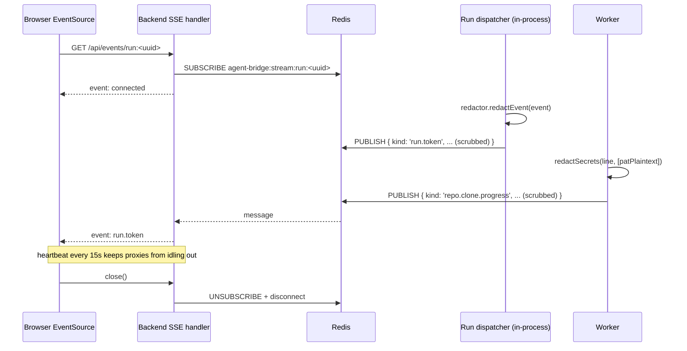

# Agent Bridge — Architecture

## 1. High-level map

```mermaid
flowchart LR
  subgraph Browser["Browser (Vite + React 19 + React Flow)"]
    UI[Agent canvas, chat, logs]
  end

  subgraph Backend["apps/backend (Hono)"]
    API[[REST API]]
    SSE[[SSE /api/events/:streamId]]
  end

  subgraph Worker["apps/worker (BullMQ)"]
    PING[ping job]
    CLONE[clone-repo job]
    IDX[index-repo job]
    WIKI[generate-wiki job]
  end

  subgraph Dispatcher["apps/backend/lib/run-dispatcher (in-process)"]
    RUN[agent.stream&nbsp;➜&nbsp;SSE + run_events]
  end

  subgraph Shared["packages/shared (subpath exports)"]
    Paths[./paths]
    Crypto[./crypto]
    Spawn[./spawn]
    GitN[./gitnexus]
    Bus[./event-bus]
    Events[./events, ./redact, ./secrets-dto]
  end

  subgraph DB["packages/db (Drizzle + Postgres)"]
    Schema[(pgvector)]
  end

  subgraph Infra["docker-compose.yml"]
    Redis[(Redis 8)]
    PG[(Postgres 17 + pgvector)]
  end

  subgraph DataRoot[".agent-bridge-data/ (isolation boundary)"]
    WS[workspace/&lt;agent&gt;/&lt;repo&gt;]
    GNH[gitnexus-home/ — fake HOME]
    Blobs[blobs/]
    Key[secret.key (0600)]
  end

  subgraph External["External MCPs (sandboxed)"]
    Notion[Notion MCP]
    DD[Datadog MCP]
    GitNexusMCP[gitnexus mcp — one per agent, multiplexed across repos]
  end

  UI -->|REST| API
  UI -->|EventSource| SSE
  API -->|enqueue| Redis
  Worker -->|dequeue| Redis
  Worker -->|publish RunEvent| Redis
  API -->|publish RunEvent| Redis
  Backend -->|subscribe| Redis
  API --> Dispatcher
  Dispatcher --> DB
  Dispatcher -->|spawnSandboxed| GitNexusMCP
  API --> DB
  Worker --> DB
  Worker --> Shared
  Backend --> Shared
  Worker -->|spawnSandboxed| GitN
  Worker -->|spawnSandboxed| External
  Worker --> DataRoot
  GitN --> DataRoot
```

## 2. Components

### 2.1 `apps/frontend` (React 19 + Vite + React Flow)

Railway-style node-based canvas: agents, attached skills, tools, repos, MCP
connections are all nodes; edges carry relationships (e.g. repo→repo with a
one-word connector + description).

Only imports from `@agent-bridge/shared` at the **browser-safe root entry** —
subpath exports like `@agent-bridge/shared/crypto` will break the Vite build
by design.

### 2.2 `apps/backend` (Hono + @hono/node-server)

- CRUD API over `@agent-bridge/db`
- SSE endpoint tails per-stream events from Redis pub/sub
- Never returns decrypted secret plaintext — responses carry `SecretSentinel`
  values only
- Before publishing any event, routes it through a per-run
  `RunRedactor` (bound to `BuiltAgent.secrets`) which scrubs every
  string leaf. Same redactor is used for the audit write and for
  terminal columns (`runs.error_message`, `runs.output_summary`), so
  SSE, Redis, and `run_events` always see the same masked payload.

### 2.3 `apps/worker` (BullMQ)

Boot sequence (deliberate, fail-fast):

1. `ensureDataDirs()` — 0700 dir layout under `.agent-bridge-data/`
2. `loadOrCreateMasterKey()` — validate or generate `secret.key`
3. `assertExpectedGitnexusVersion()` — refuse to run on a drifted version
4. Register BullMQ `Worker` per queue
5. Install signal handlers (clean drain on SIGINT/SIGTERM)

Jobs are stateless and idempotent (use `attempts: 3, backoff: exponential`).
Every long-running child process is spawned via `spawnSandboxed()` so
nothing escapes the data root.

### 2.4 `apps/mcp-bridge` (Phase 5)

MCP server (stdio + optional HTTP) that exposes **bridge tools** (see §8) to
Cursor / Claude Code. Phase 5 ships a 1:1 mapping — one bridge tool per
agent (`query_<agent_slug>`), derived from the `agents` row at runtime. A
later phase replaces this with the multi-tool `bridge_tools` table (see §8.3
and `docs/PLAN.md` Phase 7).

#### 2.4.1 Bridge session = one Mastra thread

The bridge mints **one `threadId` at process start** (`BRIDGE_THREAD_ID =
randomUUID()` in `apps/mcp-bridge/src/index.ts`) and reuses it on every
`dispatchRun(...)` call for the lifetime of the subprocess.

Why this exists: pre-fix, every IDE tool call minted a fresh runId AND used
it as the threadId, so each call landed in its own brand-new Mastra thread.
That works for stateless one-shot automations ("summarize this URL") but
breaks chat-style usage — a follow-up like *"what about the migration?"*
had no in-thread history of the previous turn, so recent-message replay,
per-thread working memory, and per-thread semantic recall all came up
empty on every call. The agent appeared amnesiac between consecutive IDE
messages even though the user thought they were having one conversation.

Pinning the threadId per bridge process restores the chat-style mental
model:

- **Same IDE session** (one bridge subprocess) → all tool calls share one
  thread → continuous history.
- **Restart IDE / reload MCP server** → bridge subprocess respawns →
  fresh threadId.

Limitations we accept for v1:

- **Multi-tab bleed.** MCP doesn't expose per-chat-tab context to the
  bridge — Cursor with two simultaneous chat tabs sends both tabs'
  messages through the same stdio pipe, so they end up in one thread.
  Workaround for users: restart the IDE / reload the MCP server when
  they want a fresh slate. Future fix: optional `conversationId` field
  on the bridge tool's input schema (Layer 2), where a capable IDE LLM
  mints and passes a per-tab id.
- **No idle auto-rotation.** If the user comes back to the same IDE
  session after hours, prior context is still loaded. Same workaround
  (manual reload). Time-based rotation was scoped but deferred.
- **Per-tab semantic isolation requires per-agent scope.** Because all
  IDE calls land in one thread, "per thread" working-memory + semantic
  recall scope effectively scopes to "this IDE session only." For agents
  that should remember across IDE restarts / chat tabs, pick "per agent"
  scope (cross-thread, persists across every web chat + IDE call).

The dispatcher's existing `resolveMemoryIds` already honored an explicit
`threadId` input (`packages/agents/src/run-dispatcher.ts:716` —
`mastraThreadId: input.threadId ?? input.runId`); the bridge fix is a
five-line plumbing change (`threadId: BRIDGE_THREAD_ID` on the dispatch
call). No DB schema change.

### 2.5 `packages/shared`

Two worlds under one package, separated by `exports`:

| Subpath       | Runtime        | Purpose                                              |
| ------------- | -------------- | ---------------------------------------------------- |
| `.` (default) | browser + node | Zod schemas, DTOs, `redactSecrets`, `RunEvent` types |
| `./env`       | node           | `.env` loader + schema validator                     |
| `./paths`     | node           | `resolveDataDir`, `ensureDataDirs`                   |
| `./crypto`    | node           | AES-256-GCM envelopes + master key                   |
| `./spawn`     | node           | `spawnSandboxed` (HOME clamp, git flags)             |
| `./gitnexus`  | node           | Pinned CLI resolver + `runGitnexus`                  |
| `./event-bus` | node           | Redis pub/sub `RunEvent` bus                         |

### 2.6 `packages/db`

Drizzle schema + generated migrations. Used by backend (reads/writes) and
worker (writes job progress + run_events audit rows). Migrations committed to
git; `pnpm db:generate` diffs `schema.ts` and writes a new SQL migration.

Lives in Postgres schema `public.*`. Mastra's auto-created tables live in a
separate `mastra.*` schema — see §7 for the ownership split and why the two
schemas never mix.

### 2.7 `packages/agents` (Phase 1+)

Mastra agent builder: takes DB rows (agent, skills, tools, repos, MCP
connections, memory config) and returns a runnable `Agent` instance. The only
place in the repo that imports `mastra`, `@mastra/memory`, `@mastra/pg`, etc.
— every other workspace sees a pure `Agent` / `RunResult` interface. This
keeps the Mastra boundary explicit and swappable.

## 3. Isolation guarantees (must not regress)

Every runtime write the app makes lives under **one** path, the
**data root**:

```
<repo>/.agent-bridge-data/
  workspace/           # cloned user repos
  gitnexus-home/       # fake HOME for GitNexus + git (registry, config, cache)
  blobs/               # generated wikis, graph JSON, chunked content
  secret.key           # 32-byte AES-256-GCM master key, mode 0600
```

**Hardening invariants.** If any of these regress, an end-user will start
seeing files appear in `~/.gitconfig`, `~/.gitnexus/`, or worse.

| Invariant                                                            | Enforced by                                                                |
| -------------------------------------------------------------------- | -------------------------------------------------------------------------- |
| No runtime write outside the data root                               | `@agent-bridge/shared/paths`                                               |
| Every `gitnexus` / `git` / user MCP spawn has `HOME` clamped         | `spawnSandboxed()`                                                         |
| Git never reads the user's global config or prompts interactively    | `spawn: 'git'` sets `GIT_CONFIG_GLOBAL=/dev/null`, `GIT_TERMINAL_PROMPT=0` |
| GitNexus version drift is caught at boot, not at indexing time       | `assertExpectedGitnexusVersion()` in worker                                |
| `npx gitnexus@latest` is never called                                | `runGitnexus()` resolves via `createRequire`                               |
| `SSH_AUTH_SOCK`, `GPG_AGENT_INFO` are stripped from spawned children | `spawnSandboxed()`                                                         |
| Browser bundles never pull in Node-only code (crypto, spawn, etc.)   | `exports` map subpath split                                                |
| No ambient `process.env` usage — everything goes through Zod schemas | `@agent-bridge/shared/env`                                                 |
| Engine mismatch (Node version) fails loudly                          | `.npmrc` `engine-strict=true` + root `engines.node` + `.nvmrc`             |

**HOME clamp patterns for user-configured MCPs (Phase 4).** `spawnSandboxed`
supports three postures. Only the first two are exposed in the UI:

| Posture                        | When                                                       | What the child sees                                                                                                     |
| ------------------------------ | ---------------------------------------------------------- | ----------------------------------------------------------------------------------------------------------------------- |
| **Clamped (default)**          | Every first-party spawn (gitnexus, git, MCPs)              | `HOME=<data-root>/gitnexus-home`, XDG dirs redirected, auth sockets stripped                                            |
| **Real HOME opt-in**           | stdio MCPs that need user CLI auth (`gh`, `aws`, `gcloud`) | `HOME` untouched, SSH/GPG sockets still stripped                                                                        |
| **Partial HOME (unsupported)** | "Share `~/.config/foo` but nothing else"                   | Not implemented. If a future MCP needs this, design it as a bind mount — don't half-implement by whitelisting XDG dirs. |

The real-HOME opt-in is a per-connection boolean
(`mcp_connections.allow_host_home`) and the UI surfaces it behind a
"Show advanced" toggle on stdio connections only, with an explicit warning
on the trade-off. http/sse transports have no subprocess; the DTO rejects
`allow_host_home: true` on them outright.

## 4. Secrets at rest

Every user-supplied secret flows through the same pipe:

```
UI input  →  backend validates SecretInput DTO  →  encryptSecret()  →  DB row (v1.iv.tag.ct)
                                                                          │
                                                                          ▼
                                               SSE stream  ←  redactSecrets(event, [plaintextsForRun])
                                                                          ▲
                                          run-time only  ←  decryptSecret() in worker (memory-only)
```

- **Envelope**: `v1.<iv:b64url>.<tag:b64url>.<ct:b64url>`
- **Algorithm**: AES-256-GCM, 12-byte IV, 16-byte tag
- **Key location**: `<data-root>/secret.key` (mode 0600), or
  `AGENT_BRIDGE_SECRET_KEY` env override (base64url-encoded 32 bytes)
- **API responses**: never include plaintext. `SecretSentinel = {set: true}`
  (no length — computing it would force N-decrypts per list read and narrow an
  attacker's guess space if the UI were screen-recorded)
- **Logs + SSE + audit**: last-line-of-defence `redactSecrets()` /
  `redactMany()` replaces any known plaintext substring with `«redacted»`
  at the publish boundary — `run-dispatcher.ts` binds a per-run
  `RunRedactor` from `BuiltAgent.secrets` and routes every outgoing
  event through it BEFORE `eventBus.publish(...)` AND
  `runsRepo.appendEvent(...)`. Same treatment for terminal strings
  (`runs.error_message`, `runs.output_summary`). The clone-repo worker
  applies the same pattern to PAT plaintexts on stderr lines. Since
  SSE and `run_events` fan out from the same scrubbed payload, they
  cannot drift.

Losing `secret.key` means every encrypted row becomes unrecoverable — back it
up if you care about portability across machines.

## 5. Event bus + SSE pipeline



Two producers, one bus: the **run dispatcher** runs inside the backend
process (LLM streaming doesn't serialise cleanly across a queue) and the
**BullMQ worker** runs long-lived clone/index/wiki jobs. Both publish
`RunEvent`s onto the same Redis channel namespace (`run:<uuid>` for
agent runs, `repo:<uuid>` for repo jobs) so the SSE handler treats them
uniformly. The `RunEvent` type is shared via `@agent-bridge/shared` so
producer and consumer cannot drift. The bus is a thin wrapper around
ioredis pub/sub — one subscriber connection per SSE client.

`run.token` is a live-only frame: high-frequency, never written to
`run_events`. The dispatcher's `TokenBatcher` (200 ms window) aggregates
tokens into `run.token.batch` rows in the audit log, so a late subscriber
can fetch a compact history without replaying thousands of token deltas.

**Per-agent fan-out (Activity panel).** Every dispatcher event is published
to TWO channels: the per-run channel `run:<runId>` (chat panel subscribes
here) AND a per-agent channel `agent:<agentId>` (right-rail Activity
panel subscribes here). Same scrubbed payload, different `streamId`.
The audit row in `run_events` is written ONCE — keyed by `runId` — so
the agent stream is a derived broadcast, not a second source of truth.
This lets the Activity tab render a continuous timeline across many
runs (chat turns, IDE-bridge calls, …) for the focused agent without
having to track individual run ids. Helper: `agentStreamId(agentId)` in
`@agent-bridge/shared/events`. Repo-job events (clone/index/wiki) are
NOT yet fanned to the agent stream — they remain on `repo:<repoId>`
because a repo can attach to multiple agents and per-target fan-out
needs an attachment-aware publish path; future work.

## 6. Process + deployment topology

Local dev (`pnpm dev`):

- `docker compose` → Redis + Postgres on loopback
- `apps/frontend` → Vite dev server on `:5173`
- `apps/backend` → Hono on `:3001`
- `apps/worker` → BullMQ worker(s)
- `packages/*` → `tsc --watch` (for type freshness)

Production (future): same four processes, Redis + Postgres managed. MCP
bridge runs alongside backend if IDE-facing is enabled.

### 6.1 BuiltAgent cache (cross-run subprocess persistence)

`packages/agents/src/built-agent-cache.ts` is a process-level cache,
keyed by `agentId`, that holds `BuiltAgent` instances — including their
mounted MCP subprocesses — across runs. Without it, every chat turn
re-spawned the gitnexus MCP + every external MCP, paid the
`initialize` + `tools/list` round-trip on each, and tore them down
again. On a Notion-attached agent that's 4–6 seconds of cold start
before the LLM sees a one-word prompt.

Mirrors how IDE-side MCP clients (Cursor, Claude Code, Claude Desktop)
behave: spawn the MCP server once at session start, reuse it for
every subsequent `tools/call`. The MCP spec is designed for long-lived
JSON-RPC; treating it as ephemeral was the mismatch.

| Property              | Behaviour                                                                                                                                                                                                            |
| --------------------- | -------------------------------------------------------------------------------------------------------------------------------------------------------------------------------------------------------------------- |
| Key                   | `agentId`. One cached `BuiltAgent` per agent.                                                                                                                                                                        |
| Invalidation          | Content hash over `MAX(updated_at)` across `agents`, `skills`, `tools`, `agent_repos`, `repos` (referenced via attachments — repo-status changes drive gitnexus mount), `repo_edges`, `agent_mcp_tools`, `mcp_connections` (referenced via allowlist), and the agent's `llm_provider`. Recomputed every `getOrBuild`; mismatch → tear down + rebuild. |
| In-flight de-dup      | Two concurrent `getOrBuild`s for the same agent share one build promise. Otherwise a chat-tool-call burst could spawn N parallel Notion subprocesses for the same agent.                                             |
| Eviction              | LRU bounded by `MAX_ENTRIES = 8`; idle entries past `TTL_MS = 30 min` dropped on access.                                                                                                                             |
| Process exit          | Backend's graceful shutdown (`server.ts`) and mcp-bridge's stdio-close handler both call `builtAgentCache.dispose()` so MCP subprocesses don't outlive the parent.                                                   |
| Secrets in memory     | Each cached entry carries decrypted plaintexts (`BuiltAgent.secrets`) for its lifetime. Same trust boundary as the master key file on disk; flagged here because the lifetime is now longer than a single dispatch. |

The dispatcher (`run-dispatcher.ts`) calls
`builtAgentCache.getOrBuild(...)` instead of `buildAgent(...)`, and
deliberately **does not** call `built.disconnect()` in its `finally`
block — disconnect now happens at eviction or process shutdown. Both
the backend and mcp-bridge run their own copy of the cache singleton
(it's a module-level instance in `packages/agents`); a single physical
MCP subprocess belongs to exactly one process.

## 7. Mastra ownership model

Agent Bridge wraps Mastra — it does not re-implement it. The repo has one
**boundary module** (`packages/agents`) that speaks Mastra, and three buckets
of responsibility:

### 7.1 Bucket 1 — Mastra owns the storage

When `@mastra/pg`'s `PostgresStore` is constructed with `schemaName: 'mastra'`
(Phase 3 wiring), Mastra auto-creates and migrates these tables. We **never**
design our own versions:

| Mastra table               | What it stores                                          |
| -------------------------- | ------------------------------------------------------- |
| `mastra.threads`           | Conversation threads (one per agent × user × session)   |
| `mastra.messages`          | Individual messages with role, content, metadata        |
| `mastra.resources`         | Per-`resourceId` working memory (persists cross-thread) |
| `mastra.workflow_snapshot` | Suspend/resume state for long-running workflows         |
| `mastra.evals`             | Eval run results                                        |
| `mastra.traces`            | OpenTelemetry spans (tool calls, LLM calls, timings)    |
| `mastra.scorers`           | Scorer outputs                                          |

`drizzle-kit` runs only against `public.*`. Mastra's migrations run on its
own schedule the first time `PostgresStore.init()` is called at boot. The
two migration runners never see each other's tables.

### 7.2 Bucket 2 — We store, Mastra consumes

Some rows on **our** tables carry config that gets piped straight into Mastra
at runtime. For these, the field shapes **must match Mastra's API exactly** —
drift is a runtime error, not a type error:

| Our column                  | Mastra consumer              |
| --------------------------- | ---------------------------- |
| `agents.memory_config`      | `new Memory({ options: … })` |
| `tools.config_json` (later) | `createTool({ … })` inputs   |

See `AgentMemoryConfig` in `@agent-bridge/shared/domain` — docstring calls
out the anti-drift rule explicitly.

### 7.3 Bucket 3 — We own it entirely

Everything else. Mastra has no opinion or schema here, so we design freely:

| Our concept                          | Why Mastra has no schema                      |
| ------------------------------------ | --------------------------------------------- |
| `agents` (row), `skills`, `tools`    | Mastra agents + tools are code, not data      |
| `repos`, `agent_repos`, `repo_edges` | Mastra has no notion of attached codebases    |
| `mcp_connections`, `agent_mcp_tools` | Mastra consumes MCP tools at runtime, not DB  |
| `llm_providers`                      | Mastra providers are instantiated, not stored |
| `runs`, `run_events`                 | UI-facing audit log; `mastra.traces` is OTel  |

**`runs` vs `mastra.traces`.** Both exist and that's deliberate. Our `runs`
carries UI semantics (`stream_id` for SSE, `input_prompt`, user-facing
status). `mastra.traces` carries low-level OTel spans. They coexist linked by
soft-FK columns on `runs` (`mastra_thread_id`, `mastra_resource_id`, added in
Phase 3g via `0003_runs_mastra_link.sql`). If Mastra's tracing is ever
disabled, our audit log still works.

The link is **soft** on purpose. Real Postgres FKs across schemas are legal
but would couple `drizzle-kit migrate` (public) to Mastra's auto-init at
boot (`mastra`). Mastra's schema is not versioned in this repo, so we keep
the columns as plain `text` and enforce the relationship at the application
layer — dispatcher writes the link while the run row is still `pending`;
chat-history joins tolerate orphan rows by rendering "history unavailable"
if Mastra has GC'd the thread. The columns are populated only when
`agents.memory_enabled = true`; memory-disabled runs leave them NULL so
the join domain stays accurate. A partial index on
`(mastra_thread_id, started_at) WHERE mastra_thread_id IS NOT NULL` keeps
the chat-replay query cheap without paying for the NULL rows that
dominate one-shot runs.

### 7.4 Rule of thumb

> If Mastra has a table for it → let Mastra own it (schema `mastra.*`).
> If Mastra's API consumes the config we store → match their shape exactly.
> If neither → we design it. No guessing.

This rule is enforced socially (this doc + `packages/agents` being the only
Mastra-importing module) rather than mechanically. A lint rule banning
`mastra*` imports outside `packages/agents` is worth adding in Phase 3.

## 8. Tools — two directions

"Tool" is an overloaded word in this codebase. It refers to two totally
different runtime objects, flowing in opposite directions through different
processes. Mixing them up (in code, DB, or a code review) is a category
error, so we name them explicitly:

```
┌───────────────────┐          ┌─────────────────┐          ┌─────────────────┐
│   Developer's     │          │   apps/mcp-     │          │  Agent Bridge   │
│   IDE coding      │◀──calls──│    bridge       │──invokes─│  Mastra agent   │
│   agent (Cursor,  │          │                 │          │  (packages/     │
│   Claude Code)    │          │  exposes        │          │   agents)       │
└───────────────────┘          │  BRIDGE TOOLS   │          │                 │
                               │  via MCP        │          │  picks up       │
                               └─────────────────┘          │  AGENT TOOLS    │
                                                            │  at runtime     │
                                                            └────────┬────────┘
                                                                     │ calls
                                                                     ▼
                                       ┌────────────────────────────────────────┐
                                       │  GitNexus MCP │ Notion MCP │ Datadog … │
                                       │  (one subproc │  native tools,         │
                                       │   per agent)  │  http/shell/custom     │
                                       └────────────────────────────────────────┘
```

### 8.1 Agent tools (inbound — the Mastra agent's toolbox)

What our Mastra agent picks up and calls while it's answering a question.
Fully modeled in the `public.*` schema today:

| Table             | Role                                                |
| ----------------- | --------------------------------------------------- |
| `tools`           | Native tools defined in code (http, shell, custom)  |
| `mcp_connections` | Registered MCP servers (Notion, Datadog, GitNexus…) |
| `agent_mcp_tools` | Per-agent allowlist into those MCP servers          |

`packages/agents` is the only place that reads these. At runtime it merges
them with Mastra built-ins and hands the combined set to `new Agent({ tools,
… })`. Users never see "agent tools" in the UI as a unified concept — they
see "Tools", "MCP Connections", etc. separately, because the authoring UX
differs per kind.

**Tool-name namespacing (Phase 4).** Two MCPs in the same agent can easily
both expose `search` or `query`. To keep the keys of `new Agent({ tools })`
unique — and give the LLM an unambiguous name to call — `mountExternalMcps`
auto-prefixes every external tool with the sanitised connection slug at
mount time: `notion__search`, `slack__search`. The raw upstream name stays
in `agent_mcp_tools.tool_name` (the allowlist is per-connection, so
`(mcp_connection_id, tool_name)` is already unique there). Gitnexus tools
come in pre-namespaced as `gitnexus_*` and pass through without a second
prefix. The picker UI previews the final prefixed name so what the
operator picks is what the LLM sees.

**Transport nuance.** `mcp_connections.transport` allows
`stdio | http | sse`, but the Mastra MCP SDK exposes only two wire shapes:
`StdioServerDefinition` and `HttpServerDefinition` (the latter
auto-negotiates Streamable-HTTP with SSE fallback internally). Our `'sse'`
value is therefore a **UI label hint**, not a distinct transport —
operators who know their shim only speaks SSE can still label it that way,
but the runtime routes http and sse through the same `HttpServerDefinition`.

**Single decrypt site.** For `mcp_connections.env_envelope` and
`headers_envelope`, exactly two files are allowed to call `decryptSecret`:
`apps/backend/src/lib/mcp-connections/discover.ts` (the test endpoint)
and `packages/agents/src/mcp/external-mcps.ts` (runtime mount). Every
decrypted value (≥4 chars) is appended to `BuiltAgent.secrets` so the
Phase 3f run-redactor scrubs it from every SSE frame + `run_events` row.

**Authentication kinds (Phase 4H).** `mcp_connections.auth_kind`
discriminates three wire-level behaviors:

| `auth_kind` | Transport | Meaning                                                                                                                                                                                             |
| ----------- | --------- | --------------------------------------------------------------------------------------------------------------------------------------------------------------------------------------------------- |
| `none`      | any       | No upstream credential; the probe connects anonymously. stdio rows always land here.                                                                                                                |
| `headers`   | http/sse  | Static `Authorization: Bearer …` / API-key headers, encrypted in `headers_envelope`. Same code path as pre-Phase-4H HTTP MCPs.                                                                      |
| `oauth`     | http/sse  | OAuth 2.1 authorization-code + PKCE via Mastra's `MCPOAuthClientProvider`. Tokens persist in `mcp_oauth_state` (one row per scope key, encrypted via the same envelope format as the other fields). |

OAuth is first-class — there is no `mcp-remote` subprocess, no
ephemeral callback port, no browser-polled stderr. The flow is:

1. `POST /api/mcp-connections/:id/test` kicks off the probe. If
   tokens are cached the probe `listToolsets()` synchronously. If
   not, Mastra's provider emits an authorize URL; the dispatcher
   parks a `TestSessionRegistry` entry keyed by `connection_id` and
   returns `{ code: 'authorize_required', sessionId, authorizeUrl }`.
2. The UI opens `authorizeUrl` in a new tab (the upstream consent
   screen) and starts long-polling `/api/mcp-connections/:id/test/poll`.
3. After approval the user's browser lands on
   `GET /oauth/mcp/:connectionId/callback?code&state`. The handler
   validates `state` against the session (CSRF guard), hands the
   `code` to `auth()` via the same `MCPOAuthClientProvider` +
   `DrizzleOAuthStorage`, then runs `listToolsets()` and flips the
   session to `ok` (or `failed`).
4. The polling UI wakes up on that flip and renders the tool list.

The callback URL is pinned to
`http://localhost:${BACKEND_PORT}/oauth/mcp/:connectionId/callback`
and is registered with the upstream as part of dynamic client
registration — it must match byte-for-byte on every round-trip, so
operators who re-bind the backend to a non-default port must also
re-create the MCP connection so registration repeats. `mcp-remote`
remains an escape-hatch for legacy/stdio-only servers but is no
longer the recommended path for anything that speaks the MCP auth
spec.

### 8.2 Bridge tools (outbound — what the IDE sees)

What `apps/mcp-bridge` exposes to Cursor / Claude Code over MCP. When a
developer types `@query_frontend_helper "why does login fail?"` in the IDE,
this is the tool that handles the request by kicking off a run against one
of our agents and streaming the answer back.

**Phase 5 model — 1:1 agent → bridge tool.** Ships the IDE integration end
to end with zero new schema: each `agents` row derives one bridge tool at
runtime (name = `query_<agent.slug>`, description = `agents.description`).
Per-call audit lands in `runs` + `run_events` with `stream_id` prefixed
`bridge:` so the UI can distinguish IDE-originated runs from UI chat runs.
The `query_` prefix is **reserved** for these auto-derived defaults —
Phase 7 explicit tools cannot use it.

**Phase 7 upgrade — 1:N agent → bridge tools.** Introduces a
`bridge_tools` table so an operator can author several curated tools per
agent (`ask_architecture`, `explain_module`, `find_tests_for`, …) each with
its own input schema + prompt template. Non-breaking migration: when the
table is empty for an agent, fall back to the Phase 5 default tool. Phase 7
also adds `runs.bridge_tool_name text` (nullable) so the UI can say which
explicit tool a run was invoked from — Phase 5 rows stay `NULL`. A DB CHECK
constraint enforces the reserved-prefix rule (`name NOT LIKE 'query\_%'`).
See `docs/PLAN.md` Phase 7 for the full migration.

### 8.3 Rule of thumb

> **Agent tools** live inside our Mastra agent's context.
> **Bridge tools** live inside the IDE's MCP client.
> They never share a table, a type, or a variable name. If a function needs
> to touch both, split it in two.

Type naming convention enforced by code review: agent-side types live under
`@agent-bridge/shared/domain` prefixed `Tool*` / `Mcp*`; bridge-side types
(added in Phase 5) live under the same module prefixed `BridgeTool*`.

## 9. Frontend architecture (`apps/frontend`)

### 9.1 Information architecture

The IA mirrors a modern VPS / cloud-platform console (DigitalOcean,
Vercel, Render). Two clusters of routes:

- **`/agents/*`** — *services you've built* (DO's Droplets / Apps).
- **`/library/*`** — *raw materials you've registered with the platform*
  (DO's account-level inventory): LLM providers, repos, MCP connections.

Plus three top-level utilities: `/` (home / onboarding), `/bridge`
(platform-wide live dashboard), and `/settings`.

The split keeps the user oriented: they always know whether they're
configuring a *service* (`/agents/<id>/build`) or curating an
*ingredient* (`/library/providers/<id>`). The sidebar groups routes
under `NAVIGATE`, `LIBRARY`, `SYSTEM` so this mental model stays visible.

```
/                                Home (overview / onboarding)
/agents                          All agents — list view
/agents/:id                      Agent detail (default tab: Build)
/agents/:id/chat                 Chat tab — ask the agent questions
/agents/:id/memory               Memory tab — long-term facts
/agents/:id/tools                Bridge tools tab — authored fns
/agents/:id/logs                 Logs tab — all agent activity
/agents/:id/bridge               Per-agent IDE snippet + run history
                                 (`/test` is kept as alias → `/chat`)
/library                         Library home (redirects to providers)
/library/providers               LLM providers — list
/library/providers/:id           LLM provider detail
/library/repos                   Repositories — list
/library/repos/:id               Repo detail (clone/index/wiki/graph)
/library/mcp                     MCP connections — list
/library/mcp/:id                 MCP connection detail
/bridge                          Cross-agent IDE bridge dashboard
/settings                        Master key, data root, theme
```

**Why no node-graph canvas as a primary surface.** The user spends 95%
of their time in *forms* (system prompts, model picker, MCP allowlist,
bridge tool authoring) and *streams* (chat tokens, run logs, repo-job
progress). A canvas optimises for *relationships*; this app optimises
for *configuration + observation*. Each agent's resources are surfaced
as structured sections on its Build page — the list IS the graph.

The repo knowledge-graph modal (`features/repo-graph/`) keeps React
Flow + dagre because it renders gitnexus's actual graph output. It is
code-split via `lazy()` so the dep cost is paid only on demand.

### 9.2 File layout

```
apps/frontend/src/
  app/                    # routes + per-route layouts
    layout.tsx            # shell: sidebar + topbar + page slot
    home/page.tsx
    agents/
      page.tsx            # /agents
      [id]/
        page.tsx          # tab dispatcher (build/chat/memory/tools/bridge/logs)
        bridge/page.tsx
        test/             # legacy alias → chat
    library/
      _chrome/            # shared library shell
      providers/{page.tsx, [id]/page.tsx}
      repos/{page.tsx, [id]/page.tsx}
      mcp/{page.tsx, [id]/page.tsx}
    bridge/page.tsx
    settings/page.tsx
    oauth/                # MCP OAuth callback page
    _chrome/              # nav-rail, top-bar, page-header, stub-page
    _dev/                 # /__ui primitive preview

  ui/                     # design system primitives (no business logic)
    button, dropdown, dialog, sheet, tabs, pill, toast,
    tooltip, command-palette, context-menu, row-menu,
    brand-glyph, bridge-row, markdown, empty, icons, …

  features/               # composite, business-aware components
    onboarding/                  # first-run checklist + dashboard hero
    agent-builder/               # Build tab — identity, prompt, model,
                                 # repos, tools, MCP allowlist
    agent-test/                  # Chat tab — chat, tool-call card,
                                 # mention popover, activity rail
    agent-memory/                # Memory tab
    agent-tools/                 # Tools tab — bridge tool authoring
    agent-bridge/                # Bridge tab — IDE snippet + runs
    agent-bridge-tools/          # Bridge tool listing inside agent
    agent-logs/                  # Logs tab — streaming run history
    library/                     # provider/repo/mcp rows + editors
    repo-graph/                  # graph-modal.tsx + graph-flow-node.tsx
    bridge-dashboard/            # /bridge — cross-agent runs + config
    settings/                    # master-key + data-root cards

  lib/                    # RPC, hooks, contexts, router
    rpc/                  # Hono RPC client wrapping every backend route
    workspace-context/    # split contexts: agents, library, bridge
    workspace-provider/   # mounts the contexts that the route needs
    agents-context/, library-context/, bridge-context/
    sse/                  # SSEProvider — multiplexed per streamId
    use-sse/              # subscribe-by-streamId hook
    use-chat/             # streaming chat hook (Mastra runs)
    router/               # 60-line history-API router + matchers
    link/                 # <Link> with prefetch-on-hover
    layout/               # shared layout helpers
    theme/                # data-theme attribute manager
    use-default-provider, use-dirty-close,
    use-drag-reorder, use-sidebar-state,
    agent-helpers

  styles/
    tokens.css            # CSS custom properties (dark + light)
    reset.css             # base typography + body atmosphere
    primitives.css        # field/button/banner/overlay scaffolding
    shell.css             # sidebar/topbar/page-header + feature styles
    react-flow.css        # graph-modal overrides
    index.css             # cascade entry

  main.tsx                # mounts <AppLayout /> with the cascade entry
```

### 9.3 Visual identity (steady-state)

**Aesthetic** — modern resource-management dashboard. Closest analogs:
DigitalOcean (the mental model maps 1:1: Droplet ↔ agent, attached
database ↔ attached repo, attached volume ↔ MCP connection, SSH
keys ↔ LLM providers), Vercel, Render, Linear (for tone), Resend
(for friendly rounding).

Recurring motifs:

- **Generous rounded corners** — cards `--radius-lg` (14 px), modals /
  hero panels `--radius-xl` (18 px), inputs/buttons `--radius` (10 px),
  pills full. The eye should never hit a hard 90° corner.
- **Soft atmosphere** — `body` carries `var(--atmosphere)`, a layered
  violet+sky radial-gradient with `background-attachment: fixed`. Do
  not delete it; it is the single biggest warmth signal.
- **One confident accent** — `--accent-500: #8b5cf6` is the only
  "click me" colour. Primary buttons may use a subtle
  `--accent-500 → --accent-400` gradient.
- **Phosphor pulse** (soft mint dot) is reserved for connected /
  streaming status only — never on buttons or cards. Aliased to
  `--success` in tokens.css; semantics: "this is live right now".
- **Hairlines + soft shadows together.** Cards have a 1 px
  `--border` rule AND a `--shadow-1` lift.

Explicit non-goals: crosshair corner markers, display serif fonts
(Fraunces), italic hero copy, two-tone display titles, mono on UI
labels / eyebrows / body copy, coordinate badges outside log/run tables.

**Typography.** ONE proportional sans (Inter) for everything. Mono
(JetBrains Mono) only for code, slugs, file paths, model ids, hashes,
and tabular numerals in run-history. Type scale lives in `tokens.css`
as `--fs-xs` (11) … `--fs-3xl` (32).

**Tokens.** Both dark and light themes are first-class; values flip
via `[data-theme]` on `<html>` with `prefers-color-scheme` as the
fallback. A 7-line bootstrap script in `index.html` reads
`localStorage['ab.theme']` BEFORE React hydrates so there's no flash.
Settings exposes a 3-way toggle (System / Light / Dark) — picking
System clears the override and restores the media-query fallback.

**Token contracts (enforced in code review):**

- Never hardcode a colour literal in component CSS — every value goes
  through a token. No `#fff`, no `rgba(...)` outside `tokens.css`.
- Pick by intent, not hue: `--text-dim` not `--gray-300`.
- Hairlines, glows, and shadows are theme-aware — go through the
  token (`--border`, `--shadow-1`, `--shadow-glow`).
- Inline SVG uses `currentColor` so glyphs invert cleanly.

### 9.4 Cross-cutting decisions

**Routing.** Custom history-API router (`lib/router/`, ~60 LOC).
Matchers: `matchAgentDetail` (returns `{id, tab?}` for `/agents/:id/:tab`),
`matchLibraryDetail`, `matchBridge`. `<Link>` does prefetch-on-hover.
No React Router — the dynamic surface is too small to justify the dep.

**State / data fetching.** Three split providers, mounted on demand by
`workspace-provider` based on the active route:

- `AgentsProvider` — agents list + per-agent resources. Mounted under
  `/agents/*` and `/`.
- `LibraryProvider` — providers + repos + mcps. Mounted under
  `/library/*` and `/agents/*` (attach pickers need it).
- `BridgeProvider` — bridge config + run history. Mounted under
  `/bridge` and `/agents/:id/bridge`.

Each exposes read state + mutators; SWR-style "fetch on mount, mutate
locally, refetch on focus". No external query layer.

**SSE.** Centralised in `SSEProvider` that multiplexes by `streamId`
(browsers cap at 6 concurrent EventSources per origin). Consumers
subscribe via `useStream(streamId)`; the provider ref-counts and
closes the connection at zero subscribers.

**Theming.** See §9.3 — tokens on `:root` (dark) and `[data-theme='light']`,
plus a `@media (prefers-color-scheme: light)` block that re-declares
the light values *only when no dataset attribute is set*. Explicit
user choice always wins.

**Accessibility floor.** Every interactive element keyboard-reachable.
`aria-current="page"` on the active nav. Modal traps focus and
restores it. Form errors linked via `aria-describedby`. Skip-to-content
link in the shell. `@media (prefers-reduced-motion: reduce)` cuts every
transition to 0 ms and disables the live phosphor pulse.

### 9.5 No browser-native UI

OS-level chrome (`alert()` / `confirm()` / native `<select>` /
`title=""` tooltips) shatters the design language the moment it opens.
Every native overlay or chooser is replaced by a custom primitive in
`ui/`:

| Native API           | Custom replacement                       |
| -------------------- | ---------------------------------------- |
| `window.alert(msg)`  | `toast.error(msg)` from `ui/toast-store` |
| `window.confirm(msg)`| `confirmDialog(...)` from `ui/dialog-store` |
| `window.prompt(msg)` | `Sheet` or `Dialog` primitive             |
| `<select>`           | `Dropdown` primitive (`ui/dropdown`)      |
| `title=""` tooltip   | `Tooltip` primitive (`ui/tooltip`, portalled to `document.body` to escape backdrop-filter containing blocks) |
| Native context menu  | `ContextMenu` primitive                   |
| Default scrollbars   | Themed scrollbars in `primitives.css`     |

**Lint enforcement** — `apps/frontend/eslint.config.js` has
`no-restricted-globals` blocking `alert` / `confirm` / `prompt` and
`no-restricted-syntax` blocking JSX `<select>`. The rule is disabled
under `src/ui/**` so the primitives can use the hidden shims.

### 9.6 No inline styles for static values

Static / theme-token-derived styling lives in CSS classes. Inline
`style={{...}}` is allowed only when:

1. The value depends on a runtime measurement
   (`getBoundingClientRect`, mouse coords, drag transforms).
2. It's a single dynamic prop pass-through (`<Dialog maxWidth={n}>`).
3. The value is genuinely per-instance and a class-based variant
   would explode (e.g. dragged item's transform during a drag).

Not enforced by lint (false-positive rate is too high) — enforced in
code review.

### 9.7 Save / success / failure feedback

A consistent feedback pattern, applied everywhere:

| Outcome                          | Mechanism                              |
| -------------------------------- | -------------------------------------- |
| Transient success / copy / test  | `toast.success(msg)`                   |
| Transient failure (dismissable)  | `toast.error(msg)`                     |
| Persistent failure (demands fix) | `<StatusStrip kind='error'>` inline    |
| Long-running progress            | live SSE log lines + phosphor dot      |
| Catastrophic failure             | `confirmDialog(...)` with retry CTA    |

Components NEVER render an ad-hoc inline "saved!" line. The
`<ToastHost />` and `<DialogHost />` mount once in `app/layout.tsx`.

### 9.8 Build agent invariants

Long-form forms (Build tab — identity, model, prompt) auto-save with
800 ms debounce; the `SavedAgo` ticker shows "Saved 3s ago" / "Saved
5m ago". Side-sheet flows (`AttachMcpSheet`, `CreateAgentSheet`,
provider/repo/mcp editors) wrap their close handler in
`useDirtyClose` — an in-flight ref guard prevents double-confirm
races between the sheet's bubble-phase Esc handler and the dialog's
capture-phase one.

The dialog store (`ui/dialog-store.ts`) replaces `pending` with a
fresh array reference on resolve (NOT splice) so React's `Object.is`
check fires and the host re-renders. Mutating in place is a footgun
that previously left dialogs hanging.
