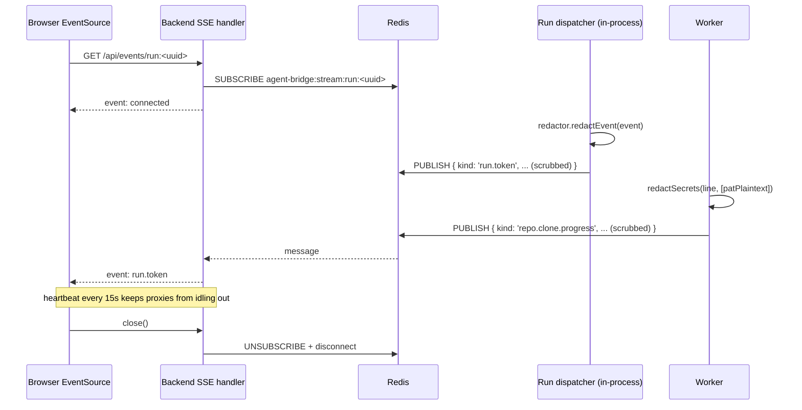

# Agent Bridge — Architecture

## Contents

- [0. What this is and how it fits together](#0-what-this-is-and-how-it-fits-together)
- [1. High-level map](#1-high-level-map)
- [2. Components](#2-components)
- [3. Isolation guarantees (must not regress)](#3-isolation-guarantees-must-not-regress)
- [4. Secrets at rest](#4-secrets-at-rest)
- [5. Event bus + SSE pipeline](#5-event-bus--sse-pipeline)
- [6. Process + deployment topology](#6-process--deployment-topology)
- [7. Mastra ownership model](#7-mastra-ownership-model)
- [8. Tools — two directions](#8-tools--two-directions)
- [9. Frontend architecture (`apps/frontend`)](#9-frontend-architecture-appsfrontend)
- [10. Wrapper-tool architecture (inspector toolkit)](#10-wrapper-tool-architecture-inspector-toolkit)
- [11. Operational subsystems](#11-operational-subsystems)
- [12. Knowledge files subsystem](#12-knowledge-files-subsystem)

## 0. What this is and how it fits together

Agent Bridge is a **local-first** dev tool. The operator runs it on
their machine; their IDE coding agent (Cursor, Claude Code, Codex)
calls into it over MCP to ask grounded questions about the operator's
multi-repo codebase. The agent that answers is itself an LLM with
access to a knowledge graph + embeddings of every repo the operator
attached, plus operator-curated edges between those repos.

Four processes make up a running system:

- **`apps/backend`** — Hono HTTP server. Owns every REST endpoint,
  the SSE event stream, and the in-process **run dispatcher** that
  drives `agent.stream(...)` for chat-tab and IDE-bridge calls. Reads
  + writes Postgres directly.
- **`apps/frontend`** — React 19 + Vite UI. Manages agents, repos,
  MCP connections, providers, skills. Subscribes to the SSE stream
  for chat / log live updates. Talks to the backend via Hono RPC
  (`hc<AppType>(baseUrl)`) — no codegen, fully typed.
- **`apps/worker`** — BullMQ worker. Runs four queues: `ping`,
  `clone-repo`, `index-repo`, `generate-wiki`. The backend enqueues;
  the worker spawns sandboxed `git` / `gitnexus` subprocesses and
  publishes progress events back through the same Redis bus.
- **`apps/mcp-bridge`** — stdio MCP server. The IDE spawns this as a
  subprocess (config block in Settings); it advertises one or two
  MCP tools per agent and routes calls through the same dispatcher
  the chat tab uses.

Three packages everyone shares:

- **`packages/shared`** — Zod DTOs, env helpers, crypto, paths,
  event-bus primitives, gitnexus types. Browser-safe at the root
  entry; subpath exports (`./crypto`, `./spawn`, ...) are Node-only.
- **`packages/db`** — Drizzle schema + repos + migrations.
- **`packages/agents`** — the **only** place allowed to import
  `@mastra/*`. Owns `buildAgent(...)`, the dispatcher, the inspector
  wrapper toolkit, and the external-MCP mount. Backend and bridge
  call into it; nothing in `apps/` touches Mastra directly.

What crosses between processes:

- **HTTP** — frontend ↔ backend (REST + SSE).
- **stdio** — IDE ↔ mcp-bridge.
- **Redis pub/sub** — backend ↔ worker (job queue + run-event bus).
- **Postgres** — backend, worker, mcp-bridge all read/write the same
  schemas.
- **Sandboxed subprocesses** — worker → `git` / `gitnexus`; backend's
  cached agent → `gitnexus` / external MCP servers.

### Glossary

- **Agent** — a row in the `agents` table. Has a system prompt,
  skills, attached repos, an LLM provider, optional inspector
  toolkit, optional MCP allowlist, optional bridge tools.
- **BuiltAgent** — the runtime materialization of an agent
  (`packages/agents/src/build-agent.ts`). Cached for 30 minutes per
  agentId; rebuilds on any agent/skill/tool/MCP/provider edit
  (version-hash drift).
- **Operator** — the human running Agent Bridge locally. Single user
  per install. Authors agents, attaches repos, configures providers.
- **Mastra** — the LLM-runtime + memory framework we wrap (chat
  history, working memory, semantic recall, tool execution, model
  abstraction). Lives in `packages/agents` and only there.
- **Wrapper / inspector wrapper** — one of six deterministic tools
  the inspector toolkit exposes to the agent's LLM
  (`find_in_codebase`, `trace_flow`, `assess_change_impact`,
  `debug_help`, `understand_module`, `list_repos`). Each wraps one
  or more `gitnexus_*` calls and returns a structured `CodebaseInspectionReport`.
- **CodebaseInspectionReport** — typed envelope returned by every wrapper invocation
  (`packages/agents/src/inspector/types.ts`). Carries ranked file
  hits, a graph subset, cross-repo relationships, a one-paragraph
  prose summary, and optional `resolved_repo` / `confidence` /
  `groundedness` per §10.4. Capped at 12k tokens.
- **RunEvent** — one row in `run_events` + one published Redis
  message per side-effect during a run (LLM call, tool call,
  gitnexus call, codebase inspection report built, error, finish). Source of the
  `/logs` timeline and the chat-tab tool-call cards.
- **Callsite** — provenance for a run: which surface invoked it
  (web chat / IDE bridge / smoke harness), which IDE + version (if
  bridge), which agent slug. Persisted in `runs.callsite_json`.
- **Run dispatcher** — `packages/agents/src/run-dispatcher.ts`. The
  one path that takes a built agent + an input message, calls
  `agent.stream(...)`, and translates Mastra's stream into
  `run_events` + Redis publishes + dispatcher return value.
- **Bridge tool** — operator-authored tool exposed to the IDE LLM
  through the bridge (`bridge_tools` table). Different surface from
  the agent's *internal* tools (inspector wrappers + external MCPs);
  see §8.

## 1. High-level map

```mermaid
flowchart LR
  subgraph Browser["Browser (Vite + React 19 + React Flow)"]
    UI[Agent canvas, chat, logs]
  end

  subgraph Backend["apps/backend (Hono)"]
    API[[REST API]]
    SSE[[SSE /api/events/:streamId]]
  end

  subgraph Worker["apps/worker (BullMQ)"]
    PING[ping job]
    CLONE[clone-repo job]
    IDX[index-repo job]
    WIKI[generate-wiki job]
  end

  subgraph Dispatcher["packages/agents/src/run-dispatcher (imported by backend, in-process)"]
    RUN[agent.stream&nbsp;➜&nbsp;SSE + run_events]
  end

  subgraph Shared["packages/shared (subpath exports)"]
    Paths[./paths]
    Crypto[./crypto]
    Spawn[./spawn]
    GitN[./gitnexus]
    Bus[./event-bus]
    Events[./events, ./redact, ./secrets-dto]
  end

  subgraph DB["packages/db (Drizzle + Postgres)"]
    Schema[(pgvector)]
  end

  subgraph Infra["docker-compose.yml"]
    Redis[(Redis 8)]
    PG[(Postgres 17 + pgvector)]
  end

  subgraph DataRoot[".agent-bridge-data/ (isolation boundary)"]
    WS[workspace/&lt;agent&gt;/&lt;repo&gt;]
    GNH[gitnexus-home/ — fake HOME]
    Blobs[blobs/]
    Key[secret.key (0600)]
  end

  subgraph External["External MCPs (sandboxed)"]
    Notion[Notion MCP]
    DD[Datadog MCP]
    GitNexusMCP[gitnexus mcp — one per agent, multiplexed across repos]
  end

  UI -->|REST| API
  UI -->|EventSource| SSE
  API -->|enqueue| Redis
  Worker -->|dequeue| Redis
  Worker -->|publish RunEvent| Redis
  API -->|publish RunEvent| Redis
  Backend -->|subscribe| Redis
  API --> Dispatcher
  Dispatcher --> DB
  Dispatcher -->|spawnSandboxed| GitNexusMCP
  API --> DB
  Worker --> DB
  Worker --> Shared
  Backend --> Shared
  Worker -->|spawnSandboxed| GitN
  Worker -->|spawnSandboxed| External
  Worker --> DataRoot
  GitN --> DataRoot
```

## 2. Components

### 2.1 `apps/frontend` (React 19 + Vite)

Tabbed UI per agent — Build, Memory, Logs, Chat — with side-sheet flows for
attaching repos, MCP connections, and skills. The information *is* a graph
(agents → repos → cross-repo relationships, agents → MCP connections → tools), but
the surface that exposes it is a list, not a canvas; see §9.1 for the
reasoning. React Flow is used only for the small repo-relationships visualisation
inside the Repos tab.

Only imports from `@agent-bridge/shared` at the **browser-safe root entry** —
subpath exports like `@agent-bridge/shared/crypto` will break the Vite build
by design.

### 2.2 `apps/backend` (Hono + @hono/node-server)

- CRUD API over `@agent-bridge/db`
- SSE endpoint tails per-stream events from Redis pub/sub
- Never returns decrypted secret plaintext — responses carry `SecretSentinel`
  values only
- Before publishing any event, routes it through a per-run
  `RunRedactor` (bound to `BuiltAgent.secrets`) which scrubs every
  string leaf. Same redactor is used for the audit write and for
  terminal columns (`runs.error_message`, `runs.output_summary`), so
  SSE, Redis, and `run_events` always see the same masked payload.

### 2.3 `apps/worker` (BullMQ)

Boot sequence (deliberate, fail-fast):

1. `ensureDataDirs()` — 0700 dir layout under `.agent-bridge-data/`
2. `loadOrCreateMasterKey()` — validate or generate `secret.key`
3. `assertExpectedGitnexusVersion()` — refuse to run on a drifted version
4. Register BullMQ `Worker` per queue
5. Install signal handlers (clean drain on SIGINT/SIGTERM)

Jobs are stateless and idempotent (use `attempts: 3, backoff: exponential`).
Every long-running child process is spawned via `spawnSandboxed()` so
nothing escapes the data root.

### 2.4 `apps/mcp-bridge`

MCP server (stdio) that exposes one or two built-in tools per agent
to Cursor / Claude Code / Codex / any MCP-compatible IDE:

- `<slug>__ask_agent` is always exposed — free-form Q&A, prose-only
  envelope. Handler: `ask-agent-handler.ts`.
- `<slug>__inspect_codebase` is additionally exposed when the agent
  has `inspector_enabled = true` (Repo-inspector template). Codebase inspection report
  envelope carrying structured codebase evidence (the agent's wrapper
  toolkit gathers it: find / trace / impact / debug / understand /
  list — see §10.7 for the wire shapes). Handler:
  `inspect-codebase-handler.ts`.

Operator-authored `bridge_tools` rows register alongside with their
authored names (§8.2).

#### 2.4.1 Bridge session = one Mastra thread

The bridge mints **one `threadId` at process start** (`BRIDGE_THREAD_ID =
randomUUID()` in `apps/mcp-bridge/src/index.ts`) and reuses it on every
`dispatchRun(...)` call for the lifetime of the subprocess. Same IDE
session → one bridge subprocess → one thread → continuous history.
Restart the IDE / reload the MCP server → fresh subprocess → fresh
threadId.

The dispatcher's `resolveMemoryIds` (in
`packages/agents/src/run-dispatcher.ts`) honors an explicit `threadId`
input — the bridge passes `BRIDGE_THREAD_ID`, the chat tab passes the
runId. Without this, each IDE tool call would mint a fresh thread and
the agent would lose chat history, per-thread working memory, and
per-thread semantic recall between consecutive IDE messages.

Known limitations:

- **Multi-tab bleed.** MCP doesn't expose per-chat-tab context to the
  bridge — Cursor with two simultaneous chat tabs sends both tabs'
  messages through the same stdio pipe, so they end up in one thread.
  Workaround for users: restart the IDE / reload the MCP server when
  they want a fresh slate. Future fix: optional `conversationId` field
  on the bridge tool's input schema, where a capable IDE LLM mints and
  passes a per-tab id.
- **No idle auto-rotation.** If the user comes back to the same IDE
  session after hours, prior context is still loaded. Same workaround
  (manual reload). Time-based rotation was scoped but deferred.
- **Per-tab semantic isolation requires per-agent scope.** Because all
  IDE calls land in one thread, "per thread" working-memory + semantic
  recall scope effectively scopes to "this IDE session only." For agents
  that should remember across IDE restarts / chat tabs, pick "per agent"
  scope (cross-thread, persists across every web chat + IDE call).

### 2.5 `packages/shared`

Two worlds under one package, separated by `exports`:

| Subpath       | Runtime        | Purpose                                              |
| ------------- | -------------- | ---------------------------------------------------- |
| `.` (default) | browser + node | Zod schemas, DTOs, `redactSecrets`, `RunEvent` types |
| `./env`       | node           | `.env` loader + schema validator                     |
| `./paths`     | node           | `resolveDataDir`, `ensureDataDirs`                   |
| `./crypto`    | node           | AES-256-GCM envelopes + master key                   |
| `./spawn`     | node           | `spawnSandboxed` (HOME clamp, git flags)             |
| `./gitnexus`  | node           | Pinned CLI resolver + `runGitnexus`                  |
| `./event-bus` | node           | Redis pub/sub `RunEvent` bus                         |

### 2.6 `packages/db`

Drizzle schema + generated migrations. Used by backend (reads/writes) and
worker (writes job progress + run_events audit rows). Migrations committed to
git; `pnpm db:generate` diffs `schema.ts` and writes a new SQL migration.

Lives in Postgres schema `public.*`. Mastra's auto-created tables live in a
separate `mastra.*` schema — see §7 for the ownership split and why the two
schemas never mix.

### 2.7 `packages/agents`

Mastra agent builder: takes DB rows (agent, skills, tools, repos, MCP
connections, memory config) and returns a runnable `Agent` instance. The only
place in the repo that imports `mastra`, `@mastra/memory`, `@mastra/pg`, etc.
— every other workspace sees a pure `Agent` / `RunResult` interface. This
keeps the Mastra boundary explicit and swappable.

The package also owns the **inspector toolkit** that wraps gitnexus
behind six deterministic wrappers (`find_in_codebase`, `trace_flow`,
`assess_change_impact`, `debug_help`, `understand_module`,
`list_repos`), the gitnexus MCP subprocess mount, the keyword-search
fallback (ripgrep, see §10.12), and the auto-attached system prompt.
Full design lives in §10 below.

The same package also owns the **knowledge-files subsystem**:
the file ingest pipeline (`knowledge-ingest.ts` — extract → chunk
→ embed → describe), the `search_knowledge` built-in tool
(`knowledge-tool.ts` — hybrid retrieval, LLM-as-judge rerank), the
file_chunks column-dim manager (`knowledge-dim.ts` — `withDimLock`
serialised DDL), and the per-run AsyncLocalStorage carrying thread-
scope + `@`-mention refs (`run-context.ts`). Full design lives in
§12 below.

## 3. Isolation guarantees (must not regress)

Every runtime write the app makes lives under **one** path, the
**data root**:

```
<repo>/.agent-bridge-data/
  workspace/           # cloned user repos
  gitnexus-home/       # fake HOME for GitNexus + git (registry, config, cache)
  blobs/               # generated wikis, graph JSON, chunked content
  secret.key           # 32-byte AES-256-GCM master key, mode 0600
```

**Hardening invariants.** If any of these regress, an end-user will start
seeing files appear in `~/.gitconfig`, `~/.gitnexus/`, or worse.

| Invariant                                                            | Enforced by                                                                |
| -------------------------------------------------------------------- | -------------------------------------------------------------------------- |
| No runtime write outside the data root                               | `@agent-bridge/shared/paths`                                               |
| Every `gitnexus` / `git` / user MCP spawn has `HOME` clamped         | `spawnSandboxed()`                                                         |
| Git never reads the user's global config or prompts interactively    | `spawn: 'git'` sets `GIT_CONFIG_GLOBAL=/dev/null`, `GIT_TERMINAL_PROMPT=0` |
| GitNexus version drift is caught at boot, not at indexing time       | `assertExpectedGitnexusVersion()` in worker                                |
| `npx gitnexus@latest` is never called                                | `runGitnexus()` resolves via `createRequire`                               |
| `SSH_AUTH_SOCK`, `GPG_AGENT_INFO` are stripped from spawned children | `spawnSandboxed()`                                                         |
| Browser bundles never pull in Node-only code (crypto, spawn, etc.)   | `exports` map subpath split                                                |
| No ambient `process.env` usage — everything goes through Zod schemas | `@agent-bridge/shared/env`                                                 |
| Engine mismatch (Node version) fails loudly                          | `.npmrc` `engine-strict=true` + root `engines.node` + `.nvmrc`             |

**HOME clamp patterns for user-configured MCPs.** `spawnSandboxed`
supports three postures. Only the first two are exposed in the UI:

| Posture                        | When                                                       | What the child sees                                                                                                     |
| ------------------------------ | ---------------------------------------------------------- | ----------------------------------------------------------------------------------------------------------------------- |
| **Clamped (default)**          | Every first-party spawn (gitnexus, git, MCPs)              | `HOME=<data-root>/gitnexus-home`, XDG dirs redirected, auth sockets stripped                                            |
| **Real HOME opt-in**           | stdio MCPs that need user CLI auth (`gh`, `aws`, `gcloud`) | `HOME` untouched, SSH/GPG sockets still stripped                                                                        |
| **Partial HOME (unsupported)** | "Share `~/.config/foo` but nothing else"                   | Not implemented. If a future MCP needs this, design it as a bind mount — don't half-implement by whitelisting XDG dirs. |

The real-HOME opt-in is a per-connection boolean
(`mcp_connections.allow_host_home`) and the UI surfaces it behind a
"Show advanced" toggle on stdio connections only, with an explicit warning
on the trade-off. http/sse transports have no subprocess; the DTO rejects
`allow_host_home: true` on them outright.

## 4. Secrets at rest

Every user-supplied secret flows through the same pipe:

```
UI input  →  backend validates SecretInput DTO  →  encryptSecret()  →  DB row (v1.iv.tag.ct)
                                                                          │
                                                                          ▼
                                               SSE stream  ←  redactSecrets(event, [plaintextsForRun])
                                                                          ▲
                                          run-time only  ←  decryptSecret() in worker (memory-only)
```

- **Envelope**: `v1.<iv:b64url>.<tag:b64url>.<ct:b64url>`
- **Algorithm**: AES-256-GCM, 12-byte IV, 16-byte tag
- **Key location**: `<data-root>/secret.key` (mode 0600), or
  `AGENT_BRIDGE_SECRET_KEY` env override (base64url-encoded 32 bytes)
- **API responses**: never include plaintext. `SecretSentinel = {set: true}`
  (no length — computing it would force N-decrypts per list read and narrow an
  attacker's guess space if the UI were screen-recorded)
- **Logs + SSE + audit**: last-line-of-defence `redactSecrets()` /
  `redactMany()` replaces any known plaintext substring with `«redacted»`
  at the publish boundary — `run-dispatcher.ts` binds a per-run
  `RunRedactor` from `BuiltAgent.secrets` and routes every outgoing
  event through it BEFORE `eventBus.publish(...)` AND
  `runsRepo.appendEvent(...)`. Same treatment for terminal strings
  (`runs.error_message`, `runs.output_summary`). The clone-repo worker
  applies the same pattern to PAT plaintexts on stderr lines. Since
  SSE and `run_events` fan out from the same scrubbed payload, they
  cannot drift.

Losing `secret.key` means every encrypted row becomes unrecoverable — back it
up if you care about portability across machines.

## 5. Event bus + SSE pipeline



Two producers, one bus: the **run dispatcher** runs inside the backend
process (LLM streaming doesn't serialise cleanly across a queue) and the
**BullMQ worker** runs long-lived clone/index/wiki jobs. Both publish
`RunEvent`s onto the same Redis channel namespace (`run:<uuid>` for
agent runs, `repo:<uuid>` for repo jobs) so the SSE handler treats them
uniformly. The `RunEvent` type is shared via `@agent-bridge/shared` so
producer and consumer cannot drift. The bus is a thin wrapper around
ioredis pub/sub — one subscriber connection per SSE client.

`run.token` is a live-only frame: high-frequency, never written to
`run_events`. The dispatcher's `TokenBatcher` (200 ms window) aggregates
tokens into `run.token.batch` rows in the audit log, so a late subscriber
can fetch a compact history without replaying thousands of token deltas.

**Run-detail read compaction (payload elision + lazy load).** The Logs UI
loads a run's full transcript via `GET /api/runs/:id` (the `runs` router).
Rows are stored full in `run_events`, but a single run can carry several
inspection-report tool results and full model-request bodies (tens of KB
each), so the route would otherwise ship hundreds of KB up front. Before the
response is serialised, any single event payload over
`RUN_EVENT_PAYLOAD_INLINE_MAX_BYTES` (2 KiB) is replaced by an elision marker
— `{ __abElided: true, bytes, kind, …preserved }` — via the shared,
pure `elideRunEventPayload` (`@agent-bridge/shared`, so the route and tests
use one implementation). The marker keeps the small STRUCTURAL fields the
timeline pairs and labels on (`ELIDE_PRESERVE_KEYS`: `stepIndex` for model
turns, `toolCallId` for tool calls, `wrapperName` / `tool` / `purpose` /
`repoLabel` for the inspector layers); without them an elided event would
render as an unpaired orphan row instead of a paired one. The frontend
lazy-loads the full payload only when the operator expands such a row, via
`GET /api/runs/:id/events/:eventId/payload` — keyed by the `run_events`
bigserial id and **scoped to the run** (the query filters on `run_id`, so a
caller cannot read another run's events). Worker-event timelines
(`worker_events`) are NOT elided. `pnpm test:run-detail-events` locks the
"`ELIDE_PRESERVE_KEYS` ⊇ everything `pairInfo` reads" invariant so the
orphan-row regression can't return.

**Per-agent fan-out (Activity panel).** Every dispatcher event is published
to TWO channels: the per-run channel `run:<runId>` (chat panel subscribes
here) AND a per-agent channel `agent:<agentId>` (right-rail Activity
panel subscribes here). Same scrubbed payload, different `streamId`.
The audit row in `run_events` is written ONCE — keyed by `runId` — so
the agent stream is a derived broadcast, not a second source of truth.
This lets the Activity tab render a continuous timeline across many
runs (chat turns, IDE-bridge calls, …) for the focused agent without
having to track individual run ids. Helper: `agentStreamId(agentId)` in
`@agent-bridge/shared/events`. Repo-job events (clone/index/wiki) are
NOT yet fanned to the agent stream — they remain on `repo:<repoId>`
because a repo can attach to multiple agents and per-target fan-out
needs an attachment-aware publish path; future work.

## 6. Process + deployment topology

Local dev (`pnpm dev`):

- `docker compose` → Redis + Postgres on loopback
- `apps/frontend` → Vite dev server on `:5173`
- `apps/backend` → Hono on `:3001`
- `apps/worker` → BullMQ worker(s)
- `packages/*` → `tsc --watch` (for type freshness)

Production (future): same four processes, Redis + Postgres managed. MCP
bridge runs alongside backend if IDE-facing is enabled.

### 6.1 BuiltAgent cache (cross-run subprocess persistence)

`packages/agents/src/built-agent-cache.ts` is a process-level cache,
keyed by `agentId`, that holds `BuiltAgent` instances — including their
mounted MCP subprocesses — across runs. Without it, every chat turn
re-spawned the gitnexus MCP + every external MCP, paid the
`initialize` + `tools/list` round-trip on each, and tore them down
again. On a Notion-attached agent that's 4–6 seconds of cold start
before the LLM sees a one-word prompt.

Mirrors how IDE-side MCP clients (Cursor, Claude Code, Claude Desktop)
behave: spawn the MCP server once at session start, reuse it for
every subsequent `tools/call`. The MCP spec is designed for long-lived
JSON-RPC; treating it as ephemeral was the mismatch.

| Property              | Behaviour                                                                                                                                                                                                            |
| --------------------- | -------------------------------------------------------------------------------------------------------------------------------------------------------------------------------------------------------------------- |
| Key                   | `agentId`. One cached `BuiltAgent` per agent.                                                                                                                                                                        |
| Invalidation          | Content hash over `MAX(updated_at)` across `agents`, `skills`, `tools`, `agent_repos`, `repos` (referenced via attachments — repo-status changes drive gitnexus mount), `repo_relationships`, `agent_mcp_tools`, `mcp_connections` (referenced via allowlist), the agent's `llm_provider`, plus `MAX(agent_files.created_at)` and `MAX(files.updated_at WHERE attached)` so file attach/detach + file edits (rename, description, chunkingMode flip) invalidate the cached `BuiltAgent` and re-build the attached-files catalog block. Recomputed every `getOrBuild`; mismatch → tear down + rebuild. |
| In-flight de-dup      | Two concurrent `getOrBuild`s for the same agent share one build promise. Otherwise a chat-tool-call burst could spawn N parallel Notion subprocesses for the same agent.                                             |
| Eviction              | LRU bounded by `MAX_ENTRIES = 8`; idle entries past `TTL_MS = 30 min` dropped on access.                                                                                                                             |
| Process exit          | Backend's graceful shutdown (`server.ts`) and mcp-bridge's stdio-close handler both call `builtAgentCache.dispose()` so MCP subprocesses don't outlive the parent.                                                   |
| Secrets in memory     | Each cached entry carries decrypted plaintexts (`BuiltAgent.secrets`) for its lifetime. Same trust boundary as the master key file on disk; flagged here because the lifetime is now longer than a single dispatch. |

The dispatcher (`run-dispatcher.ts`) calls
`builtAgentCache.getOrBuild(...)` instead of `buildAgent(...)`, and
deliberately **does not** call `built.disconnect()` in its `finally`
block — disconnect now happens at eviction or process shutdown. Both
the backend and mcp-bridge run their own copy of the cache singleton
(it's a module-level instance in `packages/agents`); a single physical
MCP subprocess belongs to exactly one process.

## 7. Mastra ownership model

Agent Bridge wraps Mastra — it does not re-implement it. The repo has one
**boundary module** (`packages/agents`) that speaks Mastra, and three buckets
of responsibility:

### 7.1 Bucket 1 — Mastra owns the storage

When `@mastra/pg`'s `PostgresStore` is constructed with `schemaName: 'mastra'`,
Mastra auto-creates and migrates these tables. We **never**
design our own versions:

| Mastra table               | What it stores                                          |
| -------------------------- | ------------------------------------------------------- |
| `mastra.threads`           | Conversation threads (one per agent × user × session)   |
| `mastra.messages`          | Individual messages with role, content, metadata        |
| `mastra.resources`         | Per-`resourceId` working memory (persists cross-thread) |
| `mastra.workflow_snapshot` | Suspend/resume state for long-running workflows         |
| `mastra.evals`             | Eval run results                                        |
| `mastra.traces`            | OpenTelemetry spans (tool calls, LLM calls, timings)    |
| `mastra.scorers`           | Scorer outputs                                          |

`drizzle-kit` runs only against `public.*`. Mastra's migrations run on its
own schedule the first time `PostgresStore.init()` is called at boot. The
two migration runners never see each other's tables.

### 7.2 Bucket 2 — We store, Mastra consumes

Some rows on **our** tables carry config that gets piped straight into Mastra
at runtime. For these, the field shapes **must match Mastra's API exactly** —
drift is a runtime error, not a type error:

| Our column                  | Mastra consumer              |
| --------------------------- | ---------------------------- |
| `agents.memory_config`      | `new Memory({ options: … })` |
| `tools.config_json` (later) | `createTool({ … })` inputs   |

See `AgentMemoryConfig` in `@agent-bridge/shared/domain` — docstring calls
out the anti-drift rule explicitly.

### 7.3 Bucket 3 — We own it entirely

Everything else. Mastra has no opinion or schema here, so we design freely:

| Our concept                          | Why Mastra has no schema                      |
| ------------------------------------ | --------------------------------------------- |
| `agents` (row, incl. `inspector_enabled`), `skills`, `tools` | Mastra agents + tools are code, not data |
| `repos`, `agent_repos`, `repo_relationships` | Mastra has no notion of attached codebases    |
| `mcp_connections`, `agent_mcp_tools` | Mastra consumes MCP tools at runtime, not DB  |
| `llm_providers` (incl. `embedding_dims`) | Mastra providers are instantiated, not stored |
| `bridge_tools`                       | Operator-authored IDE-facing tools (§8.2)     |
| `files`, `file_chunks` (incl. `embedding vector(N)` + `tsv` GENERATED), `agent_files`, `thread_files` | Knowledge documents + retrieval index. Mastra has no document schema (§12) |
| `runs` (incl. `codebase_inspection_reports_json` jsonb) | UI-facing audit log + codebase inspection report envelope cache |
| `run_events`                         | UI-facing audit log; `mastra.traces` is OTel  |

A few of these columns have non-obvious shapes worth calling out
inline:

- **`agents.inspector_enabled`** — boolean, default `true`. Per-agent
  toggle for the auto-mounted inspector toolkit (§10). When `true`
  (Repo-inspector template) the wrapper mount, gitnexus subprocess,
  inspector system-prompt, and embedding-provider boot-fail all run.
  When `false` (Build-your-own-agent) the agent runs with only the
  operator's system prompt + skills + allowlisted external MCPs; the
  bridge exposes only `<slug>__ask_agent`.
- **`llm_providers.embedding_dims`** — smallint, populated when an
  operator adds an embedding-role provider. The provider editor's
  *Test connection* button auto-detects it from the model's first
  embedding response and writes it back in the same form. The worker
  asserts on it before kicking off `gitnexus analyze --embeddings`
  so a 384↔1024 mismatch fails fast instead of corrupting the index.
- **`runs.codebase_inspection_reports_json`** — jsonb array, the codebase inspection report envelope cache.
  Each wrapper invocation appends a `CodebaseInspectionReport` via `appendCodebaseInspectionReport`
  inside one transaction; `packReportBundle` keeps it within a token
  budget (per-report cap × 2) by summarizing the weakest (lowest-confidence)
  reports rather than dropping them (see §10.4). Used by both the chat-tab tool-call cards and the
  `inspect_codebase` bridge envelope so they cannot drift.

**`runs` vs `mastra.traces`.** Both exist and that's deliberate. Our `runs`
carries UI semantics (`stream_id` for SSE, `input_prompt`, user-facing
status). `mastra.traces` carries low-level OTel spans. They coexist linked by
soft-FK columns on `runs` (`mastra_thread_id`, `mastra_resource_id`).
If Mastra's tracing is ever disabled, our audit log still works.

The link is **soft** on purpose. Real Postgres FKs across schemas are legal
but would couple `drizzle-kit migrate` (public) to Mastra's auto-init at
boot (`mastra`). Mastra's schema is not versioned in this repo, so we keep
the columns as plain `text` and enforce the relationship at the application
layer — dispatcher writes the link while the run row is still `pending`;
chat-history joins tolerate orphan rows by rendering "history unavailable"
if Mastra has GC'd the thread. The columns are populated only when
`agents.memory_enabled = true`; memory-disabled runs leave them NULL so
the join domain stays accurate. A partial index on
`(mastra_thread_id, started_at) WHERE mastra_thread_id IS NOT NULL` keeps
the chat-replay query cheap without paying for the NULL rows that
dominate one-shot runs.

### 7.4 Rule of thumb

> If Mastra has a table for it → let Mastra own it (schema `mastra.*`).
> If Mastra's API consumes the config we store → match their shape exactly.
> If neither → we design it. No guessing.

Enforced mechanically by the root `eslint.config.mjs` `MASTRA_IMPORT_PATTERNS`
guard rail — any `@mastra/*` import outside `packages/agents/**` fails
ESLint with a pointer to this section.

## 8. Tools — two directions

"Tool" is an overloaded word in this codebase. It refers to two totally
different runtime objects, flowing in opposite directions through different
processes. Mixing them up (in code, DB, or a code review) is a category
error, so we name them explicitly:

```
┌───────────────────┐          ┌─────────────────┐          ┌─────────────────┐
│   Developer's     │          │   apps/mcp-     │          │  Agent Bridge   │
│   IDE coding      │◀──calls──│    bridge       │──invokes─│  Mastra agent   │
│   agent (Cursor,  │          │                 │          │  (packages/     │
│   Claude Code)    │          │  exposes        │          │   agents)       │
└───────────────────┘          │  BRIDGE TOOLS   │          │                 │
                               │  via MCP        │          │  picks up       │
                               └─────────────────┘          │  AGENT TOOLS    │
                                                            │  at runtime     │
                                                            └────────┬────────┘
                                                                     │ calls
                                                                     ▼
                                       ┌────────────────────────────────────────┐
                                       │  GitNexus MCP │ Notion MCP │ Datadog … │
                                       │  (one subproc │  native tools,         │
                                       │   per agent)  │  http/shell/custom     │
                                       └────────────────────────────────────────┘
```

### 8.1 Agent tools (inbound — the Mastra agent's toolbox)

What our Mastra agent picks up and calls while it's answering a question.
Fully modeled in the `public.*` schema today:

| Table             | Role                                                |
| ----------------- | --------------------------------------------------- |
| `tools`           | Native tools defined in code (http, shell, custom)  |
| `mcp_connections` | Registered MCP servers (Notion, Datadog, GitNexus…) |
| `agent_mcp_tools` | Per-agent allowlist into those MCP servers          |
| `agent_files` + `files` (ready only) | Knowledge documents searchable via `search_knowledge` (§12) |
| `skills` (with `always_include = false`) | Lazy skills the LLM pulls via `read_skill`         |

`packages/agents` is the only place that reads these. At runtime it merges
them with Mastra built-ins and hands the combined set to `new Agent({ tools,
… })`. Users never see "agent tools" in the UI as a unified concept — they
see "Tools", "MCP Connections", "Files", "Skills" separately, because the
authoring UX differs per kind. The Tools tab surfaces a unified read-only
"Built-in tools" list that includes the six inspector wrappers
**plus** workspace-level built-ins (`search_knowledge`, `read_skill`),
each tagged with its own mount condition (`group: 'inspector'|'builtin'`,
`mountWhen` description) so operators can see the full picture of what the
LLM has available without spelunking the source.

**Lazy vs eager mount.** `mountExternalMcps` is hybrid. A connection whose
allowlisted tools all have a stored schema in `mcp_connection_tools` (the
_catalog_, populated whenever a discover / test / reconnect succeeds) is mounted
**lazily**: the LLM-facing proxy tools are built from the cached schemas and the
transport is opened — and OAuth performed — only when the model actually calls
one. A connection with a missing or unusable catalog falls back to the **eager**
mount (open + `listToolsets()` at build). The build hashes
`MAX(mcp_connections.updated_at)` over the agent's connections, so a reconnect
(which bumps `updated_at`) invalidates the cached agent and the next build picks
up the refreshed catalog.

**Catalog schemas are RAW JSON Schema — do not regress.** The catalog stores the
upstream tool's JSON Schema **verbatim**, pulled from the MCP SDK client
(`getConnectedClientForServer(name).client.listTools()` in `discover-probe.ts`).
Mastra's `listToolsets()` converts each schema to Zod and exposes only an
_empty_ `~standard` StandardSchema export; persisting that wrapper advertises
**no arguments** to the model, which then calls the tool with `{}` and the call
hangs. `isUsableLazySchema` refuses to lazy-mount a connection whose stored
schema is a wrapper or empty (it routes to eager, which serves the model a real
schema from the live Zod tool), and the discover path warns when a freshly
captured catalog is degenerate. At build time `toStandardSchema(rawSchema)`
round-trips faithfully — `standardSchemaToJSONSchema` reconstructs the full
schema for the model.

**Tool-name namespacing.** Two MCPs in the same agent can easily
both expose `search` or `query`. To keep the keys of `new Agent({ tools })`
unique — and give the LLM an unambiguous name to call — `mountExternalMcps`
auto-prefixes every external tool with the sanitised connection slug at
mount time: `notion__search`, `slack__search`. The raw upstream name stays
in `agent_mcp_tools.tool_name` (the allowlist is per-connection, so
`(mcp_connection_id, tool_name)` is already unique there). Gitnexus tools
come in pre-namespaced as `gitnexus_*` and pass through without a second
prefix. The picker UI previews the final prefixed name so what the
operator picks is what the LLM sees.

**Transport nuance.** `mcp_connections.transport` allows
`stdio | http | sse`, but the Mastra MCP SDK exposes only two wire shapes:
`StdioServerDefinition` and `HttpServerDefinition` (the latter
auto-negotiates Streamable-HTTP with SSE fallback internally). Our `'sse'`
value is therefore a **UI label hint**, not a distinct transport —
operators who know their shim only speaks SSE can still label it that way,
but the runtime routes http and sse through the same `HttpServerDefinition`.

**Single decrypt site.** For `mcp_connections.env_envelope` and
`headers_envelope`, exactly two files are allowed to call `decryptSecret`:
`apps/backend/src/lib/mcp-connections/discover.ts` (the test endpoint)
and `packages/agents/src/mcp/external-mcps.ts` (runtime mount). Every
decrypted value (≥4 chars) is appended to `BuiltAgent.secrets` so the
run-redactor scrubs it from every SSE frame + `run_events` row.

**Authentication kinds.** `mcp_connections.auth_kind`
discriminates three wire-level behaviors:

| `auth_kind` | Transport | Meaning                                                                                                                                                                                             |
| ----------- | --------- | --------------------------------------------------------------------------------------------------------------------------------------------------------------------------------------------------- |
| `none`      | any       | No upstream credential; the probe connects anonymously. stdio rows always land here.                                                                                                                |
| `headers`   | http/sse  | Static `Authorization: Bearer …` / API-key headers, encrypted in `headers_envelope`.                                                                                                                |
| `oauth`     | http/sse  | OAuth 2.1 authorization-code + PKCE via Mastra's `MCPOAuthClientProvider`. Tokens persist in `mcp_oauth_state` (one row per scope key, encrypted via the same envelope format as the other fields). |

OAuth is first-class — there is no `mcp-remote` subprocess, no
ephemeral callback port, no browser-polled stderr. The flow is:

1. `POST /api/mcp-connections/:id/test` kicks off the probe. If
   tokens are cached the probe `listToolsets()` synchronously. If
   not, Mastra's provider emits an authorize URL; the dispatcher
   parks a `TestSessionRegistry` entry keyed by `connection_id` and
   returns `{ code: 'authorize_required', sessionId, authorizeUrl }`.
2. The UI opens `authorizeUrl` in a new tab (the upstream consent
   screen) and starts long-polling `/api/mcp-connections/:id/test/poll`.
3. After approval the user's browser lands on
   `GET /oauth/mcp/:connectionId/callback?code&state`. The handler
   validates `state` against the session (CSRF guard), hands the
   `code` to `auth()` via the same `MCPOAuthClientProvider` +
   `DrizzleOAuthStorage`, then runs `listToolsets()` and flips the
   session to `ok` (or `failed`).
4. The polling UI wakes up on that flip and renders the tool list.

**Run-time reconnect (distinct from the flow above).** The flow above is the
_settings-page_ discover / reauthorize path. A lazily-mounted connection can
also go stale _mid-run_: when the model calls a tool whose OAuth session is
dead, the proxy tool's `execute` emits a `run.mcp.authorize_required` run event
(non-fatal — the run continues without that tool) and returns a friendly result
telling the model to ask the user to reconnect. The chat reconstructs a durable
"Reconnect" button from the persisted `run_events` rather than the live SSE
frame, which is missed on warm-cache runs (Redis pub/sub never replays);
clicking it runs the same discover / OAuth flow, after which the user resends.
Two robustness backstops bound a run regardless of MCP health: each tool call
has a per-call timeout (a hung upstream returns an error result instead of
wedging the step), and an activity-based reaper (`reapStaleRunningRuns`, run on
worker boot + a periodic sweep) marks runs that stop emitting `run_events` as
`error`, so a crashed dispatch can't leave a run `running` forever.

The callback URL is pinned to
`http://localhost:${BACKEND_PORT}/oauth/mcp/:connectionId/callback`
and is registered with the upstream as part of dynamic client
registration — it must match byte-for-byte on every round-trip, so
operators who re-bind the backend to a non-default port must also
re-create the MCP connection so registration repeats. `mcp-remote`
remains an escape-hatch for legacy/stdio-only servers but is no
longer the recommended path for anything that speaks the MCP auth
spec.

### 8.2 Bridge tools (outbound — what the IDE sees)

What `apps/mcp-bridge` exposes to Cursor / Claude Code / Codex over MCP.
When a developer invokes one of these in the IDE, the bridge runs the
agent and returns the matching wire envelope.

**Per-agent built-ins.** Every exposable agent ships:

- `<agent.slug>__ask_agent` — always, regardless of template.
  Free-form Q&A; envelope is prose-only `{ok, prose_summary?, warnings}`.
  Stable across `agents.inspector_enabled` flips so the IDE's tool
  registry doesn't churn under operator config edits. Handler:
  `apps/mcp-bridge/src/ask-agent-handler.ts`.
- `<agent.slug>__inspect_codebase` — additionally exposed when
  `agents.inspector_enabled = true` (Repo-inspector template).
  Codebase inspection report envelope `{ok, codebase_inspection_reports[], prose_summary?, warnings}`
  carrying structured codebase evidence. Handler:
  `apps/mcp-bridge/src/inspect-codebase-handler.ts`.

Both descriptions are sourced from `agents.description`; both
suffixes are **reserved** — operator-authored tools cannot collide
with them. `stream_id` is prefixed `bridge:` so the UI can
distinguish IDE-originated runs from chat-tab runs.

**Operator-authored extras — `bridge_tools` rows.** Operators can
author additional curated tools per agent (`ask_architecture`,
`explain_module`, `find_tests_for`, …) by inserting `bridge_tools`
rows with their own input schema + prompt template. These mount
alongside the built-ins with the operator's chosen names. They wrap
into the inspect_codebase envelope shape (codebase_inspection_reports[] + prose) with
an 8 KiB prose cap (operators authored their template on purpose, so
the prose channel is theirs to use). `runs.bridge_tool_name text`
(nullable) records which explicit tool a run was invoked from —
built-in `ask_agent` / `inspect_codebase` rows stay `NULL`. A DB
CHECK constraint enforces the reserved-prefix rule on author names.

### 8.3 Rule of thumb

> **Agent tools** live inside our Mastra agent's context.
> **Bridge tools** live inside the IDE's MCP client.
> They never share a table, a type, or a variable name. If a function needs
> to touch both, split it in two.

Type naming convention enforced by code review: agent-side types live under
`@agent-bridge/shared/domain` prefixed `Tool*` / `Mcp*`; bridge-side types
live under the same module prefixed `BridgeTool*`.

## 9. Frontend architecture (`apps/frontend`)

### 9.1 Information architecture

The IA mirrors a modern VPS / cloud-platform console (DigitalOcean,
Vercel, Render). Two clusters of routes:

- **`/agents/*`** — *services you've built* (DO's Droplets / Apps).
- **`/library/*`** — *raw materials you've registered with the platform*
  (DO's account-level inventory): LLM providers, repos, MCP connections.

Plus three top-level utilities: `/` (home / onboarding), `/bridge`
(platform-wide live dashboard), and `/settings`.

The split keeps the user oriented: they always know whether they're
configuring a *service* (`/agents/<id>/build`) or curating an
*ingredient* (`/library/providers/<id>`). The sidebar groups routes
under `NAVIGATE`, `LIBRARY`, `SYSTEM` so this mental model stays visible.

```
/                                Home (overview / onboarding)
/agents                          All agents — list view
/agents/:id                      Agent detail (default tab: Build)
/agents/:id/chat                 Chat tab — ask the agent questions
/agents/:id/memory               Memory tab — long-term facts
/agents/:id/tools                Bridge tools tab — authored fns
/agents/:id/logs                 Logs tab — all agent activity
/agents/:id/bridge               Per-agent IDE snippet + run history
                                 (`/test` is kept as alias → `/chat`)
/library                         Library home (redirects to providers)
/library/providers               LLM providers — list
/library/providers/:id           LLM provider detail
/library/repos                   Repositories — list
/library/repos/:id               Repo detail (clone/index/wiki/graph)
/library/files                   Knowledge documents — list (§12)
/library/mcp                     MCP connections — list
/library/mcp/:id                 MCP connection detail
/bridge                          Cross-agent IDE bridge dashboard
/settings                        Master key, data root, theme
```

**Why no node-graph canvas as a primary surface.** The user spends 95%
of their time in *forms* (system prompts, model picker, MCP allowlist,
bridge tool authoring) and *streams* (chat tokens, run logs, repo-job
progress). A canvas optimises for *relationships*; this app optimises
for *configuration + observation*. Each agent's resources are surfaced
as structured sections on its Build page — the list IS the graph.

The repo knowledge-graph modal (`features/repo-graph/`) keeps React
Flow + dagre because it renders gitnexus's actual graph output. It is
code-split via `lazy()` so the dep cost is paid only on demand.

### 9.2 File layout

```
apps/frontend/src/
  app/                    # routes + per-route layouts
    layout.tsx            # shell: sidebar + topbar + page slot
    home/page.tsx
    agents/
      page.tsx            # /agents
      [id]/
        page.tsx          # tab dispatcher (build/chat/memory/tools/bridge/logs)
        bridge/page.tsx
        test/             # legacy alias → chat
    library/
      _chrome/            # shared library shell
      providers/{page.tsx, [id]/page.tsx}
      repos/{page.tsx, [id]/page.tsx}
      mcp/{page.tsx, [id]/page.tsx}
    bridge/page.tsx
    settings/page.tsx
    oauth/                # MCP OAuth callback page
    _chrome/              # nav-rail, top-bar, page-header, stub-page
    _dev/                 # /__ui primitive preview

  ui/                     # design system primitives (no business logic)
    button, dropdown, dialog, sheet, tabs, pill, toast,
    tooltip, command-palette, context-menu, row-menu,
    brand-glyph, bridge-row, markdown, empty, icons, …

  features/               # composite, business-aware components
    onboarding/                  # first-run checklist + dashboard hero
    agent-builder/               # Build tab — identity, prompt, model,
                                 # repos, tools, MCP allowlist
    agent-test/                  # Chat tab — chat, tool-call card,
                                 # mention popover, activity rail
    agent-memory/                # Memory tab
    agent-tools/                 # Tools tab — bridge tool authoring
    agent-bridge/                # Bridge tab — IDE snippet + runs
    agent-bridge-tools/          # Bridge tool listing inside agent
    agent-logs/                  # Logs tab — streaming run history
    library/                     # provider/repo/mcp rows + editors
    repo-graph/                  # graph-modal.tsx + graph-flow-node.tsx
    bridge-dashboard/            # /bridge — cross-agent runs + config
    settings/                    # master-key + data-root cards

  lib/                    # RPC, hooks, contexts, router
    rpc/                  # Hono RPC client wrapping every backend route
    workspace-context/    # split contexts: agents, library, bridge
    workspace-provider/   # mounts the contexts that the route needs
    agents-context/, library-context/, bridge-context/
    sse/                  # SSEProvider — multiplexed per streamId
    use-sse/              # subscribe-by-streamId hook
    use-chat/             # streaming chat hook (Mastra runs)
    router/               # 60-line history-API router + matchers
    link/                 # <Link> with prefetch-on-hover
    layout/               # shared layout helpers
    theme/                # data-theme attribute manager
    use-default-provider, use-dirty-close,
    use-drag-reorder, use-sidebar-state,
    agent-helpers

  styles/
    tokens.css            # CSS custom properties (dark + light)
    reset.css             # base typography + body atmosphere
    primitives.css        # field/button/banner/overlay scaffolding
    shell.css             # sidebar/topbar/page-header + feature styles
    react-flow.css        # graph-modal overrides
    index.css             # cascade entry

  main.tsx                # mounts <AppLayout /> with the cascade entry
```

### 9.3 Visual identity (steady-state)

**Aesthetic** — modern resource-management dashboard. Closest analogs:
DigitalOcean (the mental model maps 1:1: Droplet ↔ agent, attached
database ↔ attached repo, attached volume ↔ MCP connection, SSH
keys ↔ LLM providers), Vercel, Render, Linear (for tone), Resend
(for friendly rounding).

Recurring motifs:

- **Generous rounded corners** — cards `--radius-lg` (14 px), modals /
  hero panels `--radius-xl` (18 px), inputs/buttons `--radius` (10 px),
  pills full. The eye should never hit a hard 90° corner.
- **Soft atmosphere** — `body` carries `var(--atmosphere)`, a layered
  violet+sky radial-gradient with `background-attachment: fixed`. Do
  not delete it; it is the single biggest warmth signal.
- **One confident accent** — `--accent-500: #8b5cf6` is the only
  "click me" colour. Primary buttons may use a subtle
  `--accent-500 → --accent-400` gradient.
- **Phosphor pulse** (soft mint dot) is reserved for connected /
  streaming status only — never on buttons or cards. Aliased to
  `--success` in tokens.css; semantics: "this is live right now".
- **Hairlines + soft shadows together.** Cards have a 1 px
  `--border` rule AND a `--shadow-1` lift.

Explicit non-goals: crosshair corner markers, display serif fonts
(Fraunces), italic hero copy, two-tone display titles, mono on UI
labels / eyebrows / body copy, coordinate badges outside log/run tables.

**Typography.** ONE proportional sans (Inter) for everything. Mono
(JetBrains Mono) only for code, slugs, file paths, model ids, hashes,
and tabular numerals in run-history. Type scale lives in `tokens.css`
as `--fs-xs` (11) … `--fs-3xl` (32).

**Tokens.** Both dark and light themes are first-class; values flip
via `[data-theme]` on `<html>` with `prefers-color-scheme` as the
fallback. A 7-line bootstrap script in `index.html` reads
`localStorage['ab.theme']` BEFORE React hydrates so there's no flash.
Settings exposes a 3-way toggle (System / Light / Dark) — picking
System clears the override and restores the media-query fallback.

**Token contracts (enforced in code review):**

- Never hardcode a colour literal in component CSS — every value goes
  through a token. No `#fff`, no `rgba(...)` outside `tokens.css`.
- Pick by intent, not hue: `--text-dim` not `--gray-300`.
- Hairlines, glows, and shadows are theme-aware — go through the
  token (`--border`, `--shadow-1`, `--shadow-glow`).
- Inline SVG uses `currentColor` so glyphs invert cleanly.

### 9.4 Cross-cutting decisions

**Routing.** Custom history-API router (`lib/router/`, ~60 LOC).
Matchers: `matchAgentDetail` (returns `{id, tab?}` for `/agents/:id/:tab`),
`matchLibraryDetail`, `matchBridge`. `<Link>` does prefetch-on-hover.
No React Router — the dynamic surface is too small to justify the dep.

**State / data fetching.** Three split providers, mounted on demand by
`workspace-provider` based on the active route:

- `AgentsProvider` — agents list + per-agent resources. Mounted under
  `/agents/*` and `/`.
- `LibraryProvider` — providers + repos + mcps. Mounted under
  `/library/*` and `/agents/*` (attach pickers need it).
- `BridgeProvider` — bridge config + run history. Mounted under
  `/bridge` and `/agents/:id/bridge`.

Each exposes read state + mutators; SWR-style "fetch on mount, mutate
locally, refetch on focus". No external query layer.

**SSE.** Centralised in `SSEProvider` that multiplexes by `streamId`
(browsers cap at 6 concurrent EventSources per origin). Consumers
subscribe via `useStream(streamId)`; the provider ref-counts and
closes the connection at zero subscribers.

**Theming.** See §9.3 — tokens on `:root` (dark) and `[data-theme='light']`,
plus a `@media (prefers-color-scheme: light)` block that re-declares
the light values *only when no dataset attribute is set*. Explicit
user choice always wins.

**Accessibility floor.** Every interactive element keyboard-reachable.
`aria-current="page"` on the active nav. Modal traps focus and
restores it. Form errors linked via `aria-describedby`. Skip-to-content
link in the shell. `@media (prefers-reduced-motion: reduce)` cuts every
transition to 0 ms and disables the live phosphor pulse.

### 9.5 No browser-native UI

OS-level chrome (`alert()` / `confirm()` / native `<select>` /
`title=""` tooltips) shatters the design language the moment it opens.
Every native overlay or chooser is replaced by a custom primitive in
`ui/`:

| Native API           | Custom replacement                       |
| -------------------- | ---------------------------------------- |
| `window.alert(msg)`  | `toast.error(msg)` from `ui/toast-store` |
| `window.confirm(msg)`| `confirmDialog(...)` from `ui/dialog-store` |
| `window.prompt(msg)` | `Sheet` or `Dialog` primitive             |
| `<select>`           | `Dropdown` primitive (`ui/dropdown`)      |
| `title=""` tooltip   | `Tooltip` primitive (`ui/tooltip`, portalled to `document.body` to escape backdrop-filter containing blocks) |
| Native context menu  | `ContextMenu` primitive                   |
| Default scrollbars   | Themed scrollbars in `primitives.css`     |

**Lint enforcement** — `apps/frontend/eslint.config.js` has
`no-restricted-globals` blocking `alert` / `confirm` / `prompt` and
`no-restricted-syntax` blocking JSX `<select>`. The rule is disabled
under `src/ui/**` so the primitives can use the hidden shims.

### 9.6 No inline styles for static values

Static / theme-token-derived styling lives in CSS classes. Inline
`style={{...}}` is allowed only when:

1. The value depends on a runtime measurement
   (`getBoundingClientRect`, mouse coords, drag transforms).
2. It's a single dynamic prop pass-through (`<Dialog maxWidth={n}>`).
3. The value is genuinely per-instance and a class-based variant
   would explode (e.g. dragged item's transform during a drag).

Not enforced by lint (false-positive rate is too high) — enforced in
code review.

### 9.7 Save / success / failure feedback

A consistent feedback pattern, applied everywhere:

| Outcome                          | Mechanism                              |
| -------------------------------- | -------------------------------------- |
| Transient success / copy / test  | `toast.success(msg)`                   |
| Transient failure (dismissable)  | `toast.error(msg)`                     |
| Persistent failure (demands fix) | `<StatusStrip kind='error'>` inline    |
| Long-running progress            | live SSE log lines + phosphor dot      |
| Catastrophic failure             | `confirmDialog(...)` with retry CTA    |

Components NEVER render an ad-hoc inline "saved!" line. The
`<ToastHost />` and `<DialogHost />` mount once in `app/layout.tsx`.

### 9.8 Build agent invariants

Long-form forms (Build tab — identity, model, prompt) auto-save with
800 ms debounce; the `SavedAgo` ticker shows "Saved 3s ago" / "Saved
5m ago". Side-sheet flows (`AttachMcpSheet`, `CreateAgentSheet`,
provider/repo/mcp editors) wrap their close handler in
`useDirtyClose` — an in-flight ref guard prevents double-confirm
races between the sheet's bubble-phase Esc handler and the dialog's
capture-phase one.

The dialog store (`ui/dialog-store.ts`) replaces `pending` with a
fresh array reference on resolve (NOT splice) so React's `Object.is`
check fires and the host re-renders. Mutating in place is a footgun
that previously left dialogs hanging.

## 10. Wrapper-tool architecture (inspector toolkit)

The IDE coding agent only sees the file the developer has open. Agent
Bridge sees every repo the operator attached plus the operator-curated
edges between them. For Repo-inspector agents, the wrapper-tool
architecture closes that gap with one MCP tool per agent
(`inspect_codebase`) plus six deterministic wrapper tools the agent's
own LLM picks between internally. The IDE LLM never sees `gitnexus_*`
tools by name; the agent's wrappers wrap them.

Not every agent is a repo inspector, though. Per-agent
`agents.inspector_enabled` (default `true`) gates the inspector
toolkit. Repo-inspector agents (Build flow → "Repo inspector") have it
on; Build-your-own agents have it off and run with only the
operator's system prompt + skills + any allowlisted external MCPs.

Bridge surface:

- **Always exposed**: `<slug>__ask_agent` — free-form Q&A, prose-only
  envelope `{ok, prose_summary?, warnings}`. Stable across
  `inspector_enabled` flips so the IDE's tool registry never loses
  this entry under operator config edits.
- **Additionally exposed when `inspector_enabled = true`**:
  `<slug>__inspect_codebase` — codebase inspection report envelope `{ok, codebase_inspection_reports[],
  prose_summary?, warnings}` carrying structured codebase evidence.
- Operator-authored `bridge_tools` rows mount alongside on either
  kind (§8.2). Their names are reserved against the `query_*` prefix
  by a DB CHECK constraint.

The reasoning behind the toolkit (for the repo-inspector case): a
generic IDE coding agent staring at a 50k-line repo through grep + a
single open file will rabbit-hole on the wrong thread. We have
already-indexed graph + embeddings, plus operator-curated repo relationships,
so we can answer in one tool call with structured evidence (call
graph, related files across repos, ranked hits) instead of begging
the IDE LLM to explore the codebase line by line. An earlier design
exposed every gitnexus tool to the IDE LLM directly; that failed for
predictable reasons — too many low-level tools to choose between, no
enforced bound on prose output, and nothing to stop the IDE LLM from
looping on the same hits.

### 10.1 Flow

```
IDE / Chat
   │ user question + (optional) structured hint
   │   { query, repo_hint?, remote_url?, local_folder?, branch?, with_topology? }
   ▼
apps/mcp-bridge
   │ 1. inspect_codebase handler reads structured hint
   │ 2. resolveRepoFromHint(...) — multi-signal pre-resolution
   │      ├─ ok: true     → idePreResolvedRepo threaded into run context
   │      ├─ ok: 'clarify'→ SHORT-CIRCUIT: clarification envelope, no run
   │      └─ ok: false    → error envelope (no_repos)
   │ 3. dispatchRun(...) with idePreResolvedRepo
   ▼
Mastra agent (BuiltAgent cache)
   │ tools: { (only when inspector_enabled)              ──► gitnexus MCP
   │   find_in_codebase                                       (subprocess,
   │   trace_flow                                              sandboxed)
   │   assess_change_impact
   │   debug_help
   │   understand_module
   │   list_repos
   │   …operator MCPs
   │ }
   │   ↓ run-context AsyncLocalStorage (incl. idePreResolvedRepo)
   │   ↓ wrappers call resolveRepoForWrapper(...) — uses pre-resolved
   │     repo as fallback when LLM omits repo_hint
   │ wrapper telemetry → run_events + codebase_inspection_reports_json
   │
   ▼
apps/mcp-bridge (envelope assembly)
   │ inspect_codebase → {ok, codebase_inspection_reports[], resolved_repo?,
   │                     next_actions?, clarification?,
   │                     prose_summary?, agent_repos?,
   │                     repo_relationships?, warnings}
   │ ask_agent        → {ok, prose_summary?, warnings}
```

Build-your-own agents (`inspector_enabled = false`) have only
`ask_agent` registered; the bridge skips the gitnexus subprocess
spawn and `mountInspectorTools` entirely, and `composeInstructions`
omits the auto-attached toolkit prompt. The agent runs with the
operator's base system prompt + authored skills + any allowlisted
external MCPs.

The chat tab and the IDE bridge converge on the same
`packages/agents/src/run-dispatcher.ts` path. The only difference is
the streamId prefix (`run:` vs `bridge:`), the optional
`idePreResolvedRepo` (only the bridge ever sets it), and what the
bridge does with the run's accumulated codebase inspection reports at the end (per
§10.7).

### 10.2 Inspector wrapper toolkit

Six wrappers under `packages/agents/src/inspector/workflows/`. Each
returns a `CodebaseInspectionReport` (`inspector/types.ts` + `inspector/codebase-inspection-report.ts`)
capped at 12k tokens internally; the IDE-facing envelope budgets the
whole array at the per-report cap × 2 (~24k tokens), summarizing the
lowest-confidence reports to fit.

| Wrapper                | Backed by                                           |
| ---------------------- | --------------------------------------------------- |
| `find_in_codebase`     | `gitnexus_query` × LLM term expansion (per repo×variant) |
| `trace_flow`           | `gitnexus_impact downstream` + `gitnexus_context`        |
| `assess_change_impact` | `gitnexus_impact` (both directions) + `repo_relationships` cross-repo expansion |
| `debug_help`           | regex extract from `error_text` + `gitnexus_query` + `gitnexus_context` |
| `understand_module`    | `gitnexus_context` + `gitnexus_impact downstream depth=2`             |
| `list_repos`           | direct DB read; no gitnexus, no LLM                |

### 10.3 The one LLM call per wrapper

`find_in_codebase` runs `inspector/expand.ts` once per invocation: a
small Mastra Agent (no tools, no memory, sibling of the main agent)
classifies intent and produces 2–8 codebase-specific term variants
("translation" → `i18n`, `locale`, `intl`, `t()`, `accessibility`).
Output is prose with three flat keys, parsed leniently. Hard fallback
on any failure → raw query as the only expansion. The other wrappers
do zero LLM calls.

### 10.4 Codebase inspection report + accumulator

Each wrapper invocation appends its `CodebaseInspectionReport` to `runs.codebase_inspection_reports_json`
(jsonb array) via `runsRepo.appendCodebaseInspectionReport`. Append is read-modify-
write inside one transaction with a `SELECT … FOR UPDATE` row lock on
the run, so parallel wrapper calls (the LLM fans out `find_in_codebase`
+ `understand_module` in one turn) serialize their appends instead of
clobbering each other under READ COMMITTED isolation. `packReportBundle`
then packs the array to a token budget (the per-report cap × 2, ~24k
tokens), shedding the weakest evidence first — ranked by the wrapper's
`confidence` ('high' > 'medium' > 'low' > absent), oldest-first as the
tiebreak. Lowest-confidence reports are summarized first (chunks + graph
dropped, summary + file paths kept, a `BUNDLE_STUB_WARNING` stamped), and
dropped only if the summaries themselves still overflow. The single
strongest report (highest confidence, newest among ties) is never touched,
so the best findings survive as full evidence and weaker steps survive as
summaries instead of vanishing. Every wrapper writes unconditionally —
chat-tab tool-call cards and the IDE bridge envelope share one source of truth.

Each `CodebaseInspectionReport` carries `files[]`, `graph_subset.{nodes,edges}`,
`cross_repo_relationships[]`, `summary`, `expansions[]`, `warnings[]`,
`tokens_used`, `tokens_cap` (see `packages/agents/src/inspector/types.ts`).
Three optional fields the wrappers set when they can:

- **`resolved_repo?`** — `{repo_id, label, matched_signal}` for
  single-repo wrappers (and `find_in_codebase` / `debug_help` in
  single-repo mode). Lets the chat card / Logs panel answer "why
  this repo?" without re-running the resolver. Omitted on fan-out
  calls and on `list_repos`.
- **`confidence?`** — `'high' | 'medium' | 'low'`, computed
  deterministically from observable signals (file count for
  `find_in_codebase` / `debug_help` / `assess_change_impact` /
  `understand_module`; graph-node count for `trace_flow`).
  `low` co-occurs with at least one entry in `warnings`.
- **`groundedness?`** — `{claims, grounded, ungrounded}` auto-derived
  in `finalizeCodebaseInspectionReport` (`claims` = files referenced, `grounded` =
  files with at least one chunk, `ungrounded` = path-only matches
  with no content). Surfaces "found 8 candidates, read 3 of them"
  to the IDE LLM without it having to count.

All three are propagated through `codebase_inspection_reports[*]` in the wire envelope
(per §10.7), distinct from the envelope-level `resolved_repo` which
describes the call's primary focus. Confidence stays per-wrapper —
when one codebase inspection report grades itself `low`, the bridge surfaces a
`revise_query` suggestion in `next_actions` (see §10.7) rather than
collapsing the per-wrapper signals into a single envelope-level grade.

### 10.5 Inspector run-context

`packages/agents/src/inspector/run-context.ts` exposes a
`node:async_hooks` AsyncLocalStorage holding:

```ts
{ db, eventBus, redactor, runId, streamId, agentStreamId, agentId,
  idePreResolvedRepo: { repo, matched_signal } | null }
```

The dispatcher wraps the for-await loop in
`runWithInspectorContext({...}, ...)`; wrappers read the context to
emit redacted telemetry events and to call `appendCodebaseInspectionReport`. Mastra's
tool-execute context exposes `agent.toolCallId` but not our
app-level `runId`, hence the ALS.

The `idePreResolvedRepo` slot is populated by the bridge handler when
the IDE's structured hint (`remote_url` / `local_folder` /
`repo_hint`) resolved to a single repo before dispatch (see §10.7
and the resolver in `inspector/repo-resolve.ts`). Wrappers consume
it via `resolveRepoForWrapper(...)`, which threads it as a
`fallback` into `resolveRepoFromHint` — so when the inspector LLM
calls a wrapper without `repo_hint`, the IDE's structured choice
becomes the default. The LLM can still override by passing an
explicit `repo_hint` (e.g. to follow a cross-repo edge), so the
slot is a fallback, not a lock.

### 10.5b Repo resolver

`packages/agents/src/inspector/repo-resolve.ts` is the single
function — `resolveRepoFromHint` — both layers consult: the bridge
handler for its pre-resolution step, and every wrapper via
`resolveRepoForWrapper`. One implementation keeps the resolution
contract uniform across surfaces.

Input shape:

```ts
{ repos: AttachedRepo[],
  hint:  string | { repo_hint?, remote_url?, local_folder?, branch? } | null,
  allowAll?: boolean,                  // wrappers opt in
  fallback?: { repo, matched_signal }  // bridge supplies via run context
}
```

The string form is for the LLM-supplied `repo_hint` arg; the
structured form is for the bridge's pre-resolution. Both flow through
the same scoring pass. Returns a discriminated union over `ok`:

- `{ok: true, repo, matched_signal, score_table}` — single repo
  resolved. `matched_signal` is one of `remote_url` (1.0), `role`
  (0.9), `alias` (0.85), `url_tail` (0.7), `local_folder` (0.55),
  or `fallback_single_repo` (synthetic; single-repo agent with no
  signal). Numeric weights produce a strict ranking so a
  `remote_url` match never loses to a `local_folder` coincidence on
  a different repo.
- `{ok: 'all', repos}` — fan-out across every attached repo. Only
  when `allowAll: true` AND (hint is `__all__` OR hint is empty in
  a multi-repo agent).
- `{ok: 'clarify', kind, candidates, allow_all_repos, message,
  suggested_replies}` — multi-repo agent + ambiguous hint. The
  `suggested_replies[i].args_patch.repo_hint` is pre-baked from the
  candidate's label so the IDE LLM (or wrapper LLM, depending on
  layer) can re-issue without guessing. The bridge short-circuits on
  this variant; wrappers fold it into a clarification codebase inspection report
  whose `summary` lists the candidates.
- `{ok: false, code, message, candidates}` — unrecoverable. The
  only code that lands here is `no_repos` (the resolver promotes
  `not_found` / `ambiguous` to `clarify` when a multi-repo agent
  has candidates to offer).

Pre-processing the LLM never sees:

- **Quote stripping.** IDE LLMs sometimes stringify a repo name with
  quote chars wrapping the value (`repo_hint: "\"react-stripe-js\""`).
  The resolver's `unquote` step strips matching single, double,
  backtick, and curly/smart quotes — bounded to two iterations so a
  glitched payload can't spin.
- **Effectively-empty literals.** `null`, `undefined`, `none`, `n/a`,
  `-` are treated as no hint (some models stringify the sentinel
  instead of omitting the field).
- **Remote URL normalisation.** `normalizeRemoteUrl` collapses
  `https://`, `git@host:owner/repo`, trailing slash, `.git` suffix
  to a canonical form so the IDE's `git remote get-url origin` output
  compares cleanly with whatever scheme the operator stored.

The resolver has zero LLM calls and is exercised by
`tests/smoke-resolver.ts` (27 deterministic checks pinning every
path through the scorer, the quote-stripping regression, and the
clarification + fallback shapes).

### 10.6 Telemetry events

Eight `runEventKinds` in `packages/shared/src/events.ts`, all routed
through `RunRedactor` so secret previews stay scrubbed:

- `inspector.tool.called` / `inspector.tool.result`
- `inspector.llm.called` / `inspector.llm.result` (term expansion)
- `inspector.gitnexus.called` / `inspector.gitnexus.result` (per call)
- `inspector.report.built`
- `inspector.fallback`

Each preview field is capped at `INSPECTOR_PREVIEW_BYTES_CAP = 2048`.
Audit row written to `run_events` keyed by `runId`; per-run channel
+ per-agent fan-out channel get the same scrubbed payload.

### 10.7 Wire envelopes

The bridge ships two envelope shapes — one per built-in tool. The
shape telegraphs the response: structured codebase evidence vs. a
free-form prose answer.

**`<slug>__inspect_codebase`** (Repo inspectors only).

Input keys: `query` (required) + optional `repo_hint`, `remote_url`,
`local_folder`, `branch`, `with_topology` (default false; see below).

Two response shapes share one envelope. The active fields depend on
what happened during the call:

```jsonc
{ "ok": true,
  "codebase_inspection_reports": [ /* one CodebaseInspectionReport per wrapper invocation; lowest-confidence ones summarized to fit a ~24k-token budget */ ],

  "prose_summary": "≤ 1 KiB",        // only when no wrapper ran (chit-chat)

  "resolved_repo": {                  // present when the bridge resolved a focal repo
    "repo_id": "…",
    "label": "frontend",
    "matched_signal": "remote_url"    // remote_url | role | alias | url_tail |
  },                                  // local_folder | fallback_single_repo

  "clarification": {                  // present ONLY when the bridge short-circuited
    "kind": "repo_or_all" | "single_repo_required",
    "candidates": [ /* AgentRepoSummary[] */ ],
    "allow_all_repos": false,
    "message": "no attached repo matched \"foo\"",
    "suggested_replies": [
      { "label": "frontend",
        "args_patch": { "repo_hint": "frontend" } } /* … */ ]
  },                                  // no run was dispatched in this case

  "next_actions": [                   // suggested follow-ups; IDE may use, modify, or ignore
    // kind="cross_repo": operator-curated edge from focal repo
    { "kind": "cross_repo",
      "label": "Ask about frontend (which calls backend)",
      "reason": "frontend --calls--> backend: Frontend hits GET /products on the backend.",
      "meta": {
        "connector": "calls",
        "edge_description": "Frontend hits GET /products on the backend.",
        "from_repo": { "repo_id": "…", "label": "frontend" },
        "to_repo":   { "repo_id": "…", "label": "backend" }
      },
      "args_patch": {                 // pre-baked for a follow-up call
        "repo_hint": "frontend",
        "remote_url": "https://github.com/owner/frontend.git"
      } },
    // kind="revise_query": a wrapper reported partial results or low confidence.
    // No args_patch — picking the new query is the IDE's call.
    { "kind": "revise_query",
      "label": "Consider re-asking with a narrower question",
      "reason": "One or more wrappers returned partial results …",
      "trigger": "partial_results" },
    // kind="drill_file": a file matched by path but its body was not returned (zero chunks).
    { "kind": "drill_file",
      "label": "Look inside src/foo/bar.ts",
      "reason": "Matched src/foo/bar.ts by path but the body was not returned in this call.",
      "args_patch": { "query": "Explain src/foo/bar.ts", "repo_hint": "backend" } }
  ],

  "agent_repos": [ /* AgentRepoSummary[] */ ],         // only when with_topology: true
                                                      // OR on clarification short-circuit
  "repo_relationships": [ /* CodebaseInspectionReportCrossRepoRelationship[] */ ],

  "warnings": [] }
```

Rules:

- **Default is *focused*.** When the IDE doesn't pass `with_topology:
  true`, the envelope omits `agent_repos` / `repo_relationships`. The
  IDE consumes `next_actions` for follow-up suggestions instead of
  re-deriving them from raw topology.
- **`with_topology: true` is the escape hatch.** Restores the topology
  block alongside `next_actions` for clients that want the broad view
  in one shot.
- **Clarification short-circuits the run.** When the IDE's hint is
  ambiguous in a multi-repo agent, the bridge returns the
  `clarification` envelope without dispatching a Mastra run — so
  `codebase_inspection_reports` is empty and there's no `prose_summary`. The
  clarification envelope always includes `agent_repos` +
  `repo_relationships` regardless of `with_topology` (the IDE needs
  the inventory to render a picker). The IDE LLM picks a
  `suggested_replies[i]` and re-issues with `args_patch` merged into
  the original args.
- **`resolved_repo`** records the bridge-level pre-resolution. The
  bridge handler reads the IDE's structured hint (`remote_url` →
  `role`/`alias`/`url_tail` → `local_folder`) and tries to match
  before dispatch; if a match lands, `idePreResolvedRepo` flows
  through the dispatcher into the inspector run context so wrappers
  consult it as a fallback when the inspector LLM doesn't supply its
  own `repo_hint`. See §10.5.
- **`next_actions` are envelope-level suggestions**, never directives.
  The IDE LLM may use any entry, modify it, or ignore the whole list.
  Two sources merge into one array (see `computeNextActions` +
  `computeSignalNextActions` in `inspect-codebase-handler.ts`):
  - **`cross_repo`** entries come from operator-curated
    `repo_relationships` touching the focal repo (outgoing edges first
    — "what does X reach?" — incoming second, deduped per connected
    repo, capped at 3). Each `args_patch` carries both `repo_hint` and
    `remote_url` so the bridge's pre-resolver picks the connected repo
    by URL on the follow-up call.
  - **`revise_query`** + **`drill_file`** entries are derived from
    in-band codebase inspection report signals: warnings indicating partial traversal
    or step-cap hits (→ `revise_query` with `trigger:
    'partial_results'`), the lowest `confidence` across codebase inspection reports
    being `low` (→ `revise_query` with `trigger: 'low_confidence'`),
    and files matched by path with zero chunks (→ `drill_file` with a
    pre-baked `args_patch.query`). Capped at 3 combined to keep the
    envelope focused.
- **Each `CodebaseInspectionReport` carries its own optional `resolved_repo`,
  `confidence`, and `groundedness`** (per §10.4) — those are the
  per-wrapper view, distinct from the envelope-level `resolved_repo`
  which describes the call's primary focus.

**`<slug>__ask_agent`** (every agent):

```jsonc
{ "ok": true,
  "prose_summary": "≤ 8 KiB",  // the agent's free-form answer
  "warnings": [] }
```

No `codebase_inspection_reports` / `resolved_repo` / `next_actions` on `ask_agent`.
Even on a Repo-inspector agent, when called via `ask_agent` the
bridge strips structured evidence from the response — the IDE LLM
that called this tool wants prose. The wrappers may still fire
internally during the run (they live in the cached BuiltAgent's tool
dict and the LLM may choose to call them), and their output still
lands on `runs.codebase_inspection_reports_json` for /logs replay; it just doesn't
reach the IDE on this tool.

Operator-authored `bridge_tools` rows wrap into the
`inspect_codebase` envelope shape with an 8 KiB prose cap (operators
authored their template on purpose).

`ok: true` always — chit-chat is a valid response and the IDE LLM
decides what to do with it.

### 10.8 Auto-attached system prompt

`packages/agents/src/inspector/system-prompt.md` (≤ 80 lines)
auto-appends to every agent's instructions in `composeInstructions`.
Replaces an earlier 860-line system skill. Operator override: a skill body
containing `# Inspector toolkit` skips the auto-attach. Cache-busted
by `INSPECTOR_SYSTEM_PROMPT_VERSION` baked into the BuiltAgent cache
hash. Build script copies the `.md` into `dist/` so production
resolves the same way as dev.

Earlier auto-attached blocks (gitnexus library skills, repo inventory,
repo relationships) are GONE from the prompt. Repo inventory now travels
inside `list_repos` codebase inspection report responses; cross-repo relationships return
inside `assess_change_impact`.

### 10.9 Operator skill caps

`packages/shared/src/dtos/skills.ts` enforces:

- Per-skill body ≤ `SKILL_BODY_MAX_BYTES = 4 KiB`
- Per-skill ≤ `SKILL_BODY_MAX_LINES = 200` lines
- Per-agent total ≤ `PER_AGENT_SKILL_BUDGET_BYTES = 12 KiB`

The first two enforce via Zod on POST/PATCH. The total cap runs in
`apps/backend/src/routes/skills.ts:wouldExceedAgentSkillBudget` —
sums existing rows (excluding the row being PATCHed), returns
`400 validation_failed` with explicit byte counts when the operator
would push past the cap.

### 10.10 Embeddings

`buildAgent` boot-fails when an agent has any attached repo (any
status) and no `llm_providers` row with `role='embedding'` exists.
The worker's `index-repo` job resolves the embedding provider on
every `gitnexus analyze` invocation, decrypts the apiKey, and
forwards `GITNEXUS_EMBEDDING_*` env vars (URL, model, **dims**, key)
so gitnexus's `--embeddings` pipeline routes to the workspace's
chosen embedder. The same env is forwarded into the gitnexus MCP
subprocess by `mountGitnexusMcp` so query-time embedding matches
index-time — a 384↔1024 mismatch otherwise silently returns zero
hits. `gitnexus_query` inside the inspector wrappers is hybrid
BM25 + semantic + RRF as a result.

Per-repo embeddings + graph stay inside `<source>/.gitnexus/` (i.e.
`<data-root>/workspace/<agent>/<repo>/.gitnexus/`) — same isolation
boundary as the rest of the data root (§3).

### 10.11 Incremental re-index + force flag

`POST /api/repos/:id/index` accepts `{ force?: boolean }` (default
`false`). The worker's `index-repo` job preserves the existing
`<source>/.gitnexus/` directory by default and lets gitnexus
incrementally re-walk only changed files; on `force: true` it wipes
the directory first so a clean re-index runs end-to-end. The repo
detail page exposes both buttons (Reindex + Force reindex). Fatal
gitnexus stderr lines (`looksLikeFatalLine`) are captured into
`worker_jobs.last_error` so the activity feed surfaces failures
instead of leaving the user staring at "in progress".

### 10.12 Keyword search (gitnexus #1287 workaround)

Gitnexus 1.6.3 has a bug — opening the FTS5 index in read-only mode
during query attempts a CREATE TABLE statement and aborts. As a
result `gitnexus_query` returns the semantic arm only and silently
drops the BM25 half of its hybrid retrieval. Until upstream lands a
fix, `find_in_codebase` (and any wrapper that calls it) supplements
gitnexus hits with a local ripgrep-backed scan implemented in
`packages/agents/src/inspector/keyword-search.ts`. It uses
`@vscode/ripgrep`'s pre-bundled binary (no system dep), runs one
spawn per call with all expanded query variants OR'd together,
returns up to N matches ranked by simple frequency, and reuses the
same `KeywordHit` shape as gitnexus hits so the wrapper merges them
without branching downstream. Memory-bounded by ripgrep's stream
parser, so it stays stable on the 50k-file repos this design was
built for.

### 10.13 Direction summary

| Concept | Direction | Where defined | Visible to IDE? |
| --- | --- | --- | --- |
| **Agent tools** (inspector wrappers, external MCPs, custom HTTP/shell) | inbound — agent calls them | `inspector/index.ts`, `mcp_connections` + `agent_mcp_tools`, `tools` table | NO |
| **Gitnexus client** | inbound — wrappers call it | `mcp/gitnexus-mcp.ts` (subprocess), `inspector/gitnexus-callers.ts` (typed wrappers) | NO |
| **System prompt** | not a tool — prompt content only | `inspector/system-prompt.md` | NO |
| **Operator-authored bridge tools** | outbound — IDE calls them | `bridge_tools` table | YES |
| **`inspect_codebase`** (one per agent) | outbound — IDE calls it | `apps/mcp-bridge/src/inspect-codebase-handler.ts` | YES |

Both directions exist on the same `apps/mcp-bridge` process: the
bridge IS the IDE-facing MCP server (outbound surface) AND it
constructs the agent that uses the inbound tools to answer.

## 11. Operational subsystems

The sections above describe the architectural commitments and the
core runtime model. The pieces below are the operational substrate
that keeps it running — auditable, observable, and reproducible.

### 11.1 Worker queue topology

The worker hosts five BullMQ queues, each with concurrency tuned to
the resource profile of its handler. `apps/worker/src/index.ts` boots
them in lockstep with a single Redis connection per role and asserts
the pinned GitNexus version before any queue is registered — a version
mismatch fails the process rather than discovering the drift mid-job.

`ping` runs at `WORKER_CONCURRENCY` (default several in parallel) with
`attempts: 3` and 1s exponential backoff. It exists only to prove the
boot pipe — backend → Redis → BullMQ Queue → Worker → handler — and is
re-enqueued automatically as `boot-smoke` on every worker start.

`clone-repo`, `index-repo`, `generate-wiki`, and `delete-repo` all run
at concurrency 1 by deliberate choice. Clones are disk and network
heavy; running two in parallel thrashes both for no wall-clock win on
a single-operator setup. `gitnexus analyze` is CPU-heavy and writes
into the shared `gitnexus-home/` cache directory, so two concurrent
analyses would race the registry file. `gitnexus wiki` is LLM-bound —
every page is a separate completion against the configured provider —
and gitnexus persists `--api-key`/`--base-url` flags into
`~/.gitnexus/config.json` per run; serialising avoids both rate-limit
contention and config overwrites. The delete handler `rm -rf`s a
single repo's tree and then hard-deletes its DB row; concurrency 1
keeps two delete jobs for the same repo from racing the rm.

Retry budgets are taxonomy-aware. `clone-repo` retries once on
transient network errors (a third attempt typically just stacks onto
a stale credential failure). `index-repo` runs `attempts: 1` because
`gitnexus analyze` is deterministic on its input — retrying rarely
flips a failure into a success and lengthens the "stuck indexing"
window. `generate-wiki` retries once with a 5s backoff so a transient
429/500 doesn't waste a full LLM budget on a redo. `delete-repo`
retries once on transient `EBUSY`/`ENOTEMPTY` errors (a child process
holding an open handle past the wait window); permission/disk failures
beyond that aren't retry-fixable.

Retention is asymmetric on purpose. Successful completions fall off
within 24 hours (capped at 200 entries for the heavy queues, 1 000
for `ping`); failures linger for 7 days (24 hours for `ping`) so
operators have time to inspect what broke. The auditable transcript
lives in `worker_jobs` / `worker_events` (§11.4) — BullMQ retention
is just the in-flight buffer.

The `delete-repo` handler is the only queue worker that polls its
sibling queues directly: before touching disk it loops on
`getJobs(['active','waiting','delayed'])` filtered by `data.repoId`
across the clone/index/wiki queues, sleeping 2s between polls and
timing out at five minutes. Without that wait, the rm would race a
mid-flight `git clone` writing into `source.tmp/` or a `gitnexus
analyze` writing into `source/.gitnexus/`. The five-minute ceiling
keeps a stuck sibling job from hanging the delete forever — past
that, the delete fails, BullMQ retries it once, and the operator
sees a stuck "deletion pending" repo to investigate.

### 11.2 LLM provider lifecycle

Operators configure providers as OpenAI-compatible endpoints regardless
of the actual upstream — `openai`, `llama_cpp`, `ollama`, and
`openai_compatible` all speak the same wire protocol. The single
connector lives in `apps/backend/src/lib/llm-providers/openai-compatible.ts`;
new vendors get added behind an OpenAI-compat shim (LiteLLM, vLLM,
Azure-compat, OpenRouter) rather than a parallel HTTP client. Keeping
one connector keeps the error taxonomy uniform.

The model catalog is operator-refreshed, not auto-polled.
`refreshProviderModels` in `refresh-models.ts` issues `GET /v1/models`,
parses both the OpenAI shape (`{ data: [{ id }] }`) and Ollama's
fallback (`{ models: [{ name }] }`), de-duplicates while preserving
upstream order, and persists the result on `llm_providers.models_json`.
That cell is the single source of truth for the model dropdowns the UI
renders. The test-connection probe (`test-provider.ts`) is the inference
counterpart — `POST /v1/chat/completions` with `max_tokens: 8` when a
model is set, falling back to `GET /v1/models` for reachability when
not. Both paths are single-decrypt sites: the `apiKeyEnvelope` only
crosses the encryption boundary inside one local variable per call,
and `sanitizeMessage` scrubs the plaintext from any returned error
string before it crosses the response boundary.

Providers split by `role`. Chat-role rows feed `/v1/chat/completions`;
embedding-role rows feed `/v1/embeddings` and carry an additional
`embedding_dims` column the worker forwards as `GITNEXUS_EMBEDDING_DIMS`
when running `gitnexus analyze --embeddings`. The schema enforces a
partial unique index `llm_providers_embedding_singleton_uq` on
`role = 'embedding'` so the workspace has at most one embedder — every
vector consumer (semantic recall, repo indexing, future RAG) shares
one geometry. Many chat-role rows are fine; the embedder is
deliberately a singleton.

### 11.3 MCP discover/probe + test-session registry

A new MCP connection's tools are discovered via a one-shot probe in
`packages/agents/src/mcp/discover-probe.ts` — a throwaway `MCPClient`
calls `listToolsets()`, returns the raw shape, and tears itself down
in `finally`. The probe lives in `packages/agents` because the root
ESLint guard rail forbids `@mastra/*` imports outside that package; the
backend dispatcher in `apps/backend/src/lib/mcp-connections/discover.ts`
owns the decrypt site and hands plaintext credentials in. Failures are
classified into the `McpConnectionDiscoverErrorCode` taxonomy
(`unreachable | auth | spawn_failed | timeout | unknown`) so the UI
can branch on cause rather than substring-matching messages.

OAuth makes discovery asynchronous. The user clicks Test, the backend
calls `discoverMcpToolsOAuth` without an authorization code, Mastra's
provider responds `REDIRECT` with an authorize URL, and the dispatcher
parks the in-flight state in the `TestSessionRegistry`
(`test-sessions.ts`). The frontend opens the URL in a new tab and
long-polls `/test/poll` while the user walks through the consent
screen. When the upstream redirects the browser to
`/oauth/mcp/:connectionId/callback`, the route in
`apps/backend/src/routes/oauth.ts` (mounted at root, not under `/api`,
because the URL is registered with upstreams at dynamic-client-
registration time and must stay stable across API versions) validates
the `state` param as a CSRF guard, hands the `code` to
`completeOauthCallback`, and the session transitions through `pending
→ authorize_required → ok | failed`. Sessions are in-memory only — a
restart loses them, but the user just clicks Test again.

Per-connection state is single-active: creating a new session for a
connection cancels the old one (Notion's `state` parameter would
reject the stale callback anyway). Non-terminal sessions expire after
five minutes; terminal ones linger for 30 seconds so the last poll
observes them. After discover succeeds, the operator-curated allowlist
is what `mountExternalMcps` consults at agent-build time — see §8 for
the runtime mount path.

### 11.4 Activity / audit tables beyond `run_events`

`run_events` is the per-run transcript (§7), but two adjacent tables
carry the rest of the operator-visible history.

`agent_config_events` is an append-only audit log of
`agent.config.changed` events — skill added, repo attached, MCP
allowlist replaced, anything that mutates an agent's effective
configuration. `publishAgentConfig` writes a row alongside the live
SSE frame so the Activity timeline survives page reloads and SSE
re-subscribes; the live ring only holds the current session.
`apps/backend/src/routes/agent-config-events.ts` exposes a newest-first
read-only list with an agent-existence guard so deleted agents 404
instead of returning silently empty.

`worker_jobs` is the lifecycle row per repo background job — one entry
per discrete clone, index, or wiki attempt with start/finish timestamps
and a status enum. `worker_events` is its append-only transcript,
shaped identically to `run_events` but keyed by `job_id`. The clone /
index / wiki handlers create the `worker_jobs` row after their initial
state checks pass and route every published `RunEvent` through both
the live event bus AND `appendWorkerEvent` so the `/logs` page can
replay a job's full timeline after the fact. Audit-log writes are
fail-soft on the same principle the agent dispatcher uses — a DB
hiccup logs and continues rather than killing the live stream.

The `/logs` page reads all three tables and renders agent runs and
worker jobs in one timeline. `worker-jobs.ts` and `runs.ts` have
parallel list/detail shapes precisely so the frontend can render them
through the same row component.

### 11.5 Run callsite + IDE clientInfo plumbing

`runs.callsite_json` records who initiated a run and how. The shape
(`Callsite` in `@agent-bridge/shared`) carries the originating
`client` (name + optional version), the `tool` invoked, and the args
the caller actually passed. It's provenance metadata, not load-bearing
for the run's behaviour — bad shapes parse to `null` rather than 500
the route.

The bridge captures `clientInfo` from the MCP `initialize` handshake.
`apps/mcp-bridge/src/index.ts` reads it lazily on every tool call via
`server.getClientVersion()`, so late-binding works if the IDE
re-initializes. `BridgeContext.getClientInfo()` then hands the value
into `buildCallsite` in `apps/mcp-bridge/src/inspect-codebase-handler.ts`,
which stamps it on every dispatched run alongside the agent slug, the
tool name (`inspect_codebase` for the auto-derived path or the
operator-authored `bridge_tools.name` for explicit tools), and the
raw args. Web-chat runs synthesise `{ client: { name: 'web-chat' },
tool: { name: 'chat' }, … }` so chat and bridge runs share one shape
and operator skills can branch on `client.name` uniformly.

The callsite is stamped onto the persisted `runs.input_prompt` as a
single italic line via `formatCallsiteBlock` — the LLM sees provenance
before the question. The dispatcher in `packages/agents/src/run-dispatcher.ts`
forwards `prompt` verbatim to Mastra; the prepend happens at the
caller so the persisted prompt matches what the model actually saw.
NOT injected as a system message — that path tripped a Mastra
working-memory + Jinja interaction on local templates.

### 11.6 Backend route surface + Hono RPC

`apps/backend/src/app.ts` composes roughly 25 sub-routers under
`/api`, grouped by concern. Agent-scoped routers mount under
`/api/agents/:agentId/…` (`agents`, `skills`, `tools`, `bridge-tools`,
`agent-runs`, `agent-threads`, `agent-config-events`,
`agent-mcp-tools`, `agent-repos`, `agent-files` (attach/detach
workspace knowledge files), `agent-token-estimate`,
`agent-working-memory`, `agent-scorecard` (retrieval scorecard,
§12.8)). Workspace-global resources
mount at the API root (`llm-providers`, `mcp-connections`, `repos`,
`files` (knowledge document CRUD + ingest controls — see §12),
`runs`, `worker-jobs`, `bridge`). Read-only system surface lives under
`/api/system/…` (`system-tools`, `system-skill`). SSE streaming runs
through `/api/events`. Repo background-job mutations are a secondary
mount on `repos` (`repo-jobs`, `repo-graph`, `repo-wiki-static`,
`repo-relationships`) so the static-asset handlers and JSON handlers can
share the same path namespace without router-precedence games. The
OAuth callback (§11.3) lives at `/oauth/…`, outside `/api`, because
the redirect URL is registered with upstreams at dynamic-client-
registration time and must outlive API versioning.

Body-limit policy is path-aware: the global cap is 64 KiB, except
`/api/agents/import` (4 MiB for skill markdown + `configJson` bundles)
and `POST /api/files` (50 MiB + framing for knowledge-document
uploads — matches `MAX_FILE_BYTES`). CORS, secure-headers, request
logging (dev-only), and the unhandled-error catch live on the
outer app.

The frontend consumes this surface through Hono's typed RPC client
(`apps/frontend/src/lib/rpc/index.ts`). `hc<AppType>(apiBaseUrl)`
imports the backend's exported `AppType` directly — a backend route
refactor propagates as a TS error in the frontend caller. A thin
`callApi` wrapper awaits the response, parses JSON, and either
narrows on the `ok: true` envelope or throws `ApiError` carrying the
backend's `{ code, message, details }` shape. Components never call
`fetch` or `rpc` directly; the wrapper is the single choke point for
error shape, future timeouts, and auth headers. A handful of routers
that mount twice (the `repos` secondary mount, the runs sub-router)
fall back to typed `fetch` calls because Hono's `hc` infers only the
last `.route(...)` for a given mount-point — those are the documented
exceptions, not the norm.

### 11.7 Test / fixture harness

`tests/` is a local-only fixture harness for the inspector toolkit. It
builds three small ecommerce repos under `tests/fixtures/repos/`
(`ecommerce-shared` — TS, `ecommerce-frontend` — TS + React,
`ecommerce-backend` — Python + FastAPI), indexes them with gitnexus
into a sibling data root, and exercises every wrapper against the
real subprocess. Useful for contributors verifying the wrapper toolkit
works end-to-end without setting up real repos.

Isolation is by-construction: a separate Postgres DB
(`agentbridge_test`), a sibling data root
(`.agent-bridge-data-test/`), and `DATABASE_URL` +
`AGENT_BRIDGE_DATA_DIR` set in-process before any worker module
loads. The dev DB and dev data root are never touched.

Two phases. `tests/fixture-setup.ts` (Phase 1, `pnpm test:fixture:setup`)
bootstraps the test DB, copies fixture trees into the data root,
`git init`s each one, and calls `handleIndexRepoJob` directly (no
BullMQ) to produce the `meta.json` and embeddings.
`tests/smoke-fixture.ts` (Phase 2, `pnpm test:fixture`) runs the
deterministic wrapper assertions — `list_repos`,
`find_in_codebase("Product")`, `understand_module(…)`,
`trace_flow(…)`, `assess_change_impact(…)`, `debug_help(…)`.
Assertions are intentionally loose ("at least N hits across these
repos") because BM25 + semantic + RRF ranking is non-deterministic
across embedder versions; the goal is regression detection — wrappers
that suddenly return zero hits, mounts that fail to spawn, schema
drift.

Two adjacent smokes target other contracts. `smoke-blank-agent-skill.ts`
verifies operator-authored skills reach the LLM on a `inspector_enabled
= false` agent (requires `SMOKE_CHAT_*` env pointed at a real chat
endpoint). `smoke-bridge-registry.ts` exercises the bridge's tool-
registry build for both inspector-enabled and blank agents; it runs
model-free by default and, when `SMOKE_CHAT_*` is set, additionally
round-trips `inspect_codebase` to assert the wire envelope carries
`agent_repos` + `repo_relationships`.

Two more cover the knowledge subsystem. `smoke-knowledge-tool.ts` is
pure-function (no DB, no embedder, ≈1 s) and pins `rrfFuse`,
`parseRerankResponse`, `resolveBaseUrl` normalization, and
`buildSearchKnowledgeTool`'s mount gates. `smoke-knowledge-e2e.ts`
is the heavyweight: a real PDF fixture (`tests/fixtures/pdf/`) gets
uploaded, embedded against the workspace embedder, queried via
`search_knowledge` (5 topical queries + a nonsense query), and the
result asserted on shape + score ordering + citation envelope. It
also exercises the rebuild + dim-swap paths (`ensureFileChunksDim`,
`rebuildFileChunksAtDim`), the orphan-chunk cleanup, and the
concurrent-DDL serialization (`withDimLock`). 60+ checks. Needs
`SMOKE_EMBEDDING_*` + `SMOKE_CHAT_*` env pointed at real local
endpoints (llama.cpp / Ollama / vLLM all fine).

## 12. Knowledge files subsystem

Operator uploads a markdown / text / PDF document. The system chunks
it, embeds the chunks, and exposes a built-in `search_knowledge`
tool the LLM can call to find passages by meaning + literal terms.
Citations come back with file name, page, section, and snippet so
the LLM grounds answers in operator-owned content instead of model
weights.

Full feature design lives in `docs/knowledge-files.md`. This section
is the architectural map: tables, runtime path, tool surface,
unusual patterns worth knowing about.

### 12.1 Schema

| Table          | Role                                                                                                                                                                                                                                                                                                                  |
| -------------- | ----------------------------------------------------------------------------------------------------------------------------------------------------------------------------------------------------------------------------------------------------------------------------------------------------------------------- |
| `files`        | Workspace document. `id`, `name` (editable), `filename`, `kind` ('md'|'txt'|'pdf'), `bytes`, `description`, `content_hash` (sha256, dedup), `page_count`, `storage_path` (resolved to `<dataDir>/knowledge/<id>/`), `ingest_status` ('pending'→'extracting'→'chunking'→'contextualizing' (opt-in)→'embedding'→'describing'→'ready'\|'error'), `chunks_done` (resume offset), `ingest_error`, `chunking_mode` ('flat'\|'hierarchical', operator-toggleable per file). |
| `file_chunks`  | The embedded passages. `id`, `file_id` (FK cascade), `parent_id` (self-ref nullable — child chunks point at parents in hierarchical mode), `chunk_index`, `page`, `section_path`, `text`, `context_blurb` (Anthropic Contextual Retrieval, env-gated), `embedding_model` (fingerprint string — see §12.4), `embedding vector(N)` where `N` is the active embedding provider's dim, plus a generated `tsv tsvector` column + GIN index for BM25. HNSW cosine index on `embedding`. |
| `agent_files`  | Per-agent attachment. `(agent_id, file_id, position, created_at)`. The catalog block in `composeInstructions` reads this; the `search_knowledge` tool intersects requested `file_ids` with this set ∪ `thread_files` before searching.                                                                            |
| `thread_files` | Per-chat drag-drop attachment. `(thread_id, file_id, ephemeral)`. `ephemeral=true` rows are GC'd by `deleteAgentThread` when the thread is deleted AND no other reference exists. `thread_id` is plain text — no FK to `mastra.threads` for the same reason `runs.mastra_thread_id` isn't an FK (§7.3).             |

The `embedding` column dim is **runtime-managed**, not hard-coded.
See §12.4.

### 12.2 Ingest lifecycle

`POST /api/files` inserts the row + bytes + fires `void
scheduleIngest(id)`. The pipeline (`packages/agents/src/knowledge-ingest.ts:ingestKnowledgeFile`)
runs inline in the backend process behind a FIFO semaphore
(`INGEST_CONCURRENCY = 2`):

1. **Orphan cleanup** — if `chunks_done = 0` AND `file_chunks` has rows for this file, DELETE them first. Recovers cleanly from a process crash between INSERT and `UPDATE chunks_done` that would otherwise duplicate chunks on retry.
2. **Provider sync** — read the workspace embedding provider; refuse upfront if `embeddingDims` is unset.
3. **`ensureFileChunksDim(db, provider.dim)`** — non-destructive ALTER of `file_chunks.embedding` column to the provider's dim when the table is empty; refuse with `FileChunksDimMismatch` when chunks exist at a different dim. See §12.4.
4. **Extract** — md/txt is a no-op decode; PDF uses `pdf-parse` 2.x's class-based API. Page boundaries preserved. Extracted text cached at `<dataDir>/knowledge/<id>/extracted.txt` so reingest skips re-parsing.
5. **PDF chrome strip** — drops lines appearing on ≥80% of pages (running headers/footers) and standalone page-number lines before chunking.
6. **Chunk** — `chunkDocument({ mode })`. Flat mode produces ~800-token chunks split on markdown headings then paragraphs. Hierarchical produces ~1500-token parent buckets (no embedding) + ~400-token children (embedded with `parent_id` set). Per-file cap of `MAX_CHUNKS_PER_FILE = 1000` enforced here.
7. **Embed + insert** — `BATCH = 16` per embedder call. Each chunk's embedding *input* is prefixed with `fileName\nsection_path\n[Preceding context]: <tail-of-prior-chunk>\n\nchunk_text` so retrieval can match on location and continuity, not just literal content. `chunks_done` advances after each batch commits.
8. **Auto-describe** — single utility-LLM call against the oldest chat provider (deterministic by `created_at`). 2-3 sentence description stored on `files.description` and surfaced in the catalog block. Best-effort; silent skip if no chat provider.
9. **Flip to ready**, emit `knowledge.ingest.ok`.

Every status transition emits a `knowledge.ingest.*` event on the
per-file SSE channel `file:<id>` (§12.6). The Library page subscribes
per row so the status pill + progress bar follow the pipeline live.

### 12.3 Retrieval — `search_knowledge`

The built-in tool mounted on every agent whose workspace has an
embedding provider (regardless of whether the agent has any files
attached — chat-drop uploads via `thread_files` still make the tool
useful).

Per-call flow (`knowledge-tool.ts:execute`):

1. **Per-burst cap** — closure counter, default 10 calls per 60 s window. Bumps to 15 when `referencedFileIds` is set on the run (operator `@`-mentioned files this turn → multi-file fan-out is legitimate). Cap-hit returns a soft error hint, no thrown exception.
2. **Scope resolution** — `authorized = agent_files ∪ thread_files`. If the LLM passed `file_ids`, intersect with `authorized` (hard filter; unauthorized ids surface a distinct hint so the LLM can recover). Otherwise scope to the full authorized union.
3. **Embed the query** once.
4. **Two arms in parallel**:
   - Vector: `ORDER BY embedding <=> $1::vector ASC LIMIT 20` with `WHERE embedding_model = $fingerprint AND embedding IS NOT NULL` (excludes hierarchical parents).
   - BM25: `ORDER BY ts_rank_cd(tsv, q) DESC LIMIT 20`, same WHERE filters. The tsquery is `plainto_tsquery` rewritten to OR-semantics (`' & '` → `' | '`) so partial term matches score like real BM25 instead of requiring every word.
5. **`rrfFuse(vector, bm25)`** with `k = 60` (Cormack et al.), dedupes by chunk id, sums weighted per-arm contributions (vector 1.0, BM25 `RRF_BM25_WEIGHT = 0.35` — the noisier OR-matched arm must not outvote semantic rank).
6. **Per-file diversity cap** — at most 3 chunks per file in the rerank pool. Skipped when `scope.length === 1` (single-file deep dives keep full recall).
7. **Rerank pool** (`buildRerankPool`) — top `RERANK_CANDIDATE_CAP` (12) fused candidates, plus up to `RERANK_BM25_RESCUE_SLOTS` (2) of the keyword arm's top hits appended when the down-weighted fusion left them below the cut (exact-identifier rescue).
8. **LLM-as-judge rerank** — single batched prompt with numbered candidates, model returns best-first order. Skipped when ≤3 candidates. Tolerant parser falls back to RRF order on garbage output. Any candidate the model omits gets appended in original RRF order so nothing is lost.
9. **Top-K slice** (default 5, max 10).
10. **Hierarchical parent expansion** — for any top-K chunk with `parent_id`, fetch the parent text in one batched `SELECT … WHERE id = ANY($parentIds::uuid[])` and substitute it as the snippet (2000-char cap vs 500 for flat children). Citation still points at the matching child's page + section.
11. **Return** `{ ok: true, chunks: [{file_id, file_name, page, section, snippet, score}, ...] }`. Emit `knowledge.search.result` event with chunkCount + fileCount + rerankUsed + durationMs.

`eagerPrefetchKnowledge` — same retrieval path minus the rerank,
used by the dispatcher route for short single-`@`-mention messages
("summarise @vendor-agreement"). Gated by `isFileAuthorizedForAgent`
so it respects the same agent-file scope the tool does. Top-3 chunks
land in the prompt as a fenced enrichment block (§12.5) before the
LLM turn starts.

### 12.4 Embedding dim management — `withDimLock`

`file_chunks.embedding` is a `vector(N)` column where `N` is the
active embedding provider's dim. Unlike gitnexus (which runs its
own subprocess and manages its own storage) and Mastra
`memory_observations_*` (which lazy-creates one index per dim), our
column type is **statically chosen at runtime** and serialised by an
advisory lock.

`packages/agents/src/knowledge-dim.ts` exposes:

- `readFileChunksDim(db)` — snapshot `(columnDim, chunkCount)`.
- `ensureFileChunksDim(db, targetDim)` — non-destructive ALTER when empty; throws `FileChunksDimMismatch` when chunks exist at a different dim.
- `rebuildFileChunksAtDim(db, targetDim)` — destructive: TRUNCATEs `file_chunks`, ALTERs the column, recreates the HNSW index. Called from the `llm-providers` PATCH handler (when the operator confirms a model change with `wipeSemanticVectors=true`) and from `POST /api/files/rebuild-index` (the manual escape hatch).

Both wrap their work in `withDimLock(db, async (client) => …)`:

```
acquire 1 PoolClient
BEGIN
SELECT pg_advisory_xact_lock(DIM_SYNC_LOCK_ID)   ← serialises across processes
re-read dim inside the lock
do all DDL on the same `client`                  ← critical
COMMIT (auto-releases the advisory lock)
release client
```

**The single-client invariant is load-bearing.** An earlier draft
acquired the lock on one pinned client but did the inner DDL via
`db.pool.query` — under N concurrent first-ingests on an M-client
pool with `M < N`, every waiter held one client blocked on the lock,
the lock-holder couldn't get a second client for the inner work,
deadlock. The fix is "all SQL on the lock-holder's client" — the
e2e smoke exercises 5 concurrent `ensureFileChunksDim` calls to
catch any regression.

**Embedding-model fingerprint.** `file_chunks.embedding_model` is
`${provider.kind}:${provider.defaultModel}:${dim}`, computed
identically in `knowledge-ingest.ts`, `knowledge-tool.ts`, and the
inline `eagerPrefetchKnowledge` provider lookup. The retrieval SQL
filters `WHERE embedding_model = $fingerprint`, so a provider swap
without rebuild surfaces as "no passages matched" instead of silent
semantic drift across mixed geometries. The `llm-providers` PATCH
handler ties this together: confirming a model change wipes Mastra
semantic memory AND rebuilds `file_chunks` to the new dim AND
queues reingest for every `files` row, all under one
`wipeSemanticVectors=true` opt-in.

**`resolveBaseUrl(provider.kind, provider.baseUrl)`** is the second
boundary worth knowing: every consumer of a provider's URL goes
through it (knowledge-tool embedder, knowledge-ingest embedder +
chat models for describe / contextual blurbs, the auto-attached
build-agent chat model, gitnexus mount). Strips trailing slashes
and appends `/v1` if missing. Without it, a baseUrl stored as
`http://127.0.0.1:8081` hits llama-server's native `/embeddings`
endpoint (returns top-level array, 2-D embedding) instead of the
OpenAI-compatible `/v1/embeddings` — the AI SDK then fails with
"Invalid JSON response" and ingest dies with a cryptic shape error.
Centralising the normalization is the only way to keep this
consistent across the half-dozen mount sites.

### 12.5 Prompt enrichments (fenced HTML comments)

The dispatcher injects system-side context into the user prompt
before persisting it to `runs.input_prompt`. Three kinds today:
the callsite line (`_Request origin: …_`), the newly-attached
thread-files note, and the eager-prefetch passage block.

Each enrichment is wrapped in HTML-comment fences emitted by
`wrapPromptEnrichment(kind, body)`:

```
<!-- ab:enrichment kind=prefetch -->
_Pre-fetched top-3 passages from `vendor-agreement.pdf` …_
[1] (p.7) §7 Payment Terms. Net 30. Late payments accrue interest at …
<!-- /ab:enrichment -->
```

Three reasons HTML comments:

- Invisible in every markdown viewer — even if the raw text leaks somewhere, the marker doesn't render.
- LLMs treat them as markup; no local model we've tested echoes them back.
- Easy to regex-strip without false-positive-matching real user text.

`stripPromptEnrichments(prompt)` is the inverse. Called everywhere a
persisted user prompt becomes a chat bubble: the `load-messages`
effect's mapping for `mastra.messages` user rows AND the
synthesized prompt path for in-flight runs (when the row exists on
the active-run probe but not yet on Mastra's side). Also handles
the legacy `_Request origin:_` line for rows persisted before the
fence rollout. `wrapPromptEnrichment` masks any literal closing
marker inside the body before fencing, so an operator-uploaded
file whose chunk contains the string `<!-- /ab:enrichment -->`
can't break out and leak content into the chat bubble.

### 12.6 Event kinds + streams

New `runEventKinds`:

- `knowledge.search.called` / `.result` — emitted on the per-run + per-agent streams during a chat turn, audited to `run_events`. Logs panel groups them under a new `knowledge` filter.
- `knowledge.prefetch.called` / `.result` — same channels, NOT audited (the `runs` row may not exist yet when prefetch fires from the route handler; the prefetched chunks are captured in `runs.input_prompt` so the durable record is there).
- `knowledge.ingest.started` / `.progress` / `.ok` / `.fail` — emitted on the per-file stream `file:<id>` (new). `progress` carries `step` and, on the `embedding` step, `chunksDone` / `chunksTotal`. The Library page's `FileRow` subscribes per row (only when the row is in flight; cleans up on terminal state) plus an 8-second backstop poll to recover from the SSE late-subscribe race on upload.

### 12.7 Dispatcher AsyncLocalStorage

Two stacked ALS contexts wrap `agent.stream(...)`:

- Outer: `runWithInspectorContext({ db, eventBus, redactor, runId, streamId, agentStreamId, agentId, idePreResolvedRepo })` — used by inspector wrappers AND `search_knowledge` to publish events through the shared redactor + audit pipeline.
- Inner: `withRunContext({ threadId, threadFiles, referencedFileIds })` — knowledge-specific. `search_knowledge` reads it inside its `execute` to know the thread scope and `@`-mention overrides without Mastra-internal plumbing.

`run-context.ts` returns an empty store when called outside a
dispatched run (the pure-function smoke + direct library callers
exercise this), so the tool runs silently with no telemetry surface
in those contexts.

### 12.8 Retrieval scorecard

An operator-driven eval for §12.3: does retrieval surface the right
passage, and did a change help or hurt? The operator writes a golden
set (query → answer-bearing snippets) once, runs it through the same
vector / BM25 / RRF / rerank primitives `search_knowledge` uses, and
reads a per-strategy scorecard. Per-agent, on the agent's **Scorecard**
tab; engine in `packages/agents/src/knowledge-eval.ts:runScorecard`.

**Schema** (both `agent_id` FK cascade):

| Table               | Role                                                                                                                                                                                |
| ------------------- | --------------------------------------------------------------------------------------------------------------------------------------------------------------------------------- |
| `scorecard_queries` | The golden set. `query`, `expected_snippets` (jsonb `string[]`), `expected_page` (nullable fallback), `note`, `position`. Saved whole-list (replace-all), the way the editor authors it. |
| `scorecard_runs`    | One row per run, aggregate scores only. `top_k`, `query_count`, `judged_count`, `embedding_model`, `duration_ms`, `strategy_ids`, `aggregates` (jsonb), `is_baseline`, `label`. Index on `(agent_id, created_at)`. |

**Strategies** (closed set, `scorecardStrategyIds`): `vector` (semantic
only), `bm25` (keyword only), `rrf` (hybrid, no rerank), `rrf_rerank`
(production: RRF + LLM-as-judge). Each runs the §12.3 arms in isolation,
so the table shows where the answer is found vs lost.

**Scoring.** Embed each query once, run the selected strategies over the
agent's attached files, and mark a retrieved chunk _relevant_ when its
text contains any `expected_snippets` substring (case- and
whitespace-insensitive), falling back to `expected_page` when no
snippets are set.
Reports hit-rate, MRR, nDCG, and precision per strategy over the judged
queries, plus a per-query drill-down of what each strategy returned.
The run is synchronous (sized for the tens-of-questions sets this
targets).

**Before/after comparison.** Every run is persisted (`insertRun`); then
`getComparisonRun` picks what to measure against — the pinned baseline
if set, else the immediately-previous run (null on the first run). `POST
/run` returns the new run's id plus that comparison run, and the results
table renders a per-metric ▲/▼ delta. **Set as baseline** (`POST
/runs/:runId/baseline` → `setBaseline`, transactional: clear the agent's
other flags, set this one) fixes the reference so runs compare against it
instead of drifting run-to-run. Routes live on the `agent-scorecard`
router: `GET`/`PUT /queries`, `POST /run`, `POST /runs/:runId/baseline`.

### 12.9 Known limitations / deferred

- **DOCX support** — `mammoth` not yet wired; FILE_KINDS = ['md', 'txt', 'pdf'].
- **Layout-aware PDF extraction** — `pdf-parse` is text-only; tables, figures, multi-column layouts not preserved. Phase 4 (Unstructured.io / `pdfplumber` / MinerU).
- **OCR for scanned PDFs** — extraction yields empty text on image-only PDFs; fails ingest with a clear "OCR required" message. Phase 4.
- **Language detection** — `to_tsvector('english', text)` hardcoded; non-English BM25 quality suffers. Phase 3 adds per-language dictionaries.
- **Embedding-drift sampler** — no nightly job to detect silent provider-side model updates that shift geometry without changing the fingerprint string.
- **Contextual Retrieval (Anthropic)** — per-file opt-in via `files.contextual_retrieval` (upload toggle + Files-page kebab action); `AGENT_BRIDGE_CONTEXTUAL_RETRIEVAL=true` remains a global force-on. Off by default due to ingest cost (one LLM call per chunk).
- **Cross-encoder reranker sidecar** — current rerank is LLM-as-judge through the workspace chat provider; a dedicated cross-encoder would be faster + cheaper.
- **Automated eval harness** — the retrieval scorecard (§12.8) gives on-demand, operator-run quality measurement, but there's no nightly/CI regression suite that runs a golden set and fails on a drop. The e2e smoke still only asserts "search returned chunks", not ranking quality.
- **File versioning** — re-uploading a slightly edited file is delete + re-upload today (different sha256 → different `files` row). No history of older versions, no thread-level pin to a specific version.
