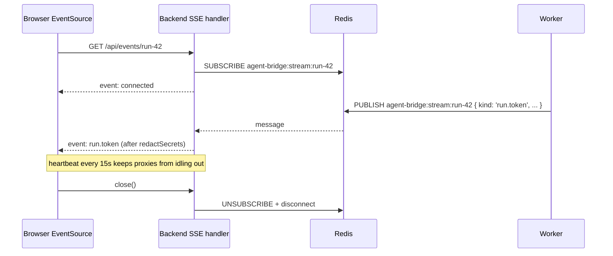

# Agent Bridge — Architecture

## 1. High-level map

```mermaid
flowchart LR
  subgraph Browser["Browser (Vite + React 19 + React Flow)"]
    UI[Agent canvas, chat, logs]
  end

  subgraph Backend["apps/backend (Hono)"]
    API[[REST API]]
    SSE[[SSE /api/events/:streamId]]
  end

  subgraph Worker["apps/worker (BullMQ)"]
    PING[ping job]
    CLONE[clone-repo job]
    IDX[index-repo job]
    WIKI[generate-wiki job]
    RUN[run-agent job]
  end

  subgraph Shared["packages/shared (subpath exports)"]
    Paths[./paths]
    Crypto[./crypto]
    Spawn[./spawn]
    GitN[./gitnexus]
    Bus[./event-bus]
    Events[./events, ./redact, ./secrets-dto]
  end

  subgraph DB["packages/db (Drizzle + Postgres)"]
    Schema[(pgvector)]
  end

  subgraph Infra["docker-compose.yml"]
    Redis[(Redis 8)]
    PG[(Postgres 17 + pgvector)]
  end

  subgraph DataRoot[".agent-bridge-data/ (isolation boundary)"]
    WS[workspace/&lt;agent&gt;/&lt;repo&gt;]
    GNH[gitnexus-home/ — fake HOME]
    Blobs[blobs/]
    Key[secret.key (0600)]
  end

  subgraph External["External MCPs (sandboxed)"]
    Notion[Notion MCP]
    DD[Datadog MCP]
    GitNexusMCP[gitnexus mcp per repo]
  end

  UI -->|REST| API
  UI -->|EventSource| SSE
  API -->|enqueue| Redis
  Worker -->|dequeue| Redis
  Worker -->|publish RunEvent| Redis
  Backend -->|subscribe| Redis
  API --> DB
  Worker --> DB
  Worker --> Shared
  Backend --> Shared
  Worker -->|spawnSandboxed| GitN
  Worker -->|spawnSandboxed| External
  Worker --> DataRoot
  GitN --> DataRoot
```

## 2. Components

### 2.1 `apps/frontend` (React 19 + Vite + React Flow)

Railway-style node-based canvas: agents, attached skills, tools, repos, MCP
connections are all nodes; edges carry relationships (e.g. repo→repo with a
one-word connector + description).

Only imports from `@agent-bridge/shared` at the **browser-safe root entry** —
subpath exports like `@agent-bridge/shared/crypto` will break the Vite build
by design.

### 2.2 `apps/backend` (Hono + @hono/node-server)

- CRUD API over `@agent-bridge/db`
- SSE endpoint tails per-stream events from Redis pub/sub
- Never returns decrypted secret plaintext — responses carry `SecretSentinel`
  values only
- Before publishing any event, runs it through `redactSecrets()` with all
  known plaintexts for that run

### 2.3 `apps/worker` (BullMQ)

Boot sequence (deliberate, fail-fast):

1. `ensureDataDirs()` — 0700 dir layout under `.agent-bridge-data/`
2. `loadOrCreateMasterKey()` — validate or generate `secret.key`
3. `assertExpectedGitnexusVersion()` — refuse to run on a drifted version
4. Register BullMQ `Worker` per queue
5. Install signal handlers (clean drain on SIGINT/SIGTERM)

Jobs are stateless and idempotent (use `attempts: 3, backoff: exponential`).
Every long-running child process is spawned via `spawnSandboxed()` so
nothing escapes the data root.

### 2.4 `apps/mcp-bridge` (Phase 5)

MCP server (stdio + optional HTTP) that exposes **bridge tools** (see §8) to
Cursor / Claude Code. Phase 5 ships a 1:1 mapping — one bridge tool per
agent (`query_<agent_slug>`), derived from the `agents` row at runtime. A
later phase replaces this with the multi-tool `bridge_tools` table (see §8.3
and `docs/PLAN.md` Phase 7).

### 2.5 `packages/shared`

Two worlds under one package, separated by `exports`:

| Subpath       | Runtime        | Purpose                                              |
| ------------- | -------------- | ---------------------------------------------------- |
| `.` (default) | browser + node | Zod schemas, DTOs, `redactSecrets`, `RunEvent` types |
| `./env`       | node           | `.env` loader + schema validator                     |
| `./paths`     | node           | `resolveDataDir`, `ensureDataDirs`                   |
| `./crypto`    | node           | AES-256-GCM envelopes + master key                   |
| `./spawn`     | node           | `spawnSandboxed` (HOME clamp, git flags)             |
| `./gitnexus`  | node           | Pinned CLI resolver + `runGitnexus`                  |
| `./event-bus` | node           | Redis pub/sub `RunEvent` bus                         |

### 2.6 `packages/db`

Drizzle schema + generated migrations. Used by backend (reads/writes) and
worker (writes job progress + run_events audit rows). Migrations committed to
git; `pnpm db:generate` diffs `schema.ts` and writes a new SQL migration.

Lives in Postgres schema `public.*`. Mastra's auto-created tables live in a
separate `mastra.*` schema — see §7 for the ownership split and why the two
schemas never mix.

### 2.7 `packages/agents` (Phase 1+)

Mastra agent builder: takes DB rows (agent, skills, tools, repos, MCP
connections, memory config) and returns a runnable `Agent` instance. The only
place in the repo that imports `mastra`, `@mastra/memory`, `@mastra/pg`, etc.
— every other workspace sees a pure `Agent` / `RunResult` interface. This
keeps the Mastra boundary explicit and swappable.

## 3. Isolation guarantees (must not regress)

Every runtime write the app makes lives under **one** path, the
**data root**:

```
<repo>/.agent-bridge-data/
  workspace/           # cloned user repos
  gitnexus-home/       # fake HOME for GitNexus + git (registry, config, cache)
  blobs/               # generated wikis, graph JSON, chunked content
  secret.key           # 32-byte AES-256-GCM master key, mode 0600
```

**Hardening invariants.** If any of these regress, an end-user will start
seeing files appear in `~/.gitconfig`, `~/.gitnexus/`, or worse.

| Invariant                                                            | Enforced by                                                                |
| -------------------------------------------------------------------- | -------------------------------------------------------------------------- |
| No runtime write outside the data root                               | `@agent-bridge/shared/paths`                                               |
| Every `gitnexus` / `git` / user MCP spawn has `HOME` clamped         | `spawnSandboxed()`                                                         |
| Git never reads the user's global config or prompts interactively    | `spawn: 'git'` sets `GIT_CONFIG_GLOBAL=/dev/null`, `GIT_TERMINAL_PROMPT=0` |
| GitNexus version drift is caught at boot, not at indexing time       | `assertExpectedGitnexusVersion()` in worker                                |
| `npx gitnexus@latest` is never called                                | `runGitnexus()` resolves via `createRequire`                               |
| `SSH_AUTH_SOCK`, `GPG_AGENT_INFO` are stripped from spawned children | `spawnSandboxed()`                                                         |
| Browser bundles never pull in Node-only code (crypto, spawn, etc.)   | `exports` map subpath split                                                |
| No ambient `process.env` usage — everything goes through Zod schemas | `@agent-bridge/shared/env`                                                 |
| Engine mismatch (Node version) fails loudly                          | `.npmrc` `engine-strict=true` + root `engines.node` + `.nvmrc`             |

## 4. Secrets at rest

Every user-supplied secret flows through the same pipe:

```
UI input  →  backend validates SecretInput DTO  →  encryptSecret()  →  DB row (v1.iv.tag.ct)
                                                                          │
                                                                          ▼
                                               SSE stream  ←  redactSecrets(event, [plaintextsForRun])
                                                                          ▲
                                          run-time only  ←  decryptSecret() in worker (memory-only)
```

- **Envelope**: `v1.<iv:b64url>.<tag:b64url>.<ct:b64url>`
- **Algorithm**: AES-256-GCM, 12-byte IV, 16-byte tag
- **Key location**: `<data-root>/secret.key` (mode 0600), or
  `AGENT_BRIDGE_SECRET_KEY` env override (base64url-encoded 32 bytes)
- **API responses**: never include plaintext. `SecretSentinel = {set: true, length: 16}`
- **Logs + SSE**: last-line-of-defence `redactSecrets()` replaces any known
  plaintext substring with `«redacted»` before publishing

Losing `secret.key` means every encrypted row becomes unrecoverable — back it
up if you care about portability across machines.

## 5. Event bus + SSE pipeline



The `RunEvent` type is shared via `@agent-bridge/shared` so producer
(worker) and consumer (frontend) cannot drift. The bus is a thin wrapper
around ioredis pub/sub — one subscriber connection per SSE client.

## 6. Process + deployment topology

Local dev (`pnpm dev`):

- `docker compose` → Redis + Postgres on loopback
- `apps/frontend` → Vite dev server on `:5173`
- `apps/backend` → Hono on `:3001`
- `apps/worker` → BullMQ worker(s)
- `packages/*` → `tsc --watch` (for type freshness)

Production (future): same four processes, Redis + Postgres managed. MCP
bridge runs alongside backend if IDE-facing is enabled.

## 7. Mastra ownership model

Agent Bridge wraps Mastra — it does not re-implement it. The repo has one
**boundary module** (`packages/agents`) that speaks Mastra, and three buckets
of responsibility:

### 7.1 Bucket 1 — Mastra owns the storage

When `@mastra/pg`'s `PostgresStore` is constructed with `schemaName: 'mastra'`
(Phase 3 wiring), Mastra auto-creates and migrates these tables. We **never**
design our own versions:

| Mastra table               | What it stores                                         |
| -------------------------- | ------------------------------------------------------ |
| `mastra.threads`           | Conversation threads (one per agent × user × session)  |
| `mastra.messages`          | Individual messages with role, content, metadata       |
| `mastra.resources`         | Per-`resourceId` working memory (persists cross-thread)|
| `mastra.workflow_snapshot` | Suspend/resume state for long-running workflows        |
| `mastra.evals`             | Eval run results                                       |
| `mastra.traces`            | OpenTelemetry spans (tool calls, LLM calls, timings)   |
| `mastra.scorers`           | Scorer outputs                                         |

`drizzle-kit` runs only against `public.*`. Mastra's migrations run on its
own schedule the first time `PostgresStore.init()` is called at boot. The
two migration runners never see each other's tables.

### 7.2 Bucket 2 — We store, Mastra consumes

Some rows on **our** tables carry config that gets piped straight into Mastra
at runtime. For these, the field shapes **must match Mastra's API exactly** —
drift is a runtime error, not a type error:

| Our column                  | Mastra consumer                  |
| --------------------------- | -------------------------------- |
| `agents.memory_config`      | `new Memory({ options: … })`     |
| `tools.config_json` (later) | `createTool({ … })` inputs       |

See `AgentMemoryConfig` in `@agent-bridge/shared/domain` — docstring calls
out the anti-drift rule explicitly.

### 7.3 Bucket 3 — We own it entirely

Everything else. Mastra has no opinion or schema here, so we design freely:

| Our concept                             | Why Mastra has no schema                      |
| --------------------------------------- | --------------------------------------------- |
| `agents` (row), `skills`, `tools`       | Mastra agents + tools are code, not data      |
| `repos`, `agent_repos`, `repo_edges`    | Mastra has no notion of attached codebases    |
| `mcp_connections`, `agent_mcp_tools`    | Mastra consumes MCP tools at runtime, not DB  |
| `llm_providers`                         | Mastra providers are instantiated, not stored |
| `runs`, `run_events`                    | UI-facing audit log; `mastra.traces` is OTel  |

**`runs` vs `mastra.traces`.** Both exist and that's deliberate. Our `runs`
carries UI semantics (`stream_id` for SSE, `input_prompt`, user-facing
status). `mastra.traces` carries low-level OTel spans. They coexist linked by
soft-FK columns on `runs` (`mastra_thread_id`, `mastra_resource_id`) added in
Phase 3. If Mastra's tracing is ever disabled, our audit log still works.

### 7.4 Rule of thumb

> If Mastra has a table for it → let Mastra own it (schema `mastra.*`).
> If Mastra's API consumes the config we store → match their shape exactly.
> If neither → we design it. No guessing.

This rule is enforced socially (this doc + `packages/agents` being the only
Mastra-importing module) rather than mechanically. A lint rule banning
`mastra*` imports outside `packages/agents` is worth adding in Phase 3.

## 8. Tools — two directions

"Tool" is an overloaded word in this codebase. It refers to two totally
different runtime objects, flowing in opposite directions through different
processes. Mixing them up (in code, DB, or a code review) is a category
error, so we name them explicitly:

```
┌───────────────────┐          ┌─────────────────┐          ┌─────────────────┐
│   Developer's     │          │   apps/mcp-     │          │  Agent Bridge   │
│   IDE coding      │◀──calls──│    bridge       │──invokes─│  Mastra agent   │
│   agent (Cursor,  │          │                 │          │  (packages/     │
│   Claude Code)    │          │  exposes        │          │   agents)       │
└───────────────────┘          │  BRIDGE TOOLS   │          │                 │
                               │  via MCP        │          │  picks up       │
                               └─────────────────┘          │  AGENT TOOLS    │
                                                            │  at runtime     │
                                                            └────────┬────────┘
                                                                     │ calls
                                                                     ▼
                                       ┌────────────────────────────────────────┐
                                       │  GitNexus MCP │ Notion MCP │ Datadog … │
                                       │  (per repo)   │  native tools,         │
                                       │               │  http/shell/custom     │
                                       └────────────────────────────────────────┘
```

### 8.1 Agent tools (inbound — the Mastra agent's toolbox)

What our Mastra agent picks up and calls while it's answering a question.
Fully modeled in the `public.*` schema today:

| Table              | Role                                                 |
| ------------------ | ---------------------------------------------------- |
| `tools`            | Native tools defined in code (http, shell, custom)   |
| `mcp_connections`  | Registered MCP servers (Notion, Datadog, GitNexus…)  |
| `agent_mcp_tools`  | Per-agent allowlist into those MCP servers           |

`packages/agents` is the only place that reads these. At runtime it merges
them with Mastra built-ins and hands the combined set to `new Agent({ tools,
… })`. Users never see "agent tools" in the UI as a unified concept — they
see "Tools", "MCP Connections", etc. separately, because the authoring UX
differs per kind.

### 8.2 Bridge tools (outbound — what the IDE sees)

What `apps/mcp-bridge` exposes to Cursor / Claude Code over MCP. When a
developer types `@query_frontend_helper "why does login fail?"` in the IDE,
this is the tool that handles the request by kicking off a run against one
of our agents and streaming the answer back.

**Phase 5 model — 1:1 agent → bridge tool.** Ships the IDE integration end
to end with zero new schema: each `agents` row derives one bridge tool at
runtime (name = `query_<agent.slug>`, description = `agents.description`).
Per-call audit lands in `runs` + `run_events` with `stream_id` prefixed
`bridge:` so the UI can distinguish IDE-originated runs from UI chat runs.
The `query_` prefix is **reserved** for these auto-derived defaults —
Phase 7 explicit tools cannot use it.

**Phase 7 upgrade — 1:N agent → bridge tools.** Introduces a
`bridge_tools` table so an operator can author several curated tools per
agent (`ask_architecture`, `explain_module`, `find_tests_for`, …) each with
its own input schema + prompt template. Non-breaking migration: when the
table is empty for an agent, fall back to the Phase 5 default tool. Phase 7
also adds `runs.bridge_tool_name text` (nullable) so the UI can say which
explicit tool a run was invoked from — Phase 5 rows stay `NULL`. A DB CHECK
constraint enforces the reserved-prefix rule (`name NOT LIKE 'query\_%'`).
See `docs/PLAN.md` Phase 7 for the full migration.

### 8.3 Rule of thumb

> **Agent tools** live inside our Mastra agent's context.
> **Bridge tools** live inside the IDE's MCP client.
> They never share a table, a type, or a variable name. If a function needs
> to touch both, split it in two.

Type naming convention enforced by code review: agent-side types live under
`@agent-bridge/shared/domain` prefixed `Tool*` / `Mcp*`; bridge-side types
(added in Phase 5) live under the same module prefixed `BridgeTool*`.
